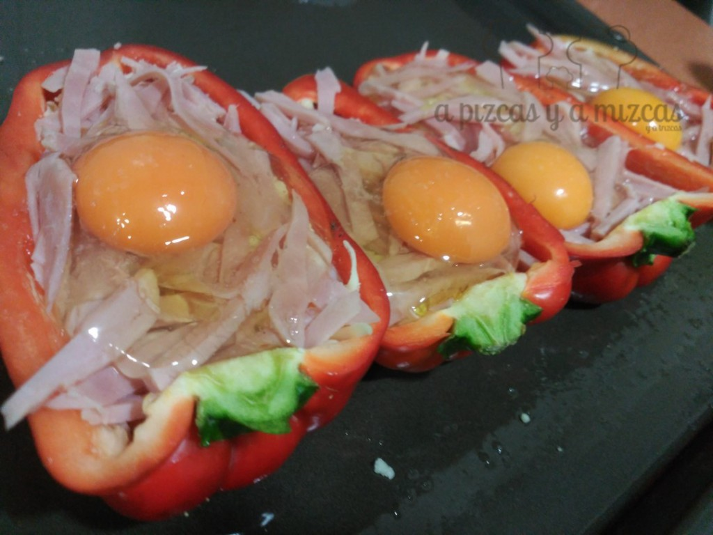
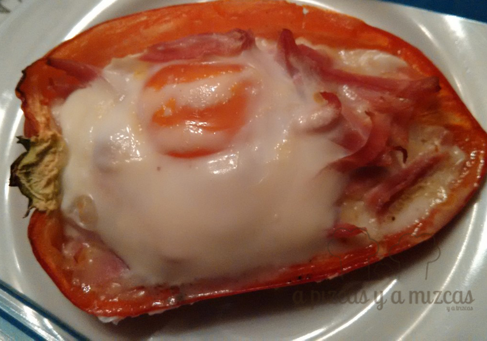

Al fin llegó el viernes... que ganas teníamos y los viernes intentamos buscar recetas que se hagan en un pis pas... Y los pimientos con jamón, queso y huevo es uno de esos platos que tienes preparado en menos de cinco minutitos y le gusta a todos. Sigue leyendo y descubre el secreto... ji ji ji

## Ingredientes para preparar los pimientos con jamón, queso y huevo (para dos personas)

- cuatro huevos
- dos pimientos medianos
- taquitos de jamón york
- queso rallado
- sal
- pimienta

Antes de empezar... tenemos que confesar que esta receta se la hemos robado a la iaia Mizcas... ji ji ji... a la iaia le salen buenísimos y a nosotros también. Es que en la familia de A Pizcas y a Mizcas somos todos unos cocinillas... ji ji ji

Empezamos limpiando los pimientos. Los cortamos por la mitad y le quitamos todas las pepitas y los nervios de dentro. Engrasamos una bandeja de horno con aceite de oliva.

 Pimientos listos para ir al horno

Y ahora.... atentos... viene lo más difícil... rellenamos los pimientos (lo de difícil era broma). Añadiremos el jamón york cortado a taquitos o a tiras (como más os guste) y el queso rallado y por último el huevo. Le añadis sal y pimienta al gusto y al horno!

Precalentamos el horno a 180º C. Introducimos la bandeja con los pimientos con jamón, queso y huevo al horno hasta que veamos que el huevo está hecho. Los pimientos deben quedar al dente.

 La cena preparada en un pis pas

No os hemos engañado, en un pis pas la cena preparada! Podeís variar el relleno... según lo que tengáis en la despensa.
