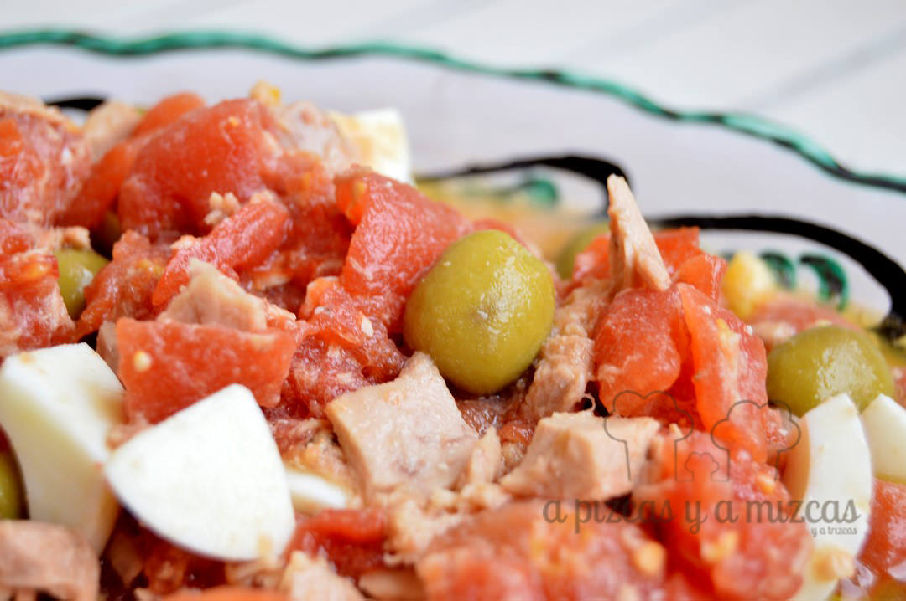
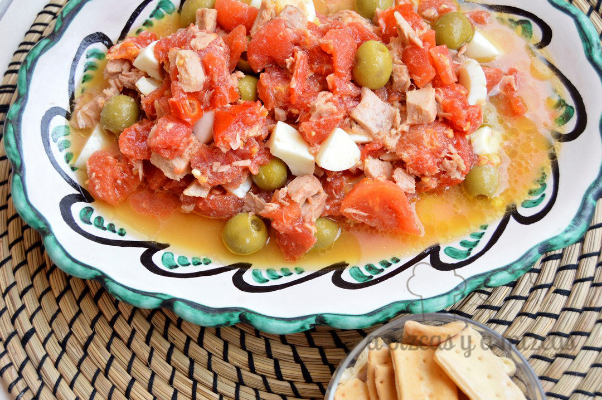

Los que nos seguís desde hace tiempo sabéis que la iaia Mizcas es manchega. Aunque con el tiempo que lleva en Valencia podemos decir que es casi casi valenciana... ji ji ji. Si queréis cotillear aquí podréis saber [algo más sobre nosotros](/sobre-nosotros/). Y muchas de las recetas que hacemos en casa las hemos aprendido de ella y el pipirrana es una de ellas. ¿Queréis saber qué es?

El pipirrana (para los que no sabéis qué es) es una ensalada que se prepara con cebolla, tomate, pimiento verde y pepino también se le añade huevo cocido y atún o caballa. Es una ensalada muy popular en algunas zonas de Andalucía, Murcia y el sur de Ciudad Real.

La iaia Mizcas siempre ha hecho su propia versión del pipirrana sin pimiento y sin pepino y así es como la hacemos nosotros.

## Ingredientes para preparar el pipirrana

- dos huevo cocidos
- dos latas de atún
- una cebolla pequeña
- un bote de un kilo de tomate entero en su jugo
- aceitunas
- sal
- aceite de oliva virgen extra

Cocemos los huevos y reservamos hasta que se enfríen. Escurrimos los tomates y lo troceamos, a continuación picamos la cebolla y el huevo. Agregamos el atún y las aceitunas.

¿Tenéis preparado el pan?

Por último un chorrito de aceite de oliva virgen extra y sal al gusto. Lo ponemos en la nevera para que se enfríe y no os olividéis del pan.

Pipirrana estilo pizcas
