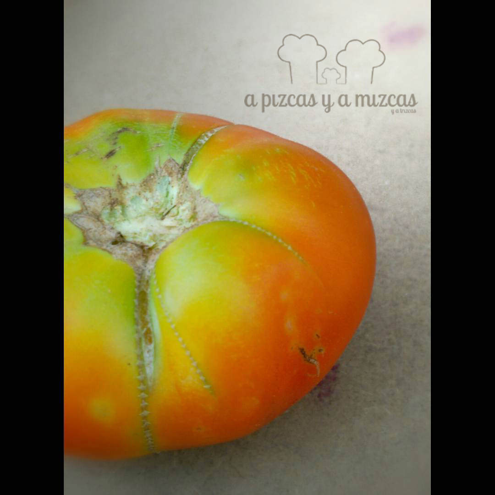
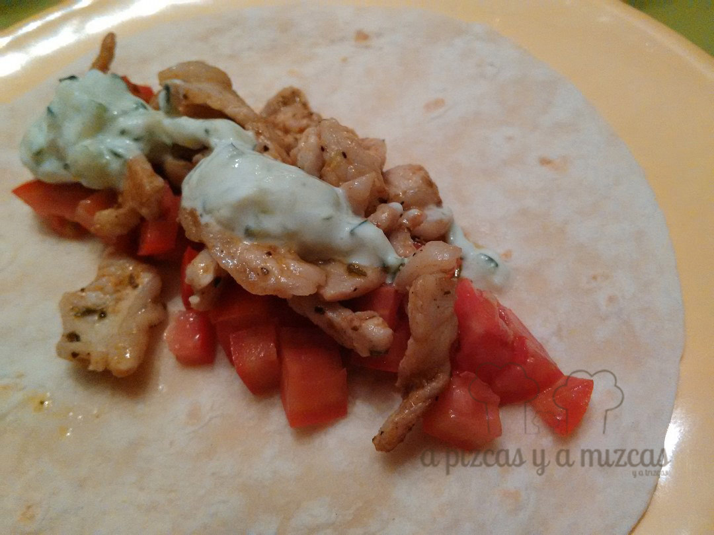
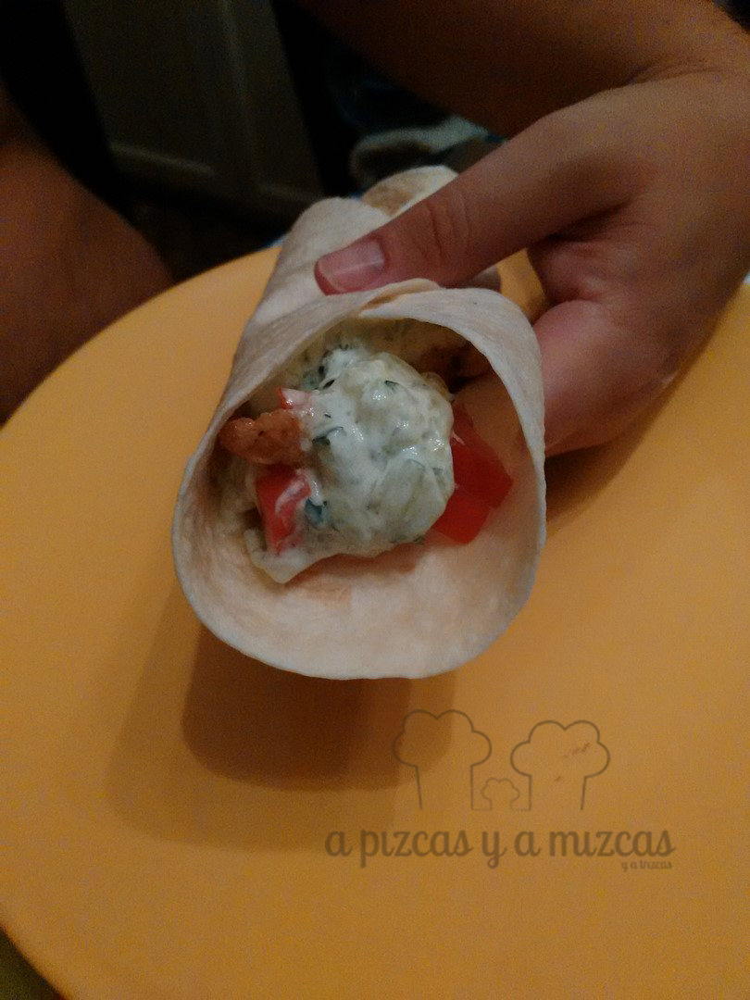

Desde que hace unos años pudimos escaparnos por Grecia somos unos enamorados de la gastronomía griega y en cuanto tenemos ocasión nos metemos en la cocina a preparar algún plato que nos traslade allí. Esta vez hemos preparado una pita estilo griego muy parecida a la que servían por el barrio de Monastiraki.

## Ingredientes para preparar la pita estilo griego (para dos personas)

- [pan de pita](/pan-de-pita-casero/)
- escalopines de lomo
- pimentón dulce
- orégano
- sal
- aceite de oliva virgen extra
- tomate
- tzatziki

Primero preparamos el tzaziki, que lo podéis tener preparado del día anterior. Esta salsa es muy utilizada en Grecia para acompañar múltiples plato. Es muy refrescante y abre el apetito.

Los ingredientes para prepararlo: dos yogures griegos naturales sin azúcar, dos pepinos pequeños o uno grande, un diente de ajo, sal, aceite y un chorro de limón exprimido.

Rallamos los pepinos con el rallador manual. Luego hay que escurrirlo muy bien para que suelte todo el líquido.

Mezclamos el pepino con el yogur, sal, aceite y un poco de limón exprimido. Picamos el ajo (este ingrediente hay que manejarlo con cuidado para que no domine el sabor) y lo añadimos.

Lo servimos adornado con hierbabuena picada.

Después cortamos el lomo a trocito pequeños y  marinamos los escalopines de lomo con un poco de pimentón dulce, orégano, aceite de oliva virgen extra y sal. Después lo pasamos por la sartén mientras calentamos un poco el pan de pita en otra sartén.

Por último cortamos el tomate a daditos pequeños.

Tomate del huerto cogido con las manitas de Trizcas... este sabe mejor!

Nosotros lo sacamos a la mesa en cuencos y cada uno se monta su pita al estilo griego. Primero hacemos una cama con el tomate, a continuación el lomo especiado y por último el tzatziki. Enrollamos y a disfrutar!

Enrollamos y a comeer!

Al ataqueee! Ñam, ñam!!

¿Qué os ha parecido? Si te animas a preparar una pita estilo griego cuéntanoslo... nos hace muchísima ilusión! :)
