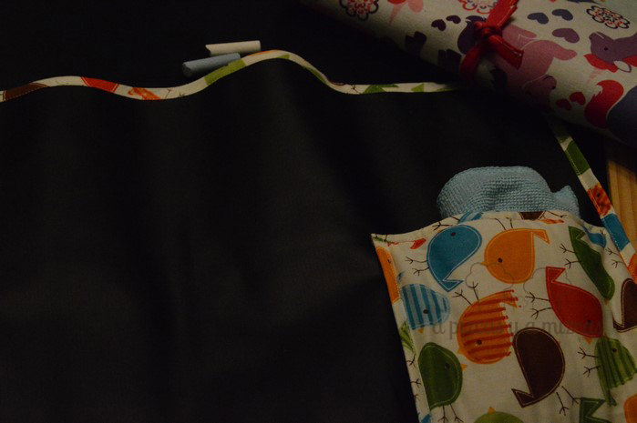
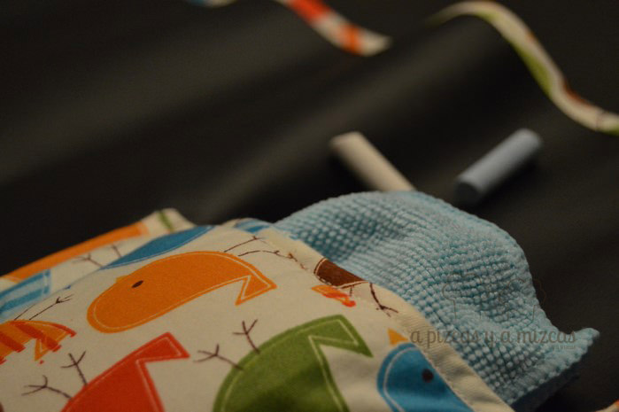
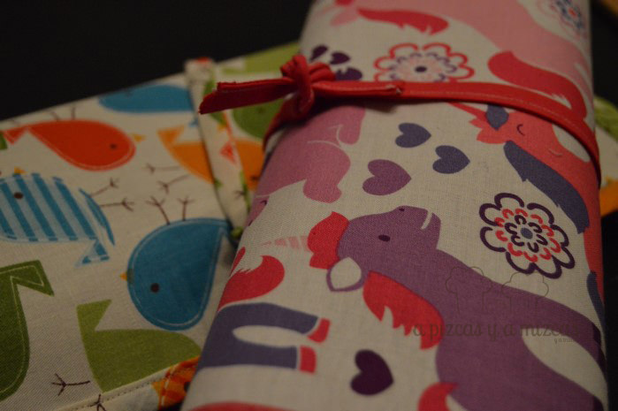
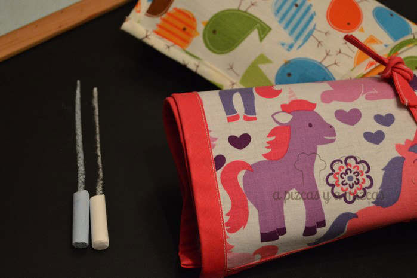

Esto de mantener a los peques seres entretenidos cuando vas a algún sitio a comer o a cenar a veces es un poco complicado... y pensamos que era una buena solución hacer una pizarra enrollable para poder llevarla a cualquier sitio y que Trizcas diera rienda suelta su imaginación con las tizas de colores, sin que tuviera que "pagarlo" el mantel del restaurante de turno, jeje.

Una vez más tuvimos que recurrir a la iaia Mizcas, que nos echó una manita encantada. Compramos todo lo necesario para ponernos a la faena y empezamos con el trabajo. La tela de pizarra enrollable y la tela estampada de ponys las compramos en [Telas de Colores](Telas%20de Colores "http://telasdecolores.com/"), una tienda online donde venden telas súper molonas, si no la conocéis os recomendamos que echéis un vistacillo, seguro que picáis alguna cosa.

Básicamente, la idea era hacer un rectángulo más o menos manejable de tela de pizarra (una tela negra en la que es posible pintar con las tizas tradicionales) y recubrir la otra parte con una tela con un estampado súper alegre y que a Trizcas le recordara a algunos de sus personajes preferidos: los pequeños ponys.

A partir de aquí ya se encargó de todo la iaia Mizcas y su máquina de coser. En el interior de la pizarra enrollable colocamos un pequeño bolsillo que nos serviría después para meter las tizas de colores y el borrador, nosotros utilizamos una bayetita de microfibra de un color que combinara. De esta forma, siempre tenemos todos los elementos necesarios a mano para que Trizcas desarrolle su arte efímero.

Y visto el éxito que ha causado en nuestro peque ser... nos animamos a preparar otra con otra tela para un amiguito.

La verdad es que es una idea genial! Si os gusta, hacérnoslo saber y podemos prepararos una muy rápidito.

