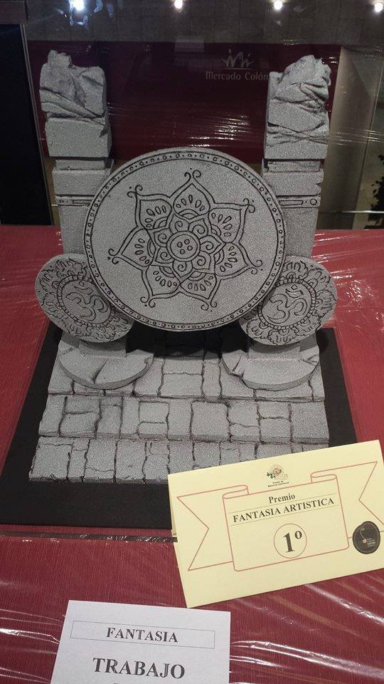
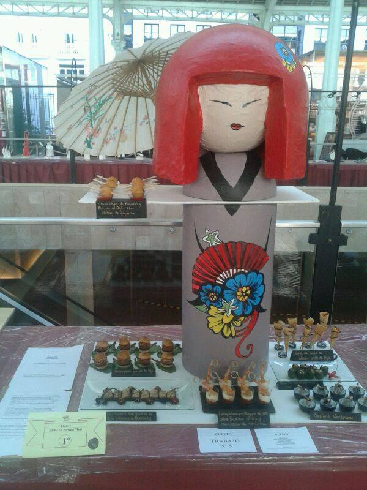
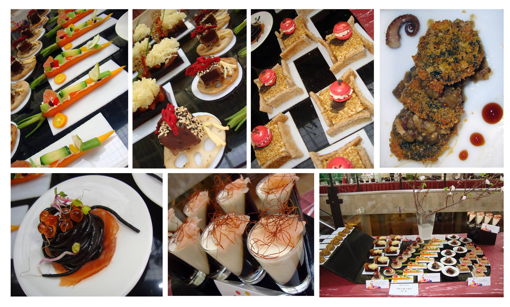
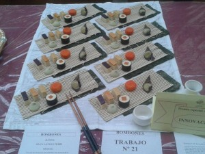

Durante los días 25 y 27 de febrero se celebró en valencia la IX Edición del Concurso Escuelas de Pastelería, organizado por el Gremio de Maestros Confiteros de Valencia. Pizcas tuvo la suerte y la responsabilidad de actuar como jurado y pudo valorar el gran control de las técnicas y de los materiales, tanto en la fase de fantasía, como en la de bombones y de buffet salado. Enhorabuena a todos los participantes, el futuro de la repostería valenciana.

## En esta edición del Concurso de Escuelas de Pastelería participaron:

- Escuela de Pastelería del Gremio de Maestros Confiteros de Valencia
- Centro Superior de Hotelería y Turismo de Valencia
- CIP de Formación Profesional de Cheste
- IES de Enguera
- IES de Xixona
- IES el Ravatxol de Castellar
- CDT La Alquería del Duc de Gandia

La exposición de los participantes se desarrolló en el Mercado de Colón de Valencia y el pase del jurado se llevó a cabo el martes 25 de febrero.

El certamen reconoce la calidad artística y nivel formativo de los sesenta alumnos que se han presentado este año, representantes de las siete escuelas de pastelería de toda España que han concurrido al concurso, presentando un total de 70 obras.

El Concurso de Escuelas de Pastelería contempla los apartados de fantasía artística, surtido de bombones y buffet salado en miniatura. La fantasía artística se realiza en materiales totalmente comestibles (caramelo, pastillaje, chocolate, mantequilla, etc.). Este año, las fantasías debían inspirarse en la cultura oriental.

Uno de los objetivos que persigue el Concurso de Escuelas de Pastelería es promocionar la profesión y las escuelas de pastelería de la provincia de Valencia, evaluando el nivel de los estudiantes de pastelería españoles participantes en un concurso que reconoce la innovación y la calidad, en la figura del premio especial al mejor trabajo del concurso.

En esta ocasión, el jurado (integrado por representantes del sector, crítica gastronómica y restauración) ha reconocido la calidad del trabajo y de las piezas presentadas, en las categorías de Fantasía Artística, Bombones, Buffet salado mini. También se han concedido dos premios tematizados e incorporados para reconocer la innovación y la calidad del mejor trabajo, entre las siete escuelas participantes.

En el primer apartado, **Fantasía Artística**, todos los premios han recaído en la Escuela Oficial del Gremio. En esta línea, el jurado ha premiado los trabajos de **Elías Gil Bau en primer lugar**, alumno de la Escuela Oficial del Gremio, José Canto Herrera -Escuela Oficial del Gremio- y de Victoria Navarro Martínez, en tercer y último lugar, también alumna de la Escuela Oficial del Gremio.

En la categoría de **Bombones**, **Cristina Molina Moreno** (I.E.S. de Xixona) ha recibido el primer premio, seguida de Pilar Domenech Ivars (I.E.S. de Xixona) y de Teresa Guanter Giralt, en tercer lugar, en este caso alumna de la Escuela Oficial del Gremio. En esta categoría, el jurado ha concedido un **premio especial a la Degustación**, que ha recaído en **Darío Ruiz**, alumno de la Escuela Oficial del Gremio.

La categoría de **Buffet salado mini**, **Olga Padilla Illa** -alumna del CdT de Valencia- ha recibido el primer premio, seguido de Juan Manuel García Graja -alumno de CdT Valencia- y en tercer lugar, en el alumno Arturo Roig Espí -de CdT Alquería del Duc, de Gandia-.

Al igual que en la anterior categoría, el buffet salado mini ha reservado dos premios más en la categoría de **Degustación,** que en esta edición han recaído en **Ana Avellana García y Teresa Guanter Chiralt**, ambas alumnas de la Escuela Oficial del Gremio de Maestros Confiteros de Valencia.

Finalmente, el Gremio de Maestros Confiteros ha entregado el **Premio Especial a la Innovación,** que ha recaído en la figura de **Olga Lanzas Ferri** y el **Premio al Mejor Trabajo**, que ha recaído en la misma alumna.

La entrega de premios ha contado con la asistencia de Marta Valsangiacomo, directora General de Empresas Agroalimentarias i Pesca, de la Consellería de Presidencia y Agricultura, Pesca, Alimentación y Agua; Mayren Beneyto, concejala de Cultura y Presidenta del Palau de la Música; y Silvia Ordiñaga, directora general de Comercio y Consumo de la Consellería de Economía, Industria y Turismo.

Enhorabuena a todos los participantes y en especial a los premiados en el Concurso de Escuelas de Pastelería. Esperamos vernos de nuevo en 2015.

_**Fotos tomadas de la página de Facebook del Gremio de Maestros Confiteros de Valencia.**_
