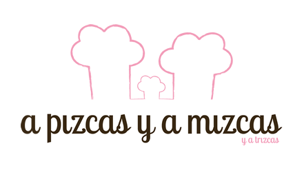
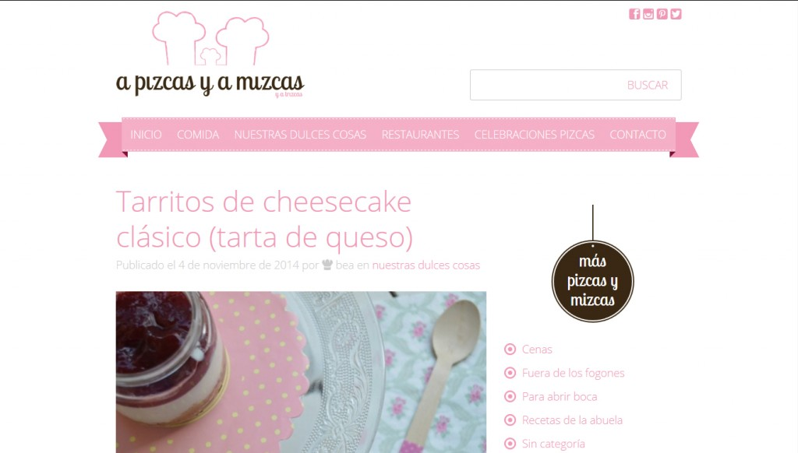
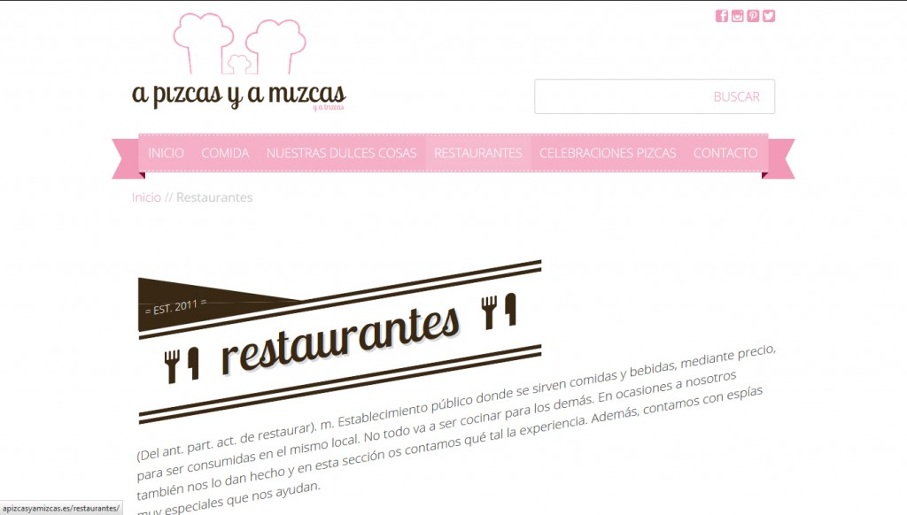
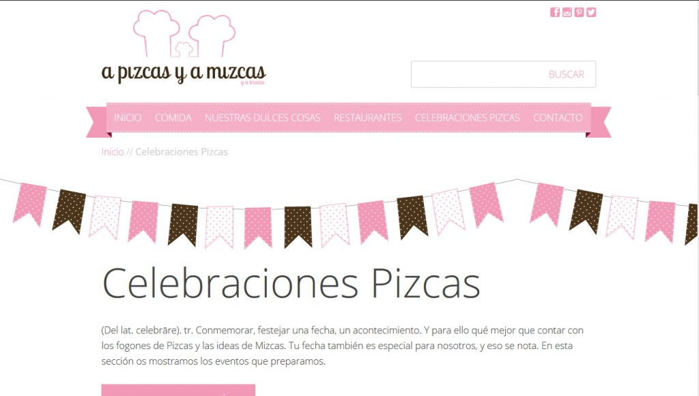

Como habéis podido comprobar, desde hace unas semanas la actividad ha disminuido en el blog de A Pizcas y a Mizcas. Así ha sido en lo que a entradas y nuevas recetas se refiere, pero lo cierto es que estábamos en “el taller”. Hemos sometido el blog a un rediseño total, así que A Pizcas y a Mizcas estrena imagen, con nuevo logo, una redistribución de las secciones y la potenciación de algunas actividades. El responsable de la nueva imagen del blog ha sido [José Luis Lloret](https://twitter.com/l1oret "José Luis Lloret ") que nos lo ha diseñado y “cocinado” con todo el amor del mundo. Nosotros hemos quedado encantados.

Lo primero que teníamos claro es que ya hace tiempo que A Pizcas y a Mizcas ya no es cosa de dos, teníamos claro que Trizcas tenía que formar parte de esta aventura ya desde el logo. Así que preparamos un nuevo logo en el que Trizcas tiene su trocito. ¿Qué os parece? A nosotros nos enamoró desde el primer momento en que lo vimos.

Luego, José Luis se curró un diseño de blog personalizado y que recoge a la perfección nuestra filosofía. Para optimizarlo, hemos redistribuido las secciones. Ahora son mucho más lógicas y hay algunas menos. Así podréis encontrar lo que busquéis mucho más fácilmente.

Además les hemos dado mucho más protagonismo a dos secciones que están teniendo bastante éxito entre vosotros. Se trata del apartado de [Restaurantes](/restaurantes/ "Nueva categoría: restaurantes") y de [Celebraciones Pizcas](/celebraciones-pizcas/ "Nueva categoría: Celebraciones pizcas"). Nos hemos dado cuenta de que a los cocinillas de estar por casa también os encanta salir fuera a comer, eso sí, cumpliendo las premisas de “bueno, bonito y barato”. Por eso os iremos dando a conocer sitios que descubrimos, tanto nosotros, como nuestros espías infiltrados, Mrs. Green y Mr. Brown. Además, muchos nos habéis pedido asesoramiento para vuestras celebraciones y ocasiones especiales, por eso nace la sección Celebraciones Pizcas, donde encontraréis infinidad de ideas y podéis poneros en contacto con nosotros a través del blog.

Las sorpresas no acaban aquí. A Pizcas y a Mizcas cumple ahora tres años de andadura y por eso estamos preparando un sorteo muy especial. Estad pendientes del blog y de las redes sociales para enteraros de cómo participar.

Deseamos que os guste todo tanto como a nosotros.
