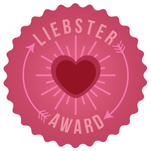

Siempre que tenemos un comentario en el blog vamos raudos a mirarlo. Nos hacen muchísima ilusión y nos ponen una sonrisa en la cara. Hace unos días, un comentario vino con una agradable sorpresa: nuestro blog A Pizcas y a Mizcas había sido nominado a los [Liebster Awards](http://liebsterawards.blogspot.com.es/ "Página oficial de Liebster Award") por parte del blog [Destaca-te](http://palomasilla.com/ "Destaca-te"), de Paloma Silla.

Superado el asombro inicial, nos pusimos a investigar. Habíamos visto la insignia de los Liebster en varios blogs, pero no sabíamos qué implicaba. Lo más importante es que son los propios blogueros los que nominan a aquellos blogs que más valoran, pero que no son muy conocidos. Es genial pues la nominación te llega de alguien que como tú, saca horas de donde no hay para llenar de contenido su blog.

La nominación nos llegó de la mano de Paloma Silla una valenciana de pro y apasionada por la moda con su propio punto de vista que se aparta de convencionalismos.Refleja ese entusiasmo por lo que le gusta  post a post a través de su blog [Destaca-te](http://palomasilla.com/ "Destaca-te"). Agradecemos mucho que se haya fijado en A Pizcas y a Mizcas y valore nuestro trabajo.

Los [Liebster Awards](http://liebsterawards.blogspot.com.es/ "Página oficial de Liebster Award") se otorgan a los blogs con menos de 200 seguidores en la red, para reconocer el esfuerzo y la labor que realizan, así como ayudar a promocionar sus contenidos entre los miles de lectores de blogs que entran diariamente a internet para consultar todo aquello que necesitan y más les gusta.

Como nominados, hay unas reglas que debemos seguir:

### [Las Reglas Oficiales son:](http://liebsterawards.blogspot.com.es/p/reglas.html "Reglas oficiales Liebster Awards")

1.  _Debes Tener ya un Liesbter para poder Nominar a un total de 5 ó 11 ó 20 Blogs._ _Dependiendo del abarcamiento de su Blogs, escoge el numero de Nominados._
2.  _En Los Liebster se es Nominado entre las selecciones de algún Blogger ya ganador de uno y que nomine a cierta cantidad, estos nominados se convierte en ganadores al momento que respoden las preguntas que se le han señalado y nomina a otros blogs, de inmediato ya es ganador de un Liebster Award._
3.  _Al Ser Nominado a un Liebster, debes Seguir al Blog que te otorgó la Nominación_
4.  _Luego de Seguir Al Blog que te Nominó debes contestar exactamente 11 preguntas que te realiza el Blogger ó escribir 11 cosas sobre ti, es decisión del Blog que te nomina si te realiza 11 preguntas ó pide saber 11 cosas sobre ti ó las realiza ambas._

En primer lugar, vamos a daros información sobre nosotros a través de 11 cosas.

1.  Decidimos hacer el blog A Pizcas y a Mizcas para tener recopiladas nuestras recetas favoritas y, de paso, difundirlas entre los amigos. Luego hemos ido creciendo: manualidades, regalos, cositas para bebés, crítica de restaurantes, costura...
2.  Ahora somos tres: Mizcas es Bea (mamá bloguera), Pizcas es Vicent (papá bloguero) y Trizcas es el terremoto (también llamado pequeser).
3.  Vivimos en Valencia y adoramos nuestra ciudad (aunque tenemos un trocito del corazoncito en Castellón).
4.  Espero que la nominación al Liebster haya venido gracias a los contenidos del blog (lo nuestro nos cuesta).
5.  Nuestro mayor éxito ha sido, sin duda, Trizcas.
6.  Nos gusta mucho la playa, pero no renunciamos a perdernos un poco por las montañas o en un entorno rural.
7.  En 2015 pretendemos ser más ordenados y constantes con el blog. Hemos cambiado su diseño (nos encanta) y ahora tenemos que estar a la altura, jeje
8.  Nos encanta salir por ahí. Descubrir nuevos sitios o visitar lugares que han estado ahí desde siempre pero a los que no les habías prestado la atención merecida.
9.  Cocinar, comer, jugar, hacer fotos y una buena serie de TV es lo que más nos gusta
10. Un secretro: Mizcas no aprendió nunca a ir en bici. Ella dice que prefiere tener los pies bien cerca del suelo ... ja ja ja
11. Tenemos pendiente volver a Santorini

A continuación, aquí están los blogs que nominamos nosotros:

- [Viva el Viernes](http://vivaelviernes.com/)
- [Mi nube celeste](http://minubeceleste.blogspot.com.es/)
- [My Crafty Birds](http://www.mycraftybirds.com/blog/)
- [Los mundos de Rocío](http://losmundosdemariroci.blogspot.com.es/)
- [Espiadimonis](http://tati-ayala.blogspot.com.es/)

Ahora nos vamos a comunicar a todos su nominación. Y así de contentos hemos empezado el 2015... que bien se siente uno cuando le reconocen su buen hacer! Gracias a todos los que estáís al otro lado.

