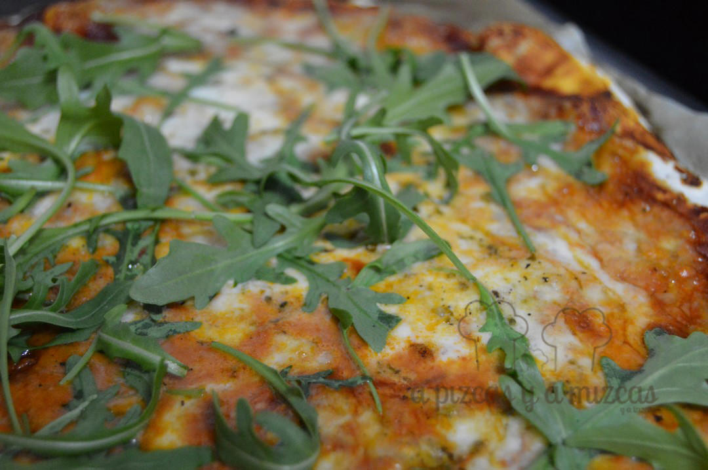
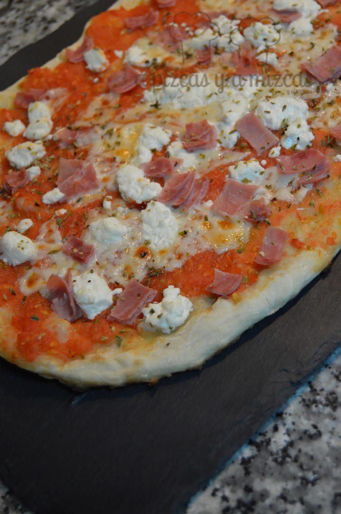
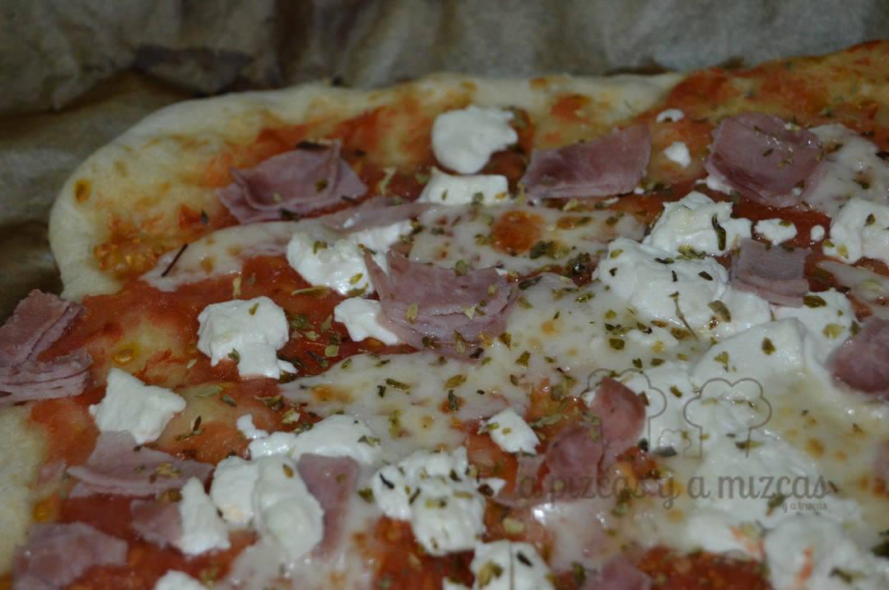

La pizza casera es uno de los platos que más gusta en casa. Es una receta sencilla y sobre todo es un plato muy versátil, en el que puedes combinar un montón de alimentos. Con esta receta de pizza casera el resultado es fantástico, casi, casi como si la hicieras en un horno de piedra. Para saber cómo tienes que hacera, sigue leyendo.

## Ingredientes para la masa pizza casera (saldrán tres masas)

- Harina de trigo (también podéis pobar con harina integral o mezclar ambas): 525 gramos
- 350 ml de agua
- 20 gramos de aceite de oliva virgen extra
- 15 gramos de sal
- 5 gramos de levadura fresca

Es básicamente la receta que ofrece nuestro admirado Ibán Yarza de su pizza sin amasado en el libro "Pan Casero", editado por Larousse y que os recomendamos fervientemente. Nosotros la hemos adaptado ligeramente a base de probar y probar (el libro ya se abre él sólo por la página 94 jeje).

Os contamos cómo la preparamos nosotros. En un bol amplio añadimos la harina y con las manos deshacemos la levadura. Incorporamos la sal y luego, en un hueco, el aceite de oliva y el agua. Con una cuchara damos unas primeras vueltas hasta que la masa de la pizza casera vaya cogiendo fuerza. Luego, con las manos amasamos un par de minutos y dejamos reposar 15 minutos en el bol tapado.

Transcurrido ese tiempo, enharinamos la superficie de trabajo ligeramente, y volcamos la masa y la trabajamos, haciéndola rodar por la mesa y plegándola sobre sí misma varias veces. Luego la hacemos una bola y la cubrimos con el paño para que repose otros 5 minutos.

A continuación, la dividimos en tres porciones más o menos iguales y  las metemos en tupper engrasados con aceite de oliva virgen y dejamos que arranque la fermentación (nosotros las dejamos unos 30-40 mintuos a temperatura ambiente) y luego al frigo, para que la fermentación sea lenta.

En unas horas ya las tenemos lista para estirar. Las que no vayamos a gastar nosotros las congelamos. Para ello metemos el tupperware con  la bola de masa y al congelador. Luego, cuando queramos hacer otra pizza casera, sólo tenemos que sacar el tupper un día antes y dejarlo en el frigo y luego dejarlo a temperatura ambiente una hora antes de estirar la masa.

Para estirar la masa de pizza casera, enharinamos ligeramente la superficie de trabajo, ponemos la bola y la aplastamos. Con las manos vamos presionando y girando la masa. Luego la tomamos entre las dos manos y dejamos que la gravedad la vaya estirando. Si no os sale, siempre podéis usar el rodillo.

La ponemos en un papel de horno y preparamos el relleno.

## Nuestros rellenos preferidos para la pizza casera

1. Tomate, mozzarella y rúcula: Rallamos cuatro tomates de pera maduros y colocamos la pulpa con sal al gusto en un colador sobre un cuenco, para que suelte los jugos. De esta forma, evitaremos la humedad para nuestra pizza casera. Con ayuda de una cuchara repartimos una fina capa de este concentrado de tomate sobre la masa de pizza casera estirada. Por encima, colocamos la mozzarela cortada en láminas no muy finas y, eso sí, muy bien escurrida. Espolvoreamos un poco de pimienta y la metemos al horno. Para hacerla en el horno, es importante lo siguiente, se debe precalentar el horno al máximo durante unos 20 minutos. Colocamos la pizza sobre papel de hornear y la metemos en el horno, sin bandeja, sobre la resistencia del horno. Durante unos 4 minutos. Luego la ponemos en la rejilla bien arriba cerca del grill y la gratinamos tres minutos más. Ahora, solo queda ponerle la rúcula por encima (os aconsejamos cortar primero la pizza).
2. Tomate, queso manchego y champiñones. Elaboramos el tomate rallado como hemos indicado. Repartimos el tomate y por encima las lonchas de queso manchego bien curado. Añadimos tomates cherry partidos por la mitad y champiñones bien escurridos. La horneamos como hemos señalado.
3. Tomate, queso de cabra y jamón de york. Elaboramos el tomate rallado como hemos indicado. Repartimos el tomate y por encima el queso de cabra desmigado. Luego solo falta repartir jamón de york a pedazos. La horneamos como hemos señalado.

¿Y a vosotros? ¿Cuál es la combinación que más os gusta?
