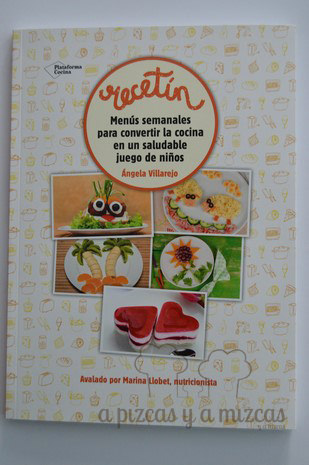
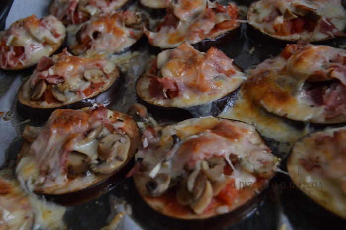
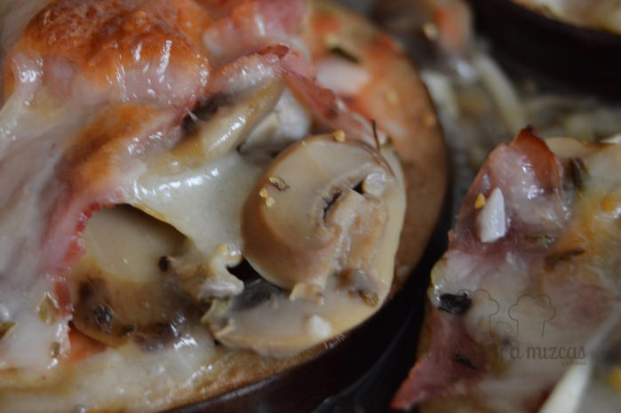

Uno de los regalos de estas navidades fue [Recetín](http://www.recetin.com/ "Recetín") un libro de [Ángela Villarejo](https://twitter.com/avillarejo?lang=es "Twitter Ángela Villarejo") con menús semanales para convertir la cocina en un saludable juego de niños. Aunque tengamos imaginación esto de preparar un menú equilibrado para los peques seres a los papis nos preocupa y la verdad es que en el libro hay un montón de ideas para sorprender a los pequeños y a los mayores. La primera receta que preparamos fue una pizza especial.

A todos lo niños cuando les dices la palabra pizza ya los tienes medio conquistados... en Recetín nos proponen una pero con base de berenjena.

Ahora vamos a preparar la nuestra!

## Ingredientes para preparar la pizza

- dos berenjenas grandes
- tomate frito
- un botecito de champiñones laminados
- 250 gramos de jamón york
- 250 gramos de queso rallado

En una fuente apta para el horno la cubrimos con papel de horno y pondremos encima las rodajas de las berenjenas. A continuación ponemos el tomate frito por encima de cada berenjena, los champiñones laminados, el jamon york troceado y por último el queso rallado.

Introducimos en el horno a 180º durante 25 minutos hasta que la base de la pizza (la berenjena) esté bien echa y que el queso esté bien gratinado.

Y del horno a la mesa. Tenemos que decir que a Trizcas le encantó la pizza-berenjena. Ya hemos incorporado esta forma de prepararla a nuestro recetario.

