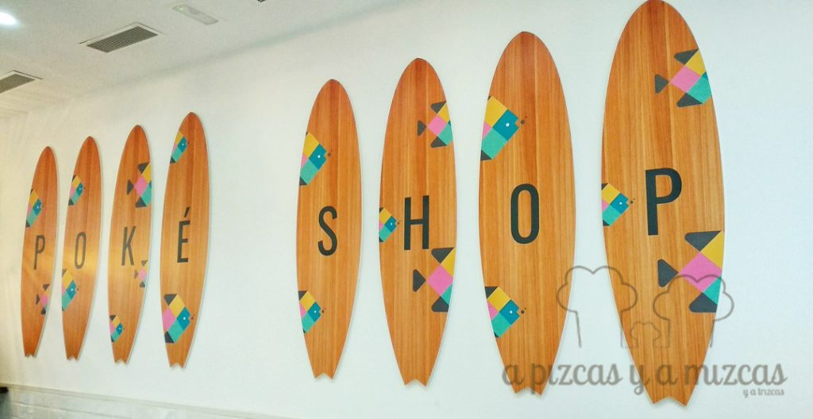
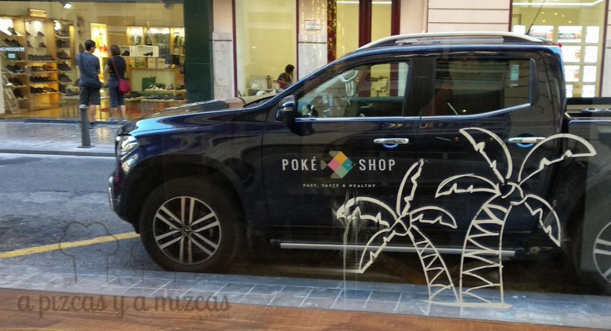
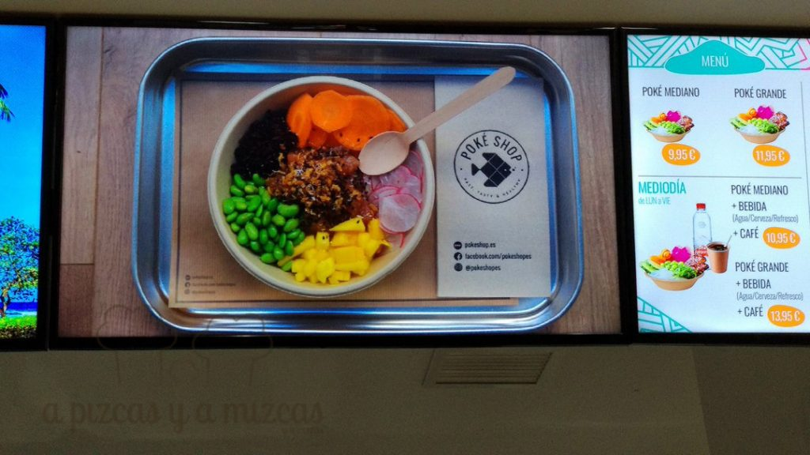
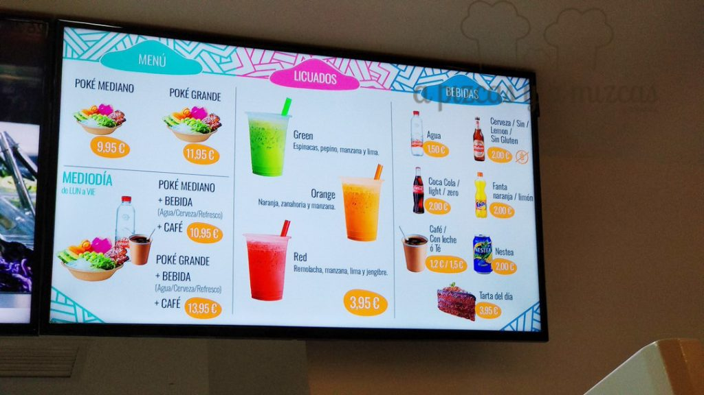
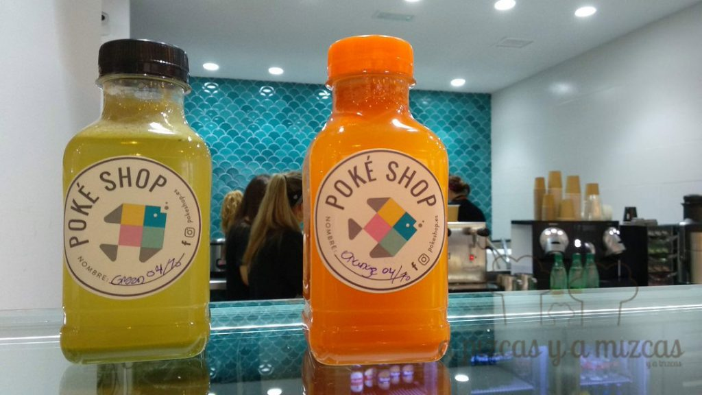
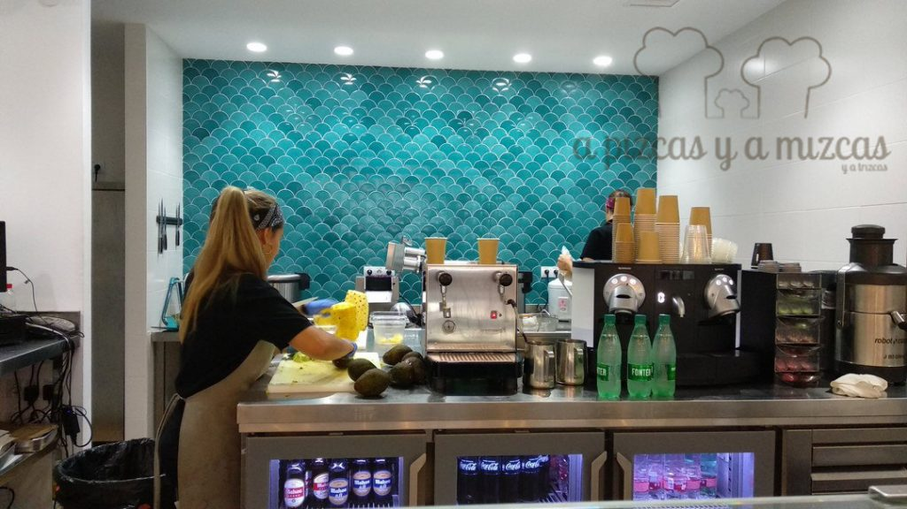
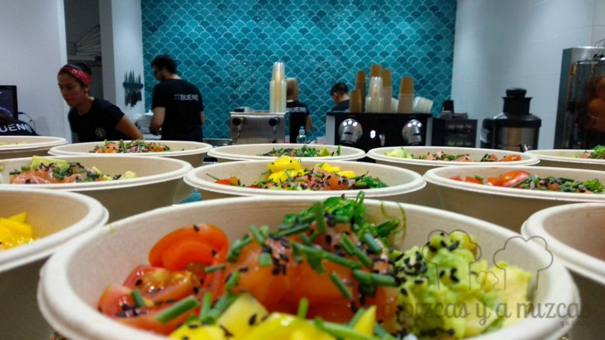
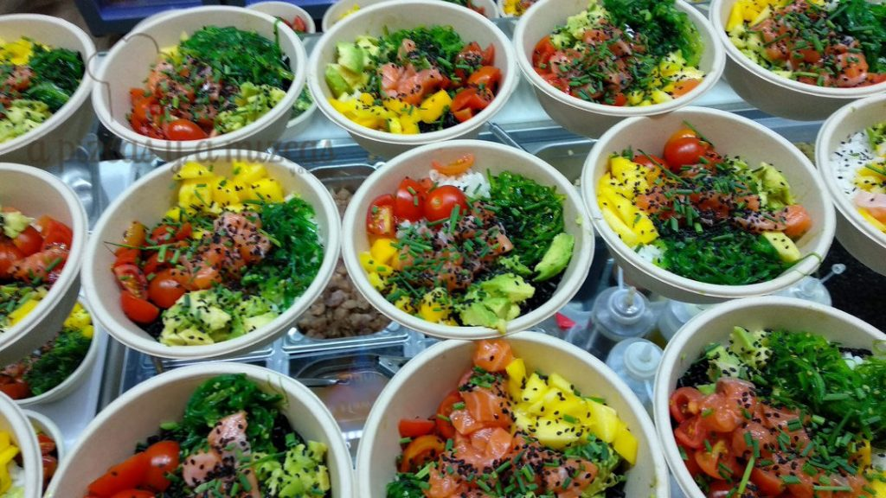
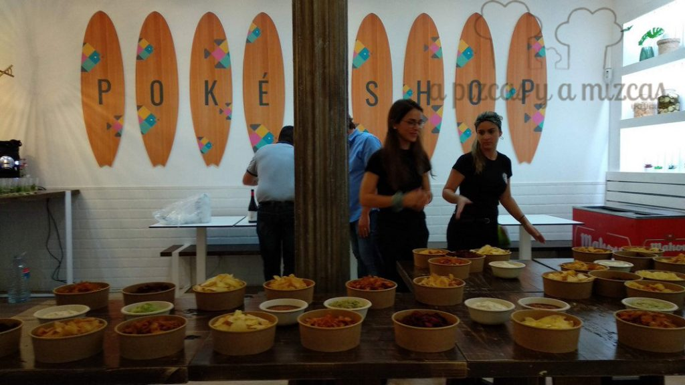
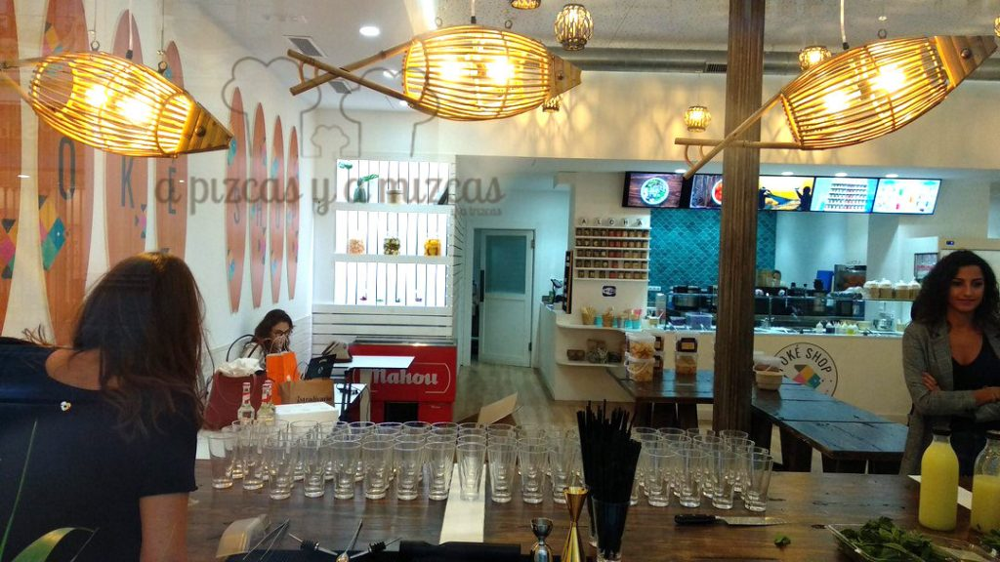

[Poké Shop](http://www.pokeshop.es/) (calle Pérez Pujol, 10) celebró el 4 de octubre la inauguración de su primer local especializado en el último fenómeno global de la gastronomía. El éxito del poké (plato típico de Hawaii a base de arroz y pescado crudo) se debe a su concepto de comida saludable, rápida, asequible y, sobre todo, sabrosa, unos ingredientes con los que el nuevo restaurante pretende iniciar un ambicioso plan de expansión en España.

El proyecto Poké Shop es el resultado de la unión empresarial entre David Campos Jiménez, Lluis Gil Llabata y Vicente Lloret Vicedo. Tras más de un año de trabajo e investigación, estudiando diferentes modelos de negocio en el ámbito de la restauración, los tres emprendedores se propusieron darle una vuelta al concepto de ‘fast good’ con una propuesta propia de poké. Comer rápido ya no es sinónimo de alimentación poco equilibrada ni de sabores insulsos.

Originario de Hawái, poké significa “cortar a pedazos”. Los pescadores de estas islas del Pacífico fueron quienes introdujeron hace más de un siglo esta cocina al sazonar los cortes de sus capturas para servirlos como aperitivo. Con la posterior incorporación de influencias de la gastronomía japonesa y asiática, estos platos que combinan arroz, pescado crudo, salsas y ‘toppings’ se consagraron en la cocina hawaiana a partir de la década de los 70, si bien ha sido en los últimos años cuando han dado el salto internacional.

El restaurante ha realizado una selección exhaustiva de ingredientes de máxima calidad para ofrecer una experiencia única al gusto del consumidor. El cliente tan sólo tiene que coger el bol y elegir diferentes ingredientes para crear su propia receta.

## Un, dos, tres, poké

1. La base del poké son los hidratos de carbono. En Poké Shop existen diferentes tipos de arroz, destacando la variedad venere o arroz negro de China, conocida como el ‘arroz prohibido’ porque su consumo estaba restringido a la familia imperial, así como el arroz blanco, especialmente aliñado por el equipo de cocina, y el arroz integral (DO Valencia). La quinoa y un mezclum selecto de vegetales son las alternativas para la base del bol.
2. El pescado crudo es el ingrediente estrella de este plato hawaiano. El restaurante valenciano ha optado por el salmón y el atún, marinados con diferentes recetas caseras de salsas, y por una versión vegetariana con tofu.
3. El siguiente paso de la elaboración del poké es el ‘topping’, que puede ser a base de ingredientes frescos –como edamame, alga wakame, tomate, mango, cebolla morada con lima o aguacate– o de encurtidos caseros: pepino, piña con lima y menta, zanahoria o nabo daikon.
4. Por último, el toque final o ‘ending’ puede estar compuesto por cebolla frita, furikake, chía o sésamo. Para acompañar a la comida y potenciar todo su sabor, Poké Shop prepara una serie de licuados a base de frutas y verduras.

**Comprometidos con el medio ambiente**

Poké Shop ha decidido apostar por un material ecológico y reciclable en sus instalaciones. Así, el bagazo de caña de azúcar es el material elegido para los bols, tanto para consumir en el local como para llevar, mientras que los cubiertos están fabricados en biomasa de maíz y los palillos, en madera.

El primer poké en el centro de Valencia es un local de 150 metros cuadrados donde el estilo hawaiano y el mediterráneo se fusionan en un ambiente moderno, acogedor y desenfadado. Las tablas de surf comparten espacio con paredes de escamas de pez y mesas de madera de diseños exclusivos.

Todo está preparado y a la vista para que el cliente llegue, elija su combinación de ingredientes y disfrute en pocos minutos de un plato rico y sano. Para celebrar la inauguración del restaurante, en los próximos días dará comienzo una campaña de promociones y descuentos en redes sociales a través de las cuentas de [Facebook](https://www.facebook.com/pokeshopes) e [Instagram](https://www.instagram.com/pokeshopes/).
