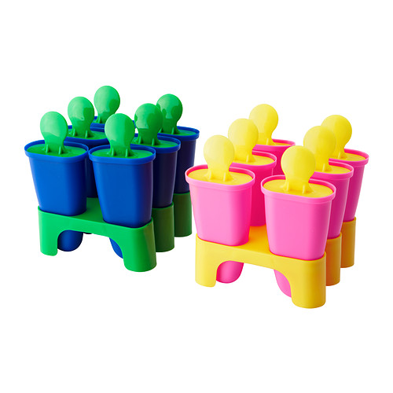
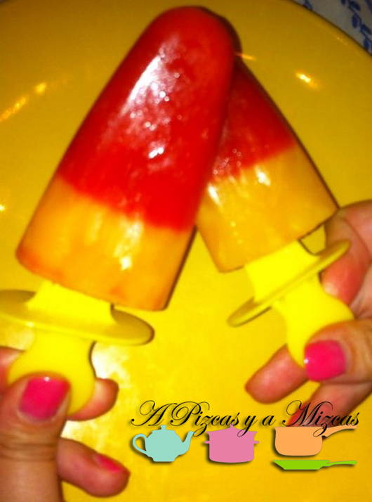
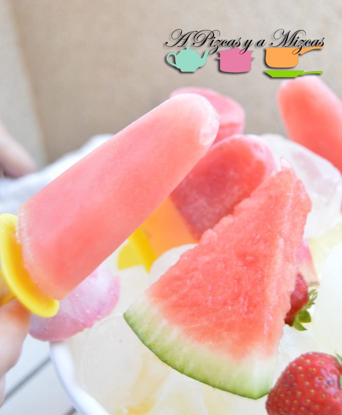
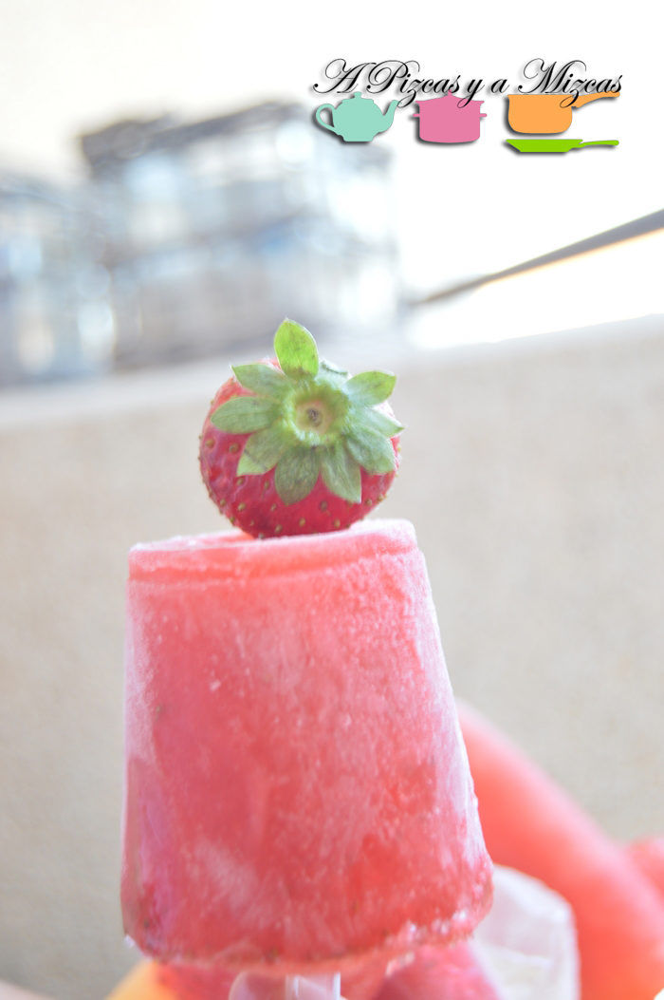
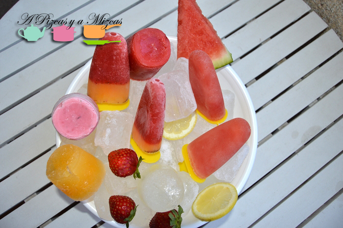

Desde que empezaron los calores en casa de A Pizcas y a Mizcas empezamos a preparar polos helados de frutas. Tenemos que confesar que es el primer año que los preparamos... empezamos preparando de fresa, luego continuamos con fresa y naranja, fresa con yogur, melón, sandía.... Nos encantan y a Trizcas también así que siempre tenemos el segundo cajón del congelador lleno de polos de frutas buenos.

Con la llegada del Ikea a Valencia cargamos con [moldes para helado](http://www.ikea.com/es/es/catalog/products/80208478/ "Moldes para helado de Ikea")... y al rico heladooooo. Como os hemos dicho atreveros con todas las frutas y a mezclar. Esperamos vuestras propuestas!

## Ingredientes para preparar polos helados de frutas

Para los polos helados de fresa y naranja

- 250 gramos de fresas
- 2 naranjas de zumo
- 100 gramos de azúcar
- 200 ml de agua

Para los polos helados de melón o sandía

- 4 cortadas de sandía
- 4 cortadas de melón
- 80 gramos de azúcar
- 200 ml de agua
- 1 sobrecito de azúcar avainillada

Para los polos helados de yogur con fresa

- 1 yogur griego
- 150 gramos de fresas

La forma de prepararlos es muy sencilla. Antes de empezar, mejor que utilicéis fruta madura. Empezamosss!

Para preparar los polos helados de fresa y naranja. Limpiamos las fresas y troceamos y lo batiremos en la batidora hasta que quede finito. Después lo colamos y reservamos.

Ahora prepararemos el almíbar para nuestros polos. En un cazo ponemos el agua y el azúcar y removemos pero sin que llegue a hervir.

Exprimimos el zumo de dos naranjas y colamos para eliminar la pulpa.

A continuación, añadimos la mitad del almíbar a las fresas y la otra mitad a las naranjas. Nosotros hicimos polos helados con dos colores, para conseguirlo tendréis que echar la mitad de fresa en los moldes para helado e introducir en el congelador dos o tres horas (no dejar que se congele del todo para poder introducir después el palo del polo) y luego añadiremos la mezcla del zumo de las naranjas y vuelta al congelador. Dejaremos 4 0 5 horas y listo para disfrutar de vuestro polo de fresa y naranja.

Ahora preparamos los polos helados de sandía o melón. Troceamos el melón o sandía y quitamos la parte verde. Introducimos a la batidora y batimos bien. Reservamos.

Mientras preparamos el almíbar en un cazo. Añadimos el agua, azúcar (si la fruta está muy dulce no será necesario) y el azúcar avainillado y dejamos en el fuego sin que llegue a hervir.

Agregamos el almíbar a la fruta y lo pondremos en los moldes para helado e introducimos en el congelador.

Por último preparamos los polos helados de fresa y yogur. Limpiamos y troceamos las fresas, trituramos, colamos y añadimos el yogur griego. Removemos bien y lo echamos a los moldes para helado. Al congelador, esperamos 4 o 5 horas y disfrutar!

Cómo os hemos explicado podéis probar con cualquier fruta... nosotros ya os iremos mostrando nuevas combinaciones...

