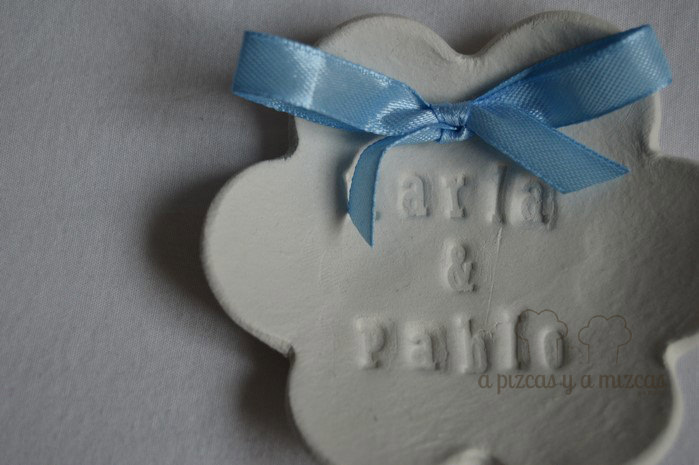
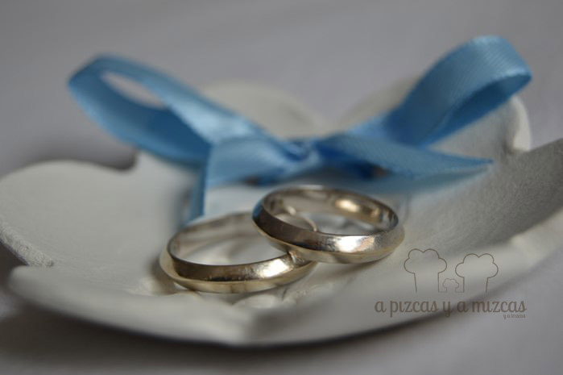
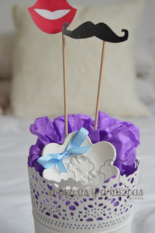

Dentro de unos meses se casarán unos amigos y pensamos que era una buena idea regalarles un porta alianzas para su gran día hecho con nuestras manitas. Y ahora que hemos cogido el truquillo a la pasta de modelar lo preparamos en un periquete.

Nos hace muchísima ilusión poder formar parte de ese día tan especial... hace años vimos cómo nació este amor y cómo ha ido evolucionando hasta el día de hoy que no nos imaginamos a Pablo sin Karla ni a ella sin él. Este es uno de esos amores que unen oceános y acercan culturas... y por eso nos encanta! Enhorabuena chicos y vivan los novios!!

Además esta semana de San Valentín es la más idonéa para entregar este regalo... os dejamos esta idea por si queréis sorprender a alguien especial... Siempre es buen momento para celebrar el amor! Uy... cómo estamos...viva el amor! ja ja ja ja

La forma de preparar el porta alianzas es muy similar a cómo preparamos las [plaquitas para las puertas de la habitación de los peques y el vacía bosillos](/regalos-con-pasta-para-modelar/ "Regalitos con pasta para modelar")

## Materiales necesarios para preparar el porta alianzas

- un trocito de pasta para modelar
- Sellos abecedario, nosotros utilizamos [estos](http://www.mycraftybirds.com/sellos/436-stamp-clear-a6-artis-decor-abc-1.html "Sellos abecedarios de My Crafty Birds") de [My Crafty Birds](http://www.mycraftybirds.com/blog/ "My Crafty Birds, tienda creativa")
- Rodillo
- Cuchillo
- Corta pastas
- Lazo azul

Ya tenemos todo lo necesario... vamos al lío! Amasamos la pasta para modelar, hacemos una bola y con la ayuda de un rodillo (de los de amasar pan) y extendemos hasta que tenga el grosor deseado. Luego utilizamos un cortapastas pequeño en forma de flor.

Ahora con los sellos del abecedario ponemos los nombres de Karla & Pablo centrados en nuestra "flor". Y con la ayuda de una pajita hacemos dos agujeritos para poner después el lacito para poder poner las alianzas. No quitaremos las pajitas hasta que esté bien seco.

Dejamos secar durante dos días. Y lijaremos para que quede liso y suave y con los bordes redondeados. Para finalizar pasaremos el lacito azul y haremos un lazo bonito. Y nuestro porta alianzas ya lo tenemos listo para nuestros amigos.

> Y recordad que si queréis nos podéis encargar a nosotros que os preparemos el porta alianzas con la inscripción que deseéis. Sólo tenéis que contactar con nosotros a través de [nuestro formulario de contacto](/contacto/ "Contacto").

