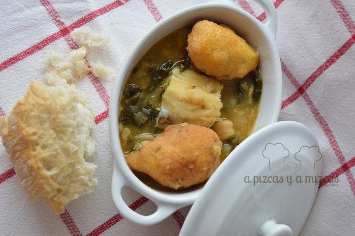
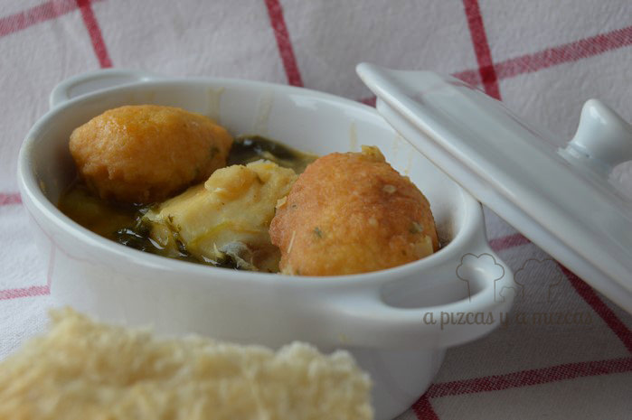

Os hemos enseñado en varias ocasiones fotos del potaje que hace la iaia Mizcas...pero al final nos hemos animado a prepararlo. Hemos intentado que nos quede igual que a ella... a nuestro juicio estaba buenísimo, pero tendremos que invitarla para que pruebe nuestro potaje con bacalao para saber el veredicto.... je je je

Según nos ha contado la iaia Mizcas la receta ha pasado de una generación a otra... y estas recetas se tienen que conservar!

## Ingredientes para preparar el potaje con  bacalao (para seis personas)

- 500 gramos de garbanzos
- 300 gramos de espinacas
- 300 gramos de bacalao
- media cebolla
- una hoja de laurel
- media cabeza de ajos
- un diente de ajo
- una cucharada de pimentón
- perejil
- dos tomates rallados
- tres o cuatro patatas
- tres huevos batidos

Poner la víspera los garbanzos en remojo con una pizca de bicarbonato y sal.

")

El bacalao lo pondremos en agua fría troceado en la nevera durante 48 horas

Para hacer el potaje, se lavan bien los garbanzos y se ponen en la olla exprés con agua fría, con la media cabeza de ajos entera, la hoja de laurel, la patata cortada a pedazos y añadimos el bacalao troceado. Cuando empiece a tirar el vapor la olla expres los tendremos de 20 a 30 minutos.

Se lavan las espinacas, quitándoles los tallos, y se echan a cocer en una olla a parte, unos ocho minutos. Se escurren y las añadiremos a los garbanzos.

En una sartén calentamos aceite y se fríe media cebolla pelada y muy picada,un ajo laminado sin que tome demasiado color; se añade el tomate natural rallado. Se sacan dos cucharadas soperas de los garbanzos cocidos y la patata. Lo chafamos con un tenedor y lo incorporamos al refrito. De esta forma el caldito nos quedará un poco más espeso. Añadimos un poquito  de pimentón

Añadimos el refrito a la olla . Lo dejamos cocer durante 15 minutos a fuego lento.

")

Se pueden añadir "peyuelas" (así es como lo llama la iaia Mizcas), se hacen con tres huevos batidos, miga de pan desmenuzada (de aproximadamente una barra de pan, podeís utilizar el pan del día anterior), un diente de ajo y dos remitas de perejil muy picadito.  Con estos ingredientes se hace una masa, y se formarán una especie de albóndigas. Cogemos la cantidad que quepa en una cuchara sopera y las freíremos, repetiremos hasta que se agote la masa.

")

Incorporaremos las peyuelas en los últimos minutos de cocción a fuego lento.

")

A disfrutar del potaje con bacalao.

