Uno de los mayores retos que tenemos cada año es preparar la fiesta de cumpleaños de Trizcas. Hay que pensar la temática, qué vamos a servir y cómo lo vamos a presentar. Hasta ahora sólo habíamos preparado así sus aniversarios ([primer cumpleaños](/fiesta-de-primer-cumpleanos/ "Primer cumpleaños de Trizcas") y [segundo cumpleaños](/fiesta-de-cumpleanos-de-indios/ "Segundo cumpleaños Trizcas")), pero en esta ocasión las viandas de A Pizcas y a Mizcas salieron del hogar, pues nuestra colaboradora y "ojeadora" de locales de moda  Mrs. Green nos pidió que le organizáramos su fiesta de cumpleaños este verano, pues cumplía 30 años y quería sorprender a sus invitados.

Nos indicó que quería algo muy sencillo, donde predominaran los tonos rosas y blancos en la decoración y que la comida fuera como un cóctel nocturno informal, para tener que limpiar lo mínimo y poder disfrutar todos de la fiesta de cumpleaños. Rápidamente nos pusimos manos a la obra y nuestras cabezas empezaron a imaginar menús, decoraciones, modos en los que presentar las recetas para que fueran cómodas de comer y que, una vez finalizada la fiesta, su casa quedara rápidamente recogida.

En un par de reuniones concretamos con Mrs. Green el menú (no ofreció mucha resistencia, jejeje). Y sólo quedaba ponerse los mandiles y echar una mañana y media cocinando y un rato más para montar la fiesta de cumpleaños en el apartamento de Mr. Brown y Mrs. Green.

## El menú de una fiesta de cumpleaños muy especial

- [Pico de gallo](/pico-de-gallo/ "Pico de gallo")

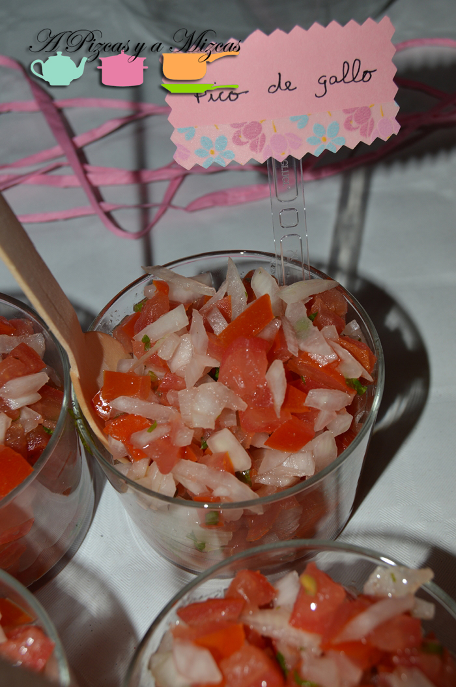

- [Guacamole](/guacamole/ "Guacamole")

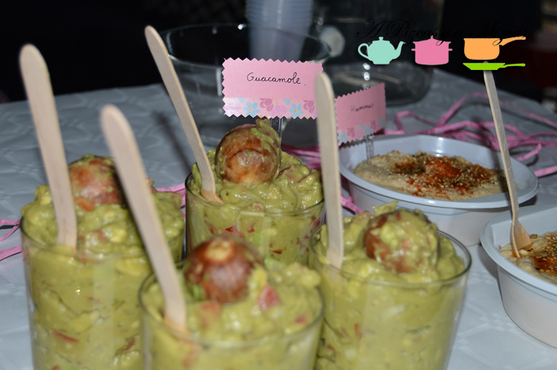

- [Fingers de pollo especiado](/fingers-de-pollo-al-curry-con-hummus/ "Fingers de pollo especiado")

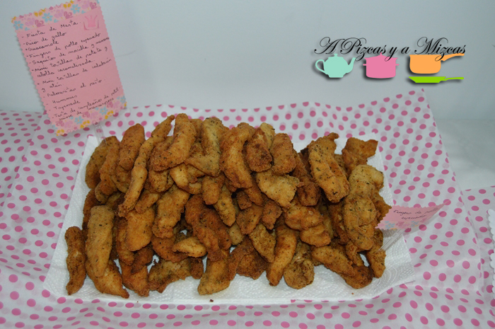

- [Saquitos de morcilla y manzana](/paquetitos-de-pasta-brick/ "Saquitos de morcilla y manzana")

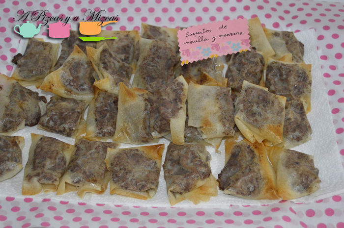

- Minitortillas de patata y cebolla caramelizada; y de calabacín y atún

- [Palmeritas de pesto](/palmeritas-al-pesto/ "Palmeritas al pesto")

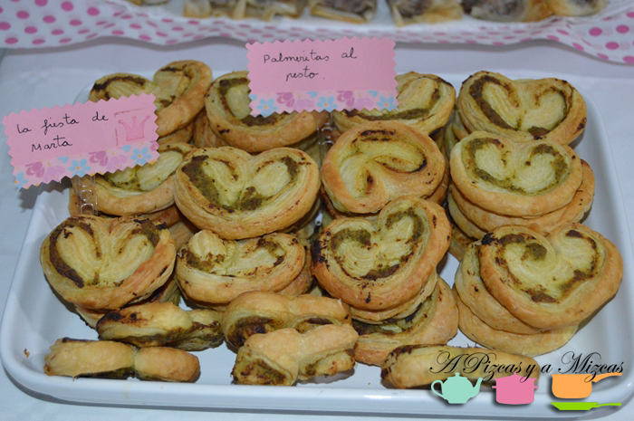

- [Hummus](/una-cena-desde-la-otra-orilla-del-mediterraneo-kebab-y-falafel-caseros/ "Hummus")

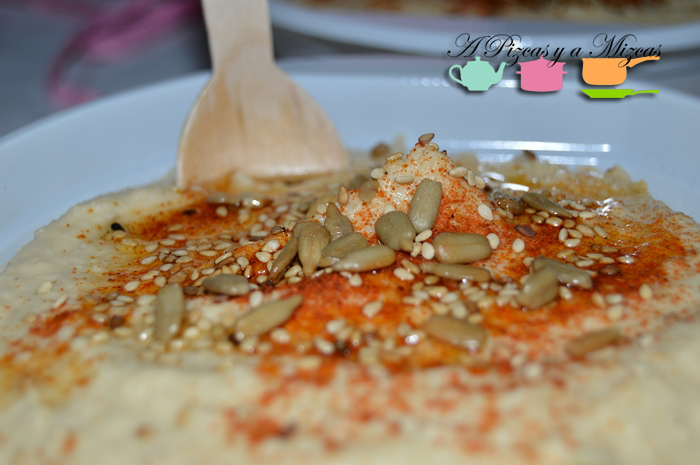

- Tapenade

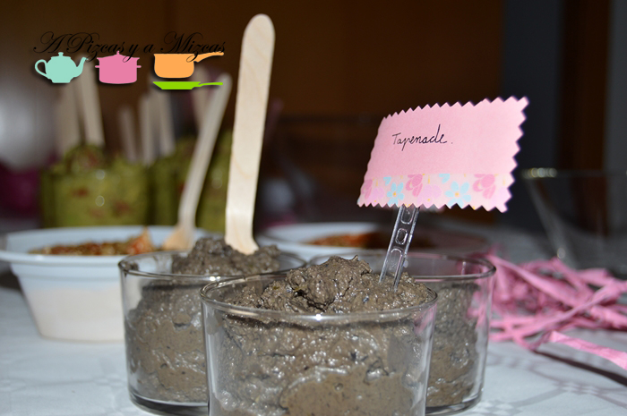

- [Sangría blanca](/sangria-blanca/ "Sangría blanca") para beber

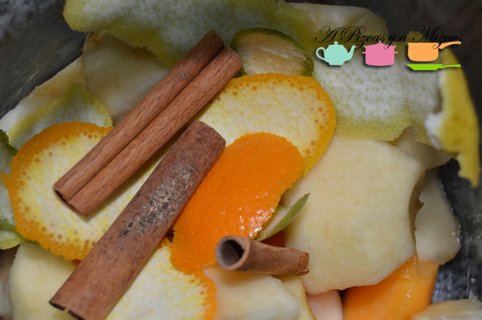

- Tarta fondant de petit suise de mascarpone

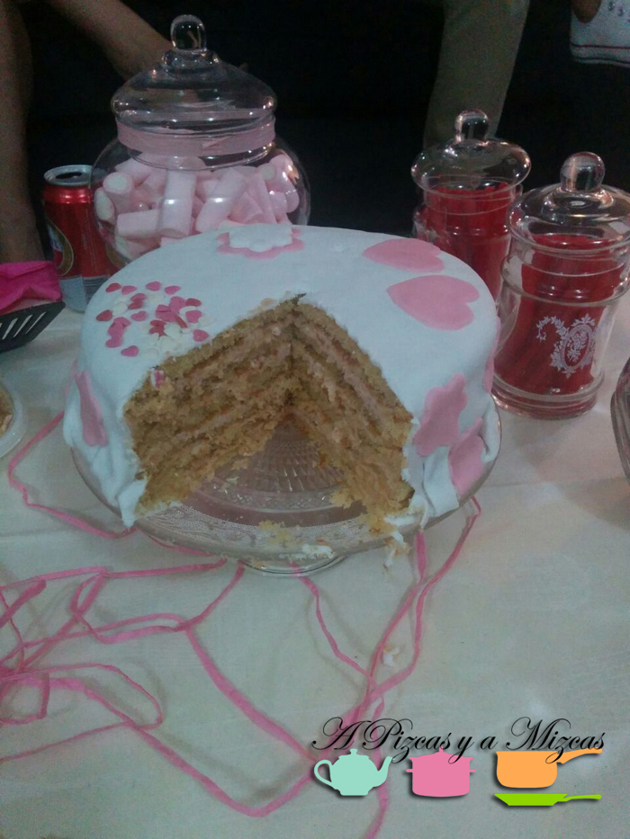

El día convenido, Pizcas y Mizcas se presentaron en casa de Mrs. Green y Mr. Brown y en una hora dejamos su salón "tintado" de rosa y blanco y con toda la comida a la espera de que llegaran los invitados a la fiesta de cumpleaños.

Planteamos la comida en tres mesas. La primera de ella la planteamos como una mesa para dippear con las salsas. Así, colocamos aquí el pico de gallo y el guacamole, acompañados de nachos mexicanos; y el hummus de garbanzos y la tapenade de aceitunas negras y anchoas con crackers y panecillos. En esta primera mesa, los invitados también encontraban los cubiertos y servilletas necesarios para disfrutar de la fiesta. Así como la jarra con nuestra refrescante sangría blanca.

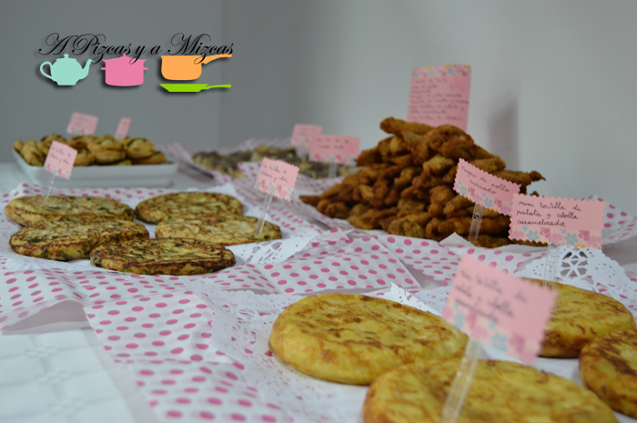

A continuación, en una segunda mesa colocamos la parte más salada de la fiesta de cumpleaños, con las palmeritas de pesto, las tortillitas y los fingers de pollo especiado.

Por último había una mesa dulce, presidida por nuestra tarta fondant de petit suisse de mascarpone (próximamente os damos la receta) y las golosinas que preparó una amiga de Mrs. Green con mucho gusto.

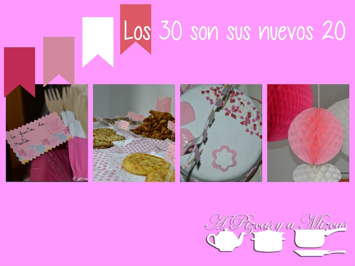

La fiesta de cumpleaños fue todo un éxito y nuestro primer "catering" fuera del hogar. Nos encantó la experiencia y estamos dispuestos a repetir.
