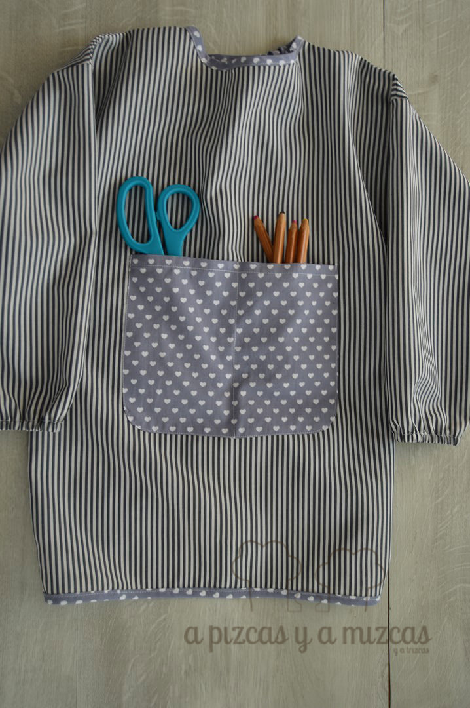
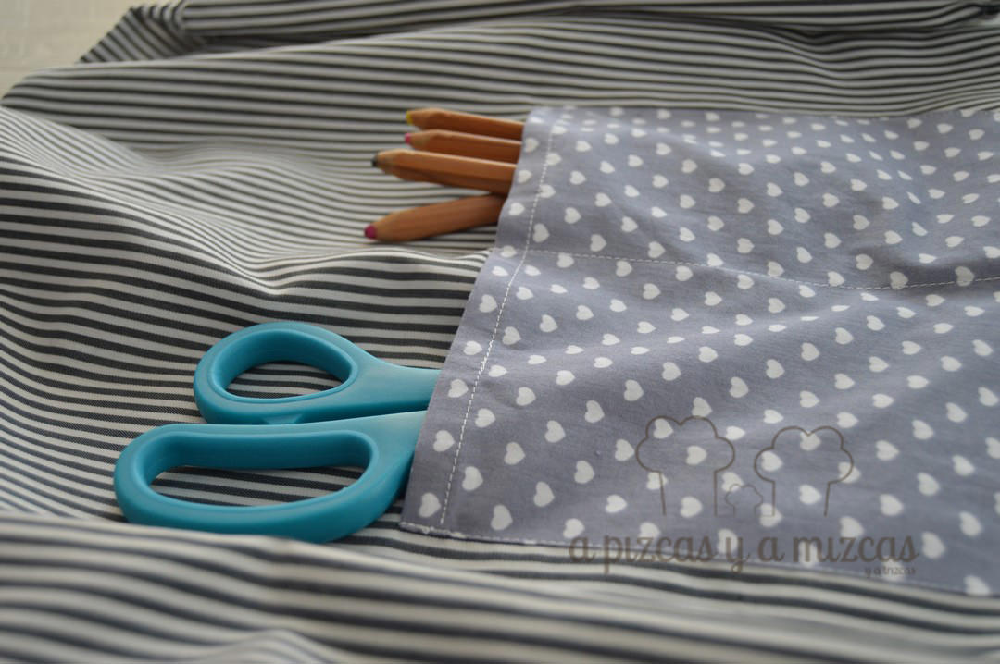
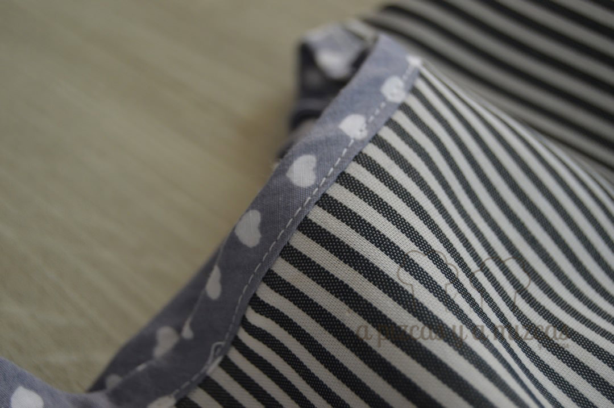
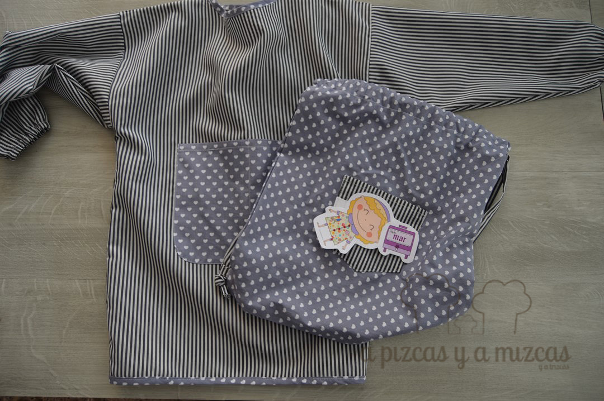
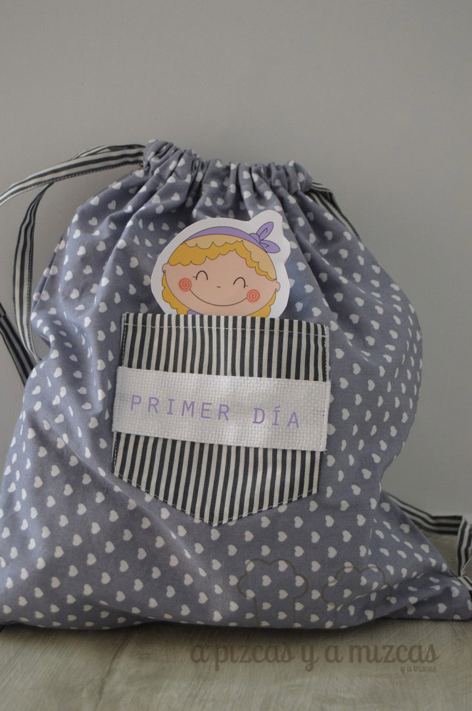

Hoy es el primer día de cole de Trizcas... y directamente al cole de los mayores! Qué rápido pasa el tiempo... parecía que esta etapa no iba a llegar y hoy vamos de estreno al cole: mochila, libros, material escolar y muchas ganas. Y así hemos estado esta última semana: preparando el primer día de cole de Trizcas

En casa estamos todos muy emocionados. Empezar el cole, en cierta forma, representa el fín de una etapa y el principio de otra aún más emocionante... Para Trizcas estar rodeada de un montón de amigos y amigas y para nosotros aprender cada día junto a ella.

## Preparando el pimer día de cole

En el cole nos indicaron la relación de cosas que debíamos llevar para el primer día y entre todas ellas os contamos las que más nos ha gustado preparar.

Tenemos que  llevar un babero para los días que jueguen con la pintura de dedos, acuarelas o plastelina. Y otra vez más pedimos recurrimos a la iaia Mizcas y con la ayuda de su máquina mágica le hizo el baby más bonito.

El babero ya está listo!

Y para llevar la muda de la ropa cosimos a juego un saquito, que a nosotros nos ha encantado cómo ha quedado. ¿Qué os parece a vosotros?

Y como ya sabréis, en el cole todo lo que llevas tiene que ir con el nombre del niño/a marcado y nosotros hemos utilizado los muñequitos de [Pata de Pirata](http://patadepirata.blogspot.com.es/) para que Trizcas pueda identificar facilmente su mochila. Si no los conocéis, ya estáis tardando en pasar por su página... os va a encantar!

Saquito para la muda...también listo!

Dejamos los nervios a un lado... y empezamos una nueva etapa en la vida de a Pizcas, Mizcas y Trizcas.

Si os ha gustado o queréis preguntarnos o contarnos cualquier cosa podeís poneros en contacto con nosotros a través de nuestro [formulario de contacto.](/contacto/)

Ya sabéis que nos encanta que nos conteís cositas! :)
