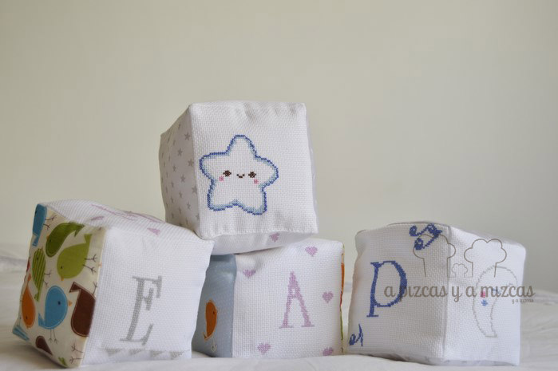

Hoy estamos juguetones... y nos ha dado por pensar cúal era nuestro primer juguete, el que recordamos con más cariño. Y casi con esa idea nació este regalo hecho con nuestras manitas. Mi primer juguete: un rompecabezas para bebé.El juguete que más recuerda Mizcas es su "pelón", recuerdo que lo llevaba a todas partes debajo del brazo y pesaba lo suyo... ja ja ja. Tanto lo quería que hasta lo comparaba con mi hermano.... ji ji ji... pobrecico my brother, lo que le tocó aguantar....

El juguete de Pizcas sin dudarlo son los "Gi-Joe"... sólo con mencionarlos se le ha iluminado la cara..."la de horas que me pasaba con esos muñequitos".... ji ji ji.... historietas de papá Pizcas.... ja ja ja

Si tenemos que pensar el juguete favorito de Trizcas... es un poco dificil...porque va cambiando según la semana. Pero si tiene algunos favoritos: Valentín "un dragón grande y valiente", Pinkie Pie o la Doctora Juguetes

Esta vez con la ayuda de la iaia Mizcas hicimos cuatro cubos y en cada una de las caras bordamos motivos distintos. Por un lado bordamos las letras que forman la palabra mamá, papá y bebé. En algunas de las caras restantes bordé a punto de cruz una luna, un sol, unas nubes sonríentes y una estrella. En el resto de caras de los cubos pusimos retalitos de las telas estampadas con estrellas en fondo blanco y gris, una tela de pajarillos de colores y una tela azúl con los pajarillos que más nos gustaron.

Los cubos ya están preparados para jugar

Mamá no se podrá resistir... ji ji

Sólo queremos que sea uno de los juguetes favoritos de Querubín y que guarde un buen de recuerdo de su primer juguete: un rompecabezas para bebé ya que lo hemos hecho con mucho cariño.

¿Hacemos una torre?

Luna, lunera...

Ya se que os lo decimos siempre pero si os gusta lo que hacemos y queréis unos cubos tan chulis como estos o tenéis otra idea o queréis preguntarnos o contarnos cualquier cosa podéis poneros en contacto con nosotros a través de nuestro [formulario de contacto](/contacto/ "Contacto A Pizcas y a Mizcas"). No encanta que nos contéis cosas... no seáis timidos, que estáis en vuestra casa :)
