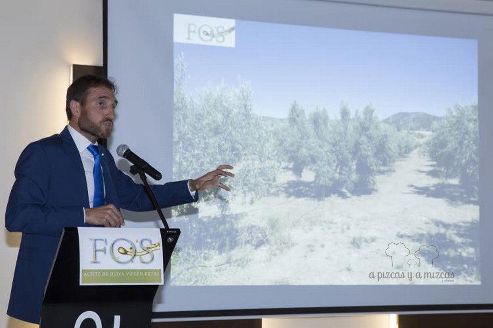
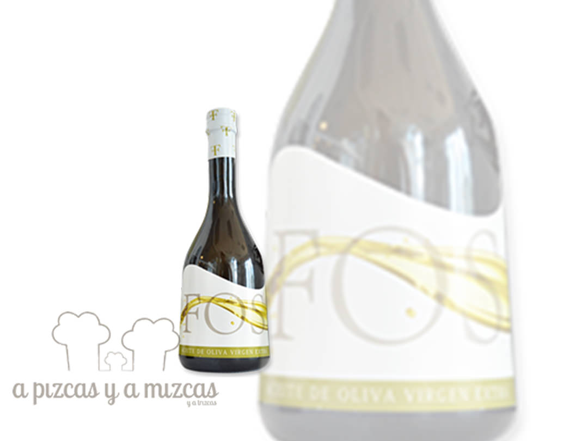

Acudir a [Casa Montaña](http://www.emilianobodega.com/), en el corazón del barrio de El Cabanyal, en Valencia es siempre un placer. Ir allí para conocer un nuevo aceite de oliva virgen extra (AOVE) era una oportunidad que no podíamos dejar pasar. El 22 de junio Bodegas Fos, propiedad del empresario naviero Vicente Boluda, nos invitó a la presentación de su nuevo aceite de oliva virgen extra de alta gama.

El aceite de oliva virgen extra Fos está elaborado con aceitunas seleccionadas de la variedad Serrana de Espadán, en fincas de varias localidades del Alto Palancia (Castellón). Olivos centenarios cuya producción y la posterior elaboración del aceite ha sido encargada a Miguel Abad, uno de los mayores expertos en elaiotecnia de España. Y además, uno de los más apasionados defensores de la cultura del aceite de oliva que hemos conocido nunca.

Para la elaboración del AOVE Fos se han seleccionado rigurosamente los frutos, en su punto óptimo de maduración (segunda quincena de octubre, la fecha viene indicada en cada botella, cosa que muy pocos elaboradres de aceite de oliva virgen extra se atreven a hacer), en parcelas ubicadas en Navajas, Altura y Jérica. Se recolectan por medios mecánicos y manuales y se obtiene mediante extracción en frío (sistema continuo de dos fases, y temperatura siempre por debajo de los 20º).

Tal y como explicó Abad, el control de la temperatura es importante y debe hacerse en todo el proceso, desde la recogida, para garantizar que los aromas del fruto acaben lo más íntegros posible en el aceite final. El resultado es un producto calidad superior, clasificado como frutado medio complejo. De un color verde intenso, el AOVE Fos presenta en nariz aroma a ceituna verde, manzana verde, almendras y tomate maduro. En boca es muy elegante, ligeramente amargo y picante, con sabor a almendras dulces, tomate, hierba recién cortada y plátano verde.

El aceite de oliva virgen extra Fos se presenta en dos formatos de envase con capacidades de 250 ml y 500 ml., con un cuidadoso etiquetado, que da detallada información de las características del producto, lo que facilita su consumo. El formato recuerda ligeramente al de una botella de cava.

En Casa Montaña nos atendieron, como siempre, de maravilla. Un local donde el producto es el rey y el servicio está siempre a la altura. El menú que disfrutamos fue:

- Jamón ibérico
- Habas condimentadas
- Patatas bravas de secano
- Ensalada de tomate de temporada
- Gilda
- Salmorejo
- Clòtxinas valencianas
- Pimiento del piquillo relleno
- Montadito de brandada de bacalao
- Solomillo de buey trinchado con ajos tiernos
- Trufa de chocolate artesano
- Pastel ruso
- Gominola de AOVE Fos

Todo ello acompañado con vinos de [Boodegas Fos](http://www.bodegasfos.com/), elaborados en el corazón de La Rioja Alavesa. Para la ocasión se seleccionaron Fos Blanco (100% Viura) y el tinto Fos Reserva (85% Tempranillo, 15% Graciano).

Para más información sobre el aceite de oliva virgen extra Fos, podéis consultar [Aceites Fos](http://www.aceitesfos.com/index.html)
