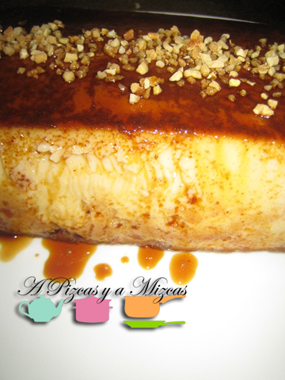
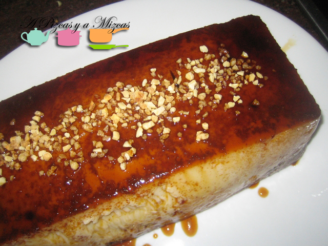
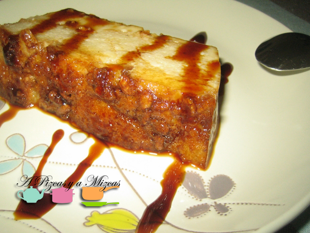

El domingo pasado nos quedamos a comer en casita y aprovechamos para cocinar. Teníamos claro el menú pero nos olvidamos del postre... así que tuvimos que improvisar a última hora. Con los ingredientes que teníamos por la cocina nos inventamos un puding de magdalenas que nos quedó buenísimo.

Así que ahí va la receta por si un día se os presentan invitados inesperados... en un periquete un postre muy apañado

## Ingredientes para preparar un puding de magdalenas

- 4 huevos
- 1/2 litro de leche desnatada (nosotros utilizamos desnatada)
- 4 magdalenas valencianas
- 1 ramita de canela
- cáscara de un limón pequeño
- 150 gramos de azúcar
- canela en polvo
- caramelo líquido
- crocanti de almendras

En un cazo ponemos la leche, el azúcar, la rama de canela y la cáscara del limón calentamos un poco sin que llegue a hervir. Reservamos y dejamos que se enfríe un poco. Retiramos la cáscara del limón y el palito de canela

Mientras en un recipiente apto para horno pondremos el caramelo líquido por toda la superficie del recipiente. A continuación troceamos las magdalenas y los vamos poniendo en el recipiente. Podeís utilizar pan, bizc

Batimos los huevos y los incorporamos a la leche que teníamos enfriando. Añadimos un poco de canela en polvo y vertemos en el recipiente para el horno donde tenemos los trozos de magdalenas.

Precalentaremos el horno a 250º. Introducimos el recipiente (en nuestro caso utilizamos un molde de silicona) en otra fuente apta para el horno para prepararlo al baño maría durante aproximadamente 40 minutos a 200º.  Transcurrido ese tiempo comprobar con un cuchillo si está cuajado.

Dejar enfriar en la nevera, con un par de horas será suficiente. Aunque si lo dejáis de un día para otro estará mucho mejor.

A la hora de servir el puding de magdalenas, desmoldamos con cuidado y ponemos por encima crocanti de almendras.

A disfrutar de este postre de toda la vida!
