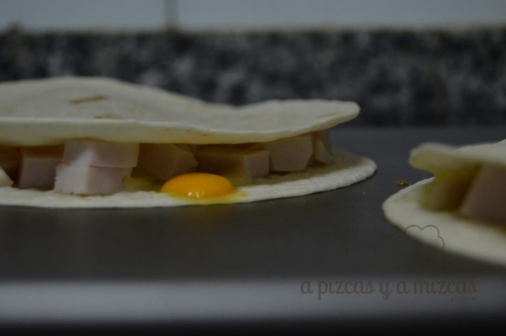
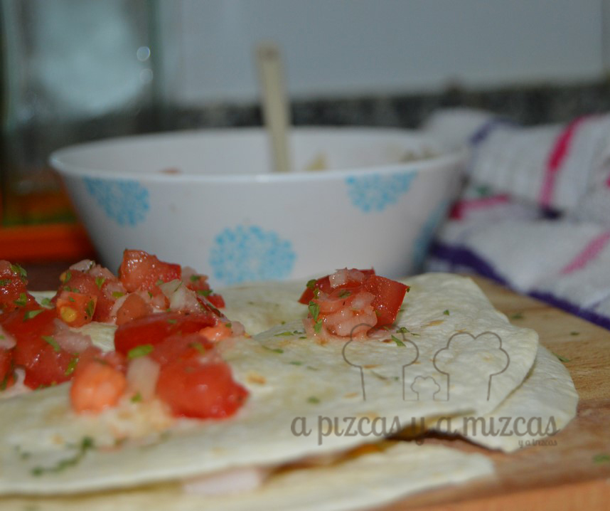
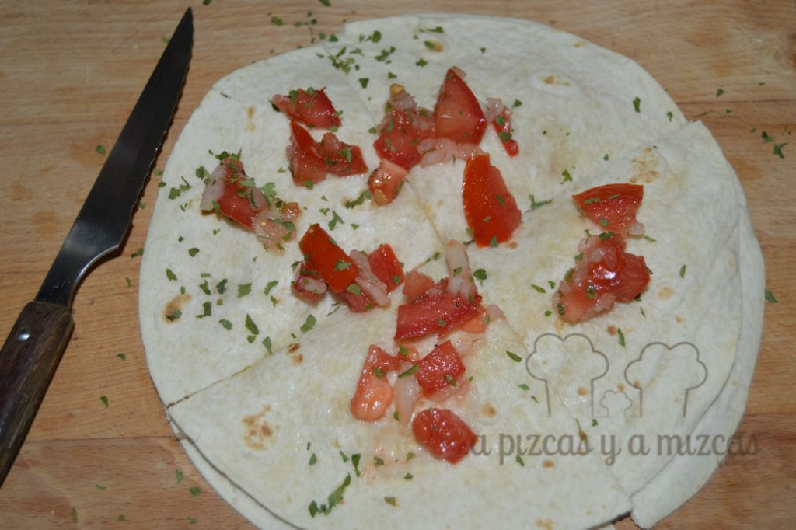
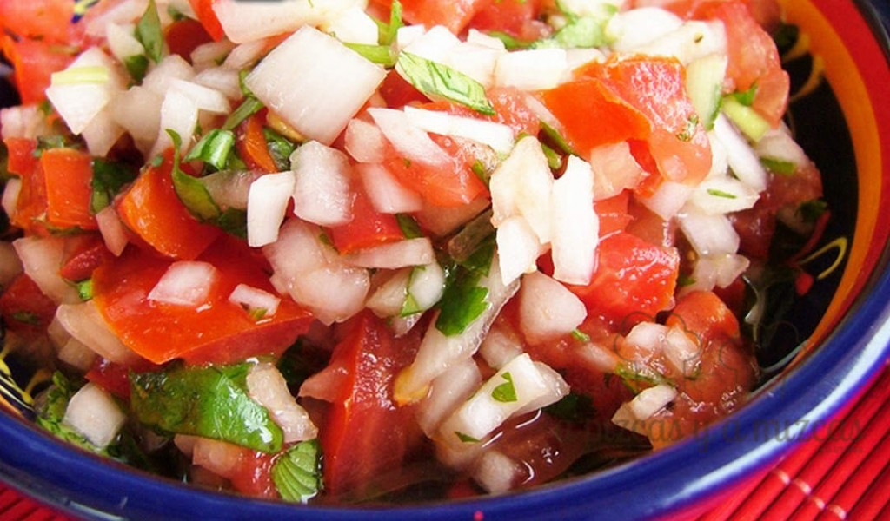
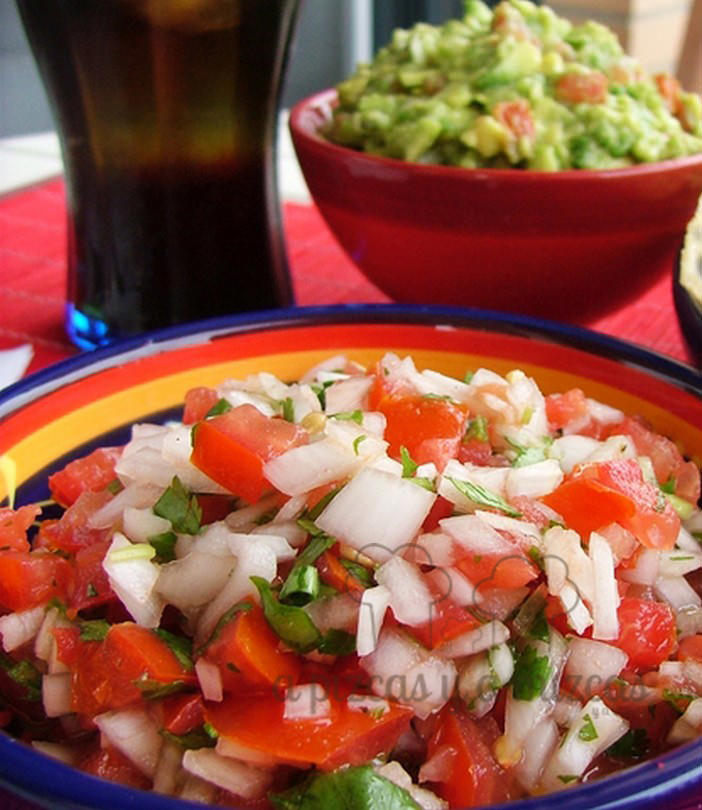

Llegó el viernes! y toca receta express... hoy os dejamos nuestra forma de preparar la quesadilla de pechuga de pavo y queso.

La quesadilla es una tortilla de maíz rellena de queso y otros ingredientes. La podéis rellenar de lo que queráis. Nosotros esta vez, utilizamos para el relleno taquitos de pechuga de pavo y mezcla de quesos.

## Ingredientes para preparar la quesadilla de pechuga de pavo y queso (para dos quesadillas)

- 4 tortillas de maíz
- mezcla de quesos
- taquitos de pechuga de pavo

En primer lugar, precalentamos el horno a 200ºC.

En una bandeja apta para el horno, colocaremos papel de horno (papel sulfurizado) y las tortillas de maíz. Agregamos la mezcla de quesos y los taquitos de pechuga de pavo. Colocamos encima otras dos tortillas de maíz.

Lo tendremos en el horno uno 5 minutos apróximadamente (o hasta que veamos que esté dorado).

Para acompañar la quesadilla podéis preparar un [pico de gallo](/pico-de-gallo/) rápido. Un tomate cortado a daditos, una cebolla picada, perejil y un chorrito de limón. Aceite y sal.

 Pico de gallo

Y para nota... no puede faltar el [guacamole](/guacamole/)... Y ya tenéis la cena mexicana preparada! Fácil, eh?

 Guacamole
