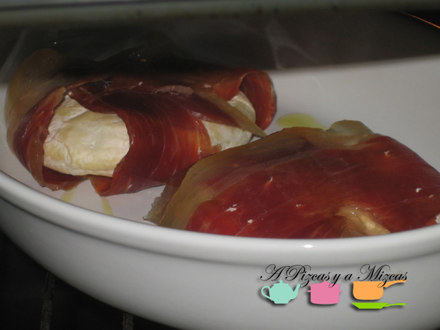

Hace poco os contamos en A Pizcas y A Mizcas que de nuestra escapada a Milán nos trajimos varios ejemplares de queso tomino. Se trata de un queso de pasta blanda y corteza comestible, típico del Piemonte italiano. Su formato más habitual es el de piezas de unos 12 centímetros de diámetro y de un centímetro de alto. Se puede tomar frío, pero allí es típico tomarlo caliente, si es a la brasa, mejor. Hoy os proponemos una versión españolizada de una receta que suelen preparar mucho en esta zona del norte de Italia.

## Queso tomino envuelto en jamón serrano

- Una pieza de queso tomino por comensal
- Dos lonchas bien finas de jamón serrano por comensal

Como os hemos comentado, el queso tomino se suele tomar caliente. Allí lo suelen preparar a la brasa, pero también puede hacerse en la plancha o en el horno. Eso sí, es importante cubrir el queso con papel de aluminio para que el calor no le sea muy agresivo. En ocasiones, los italianos preparan el queso tomino envuelto en speck (jamón ahumado) mucho más sabroso que el papel de aluminio, dónde va a parar. Nosotros teníamos un buen jamón en casa, así que decidimos practicar el arte de la loncha larga y españolizar esta receta.

Precalentamos el horno al máximo durante  8 minutos aproximadamente.

Lo primero es cortar las lonchas de jamón. Han de ser largas, pues habrán de envolver el queso tomino; y finas, para que queden crujientes.

Tomamos una loncha de jamón y la extendemos. Cogemos otra y la colocamos en forma de cruz.. En el centro del jamón colocamos la pieza de queso tomino, doblamos las lonchas de jamón, de modo que todo el tomino quede cubierto y lo colocamos en un recipiente para horno, con cuidado de que no se abra el "paquete".

Hacemos lo mismo con todas las piezas que necesitemos.

Lo metemos en el horno durante 6 minutos, aproximadamente. Veréis como el jamón queda crujiente y el queso fundente. Con un cuchillo podéis comprobar si el tomino está ya fundido. Si consideráis que todavía no está suficiente, dejadlo un minuto más.

Hay que comerlo caliente y está buenísimo.

