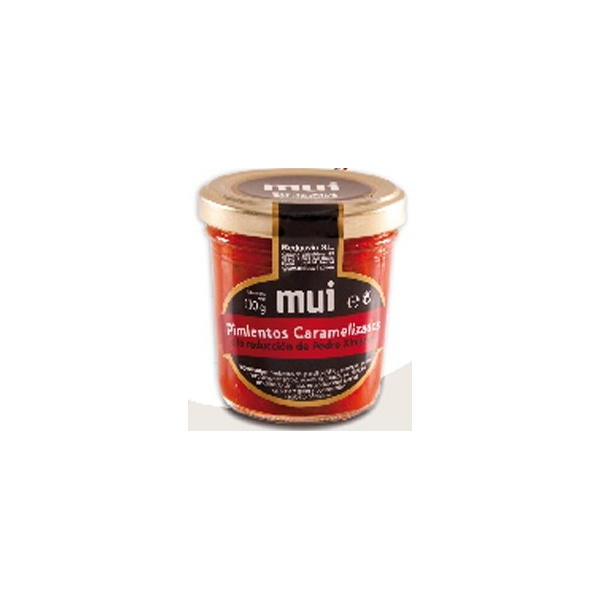
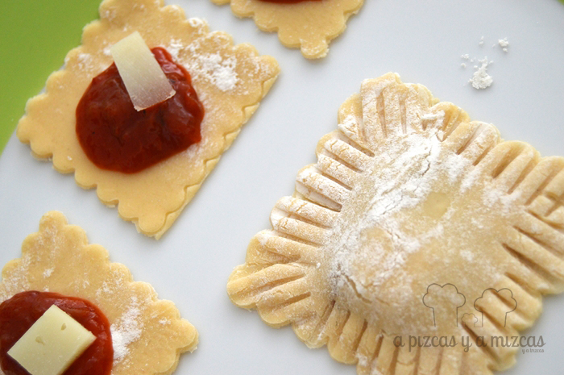

¿Os acordáis que el otro día preparamos pasta fresca casera? Con ella preparamos unos ricos canelones y reservamos parte de esa pasta fresca para elaborar unos ravioli de pasta fresca con pimientos caramelizados y queso manchego. Son muy rápidos de preparar y los podemos guardar en la nevera hasta tres días, incluso congelarlos y tenerlos a mano para cuando los queramos hervir. En la receta no indicamos cantidades, nosotros preparamos para dos personas (unos cinco ravioli por persona).

## Ingredientes para ravioli de pasta fresca con  pimientos y queso manchego

- Pasta fresca casera
- Mousse de pimientos
- Un trozo de queso manchego curado
- Nata líquida (para la salsa)
- Queso rallado (para la salsa)
- Cebolla tierna picada fina (para la salsa)

Como hemos dicho antes, la [pasta fresca casera](/canelones-de-pasta-fresca-casera/ "pasta fresca") la teníamos ya lista de cuando hicimos los canelones. Simplemente, con ayuda de dos cortapastas, uno mayor que el otro de tamaño, cortamos 10 piezas pequeñas y otras 10 grandes de pasta fresca. En una superficie plana enharinada colocamos nuestras 10 piezas más pequeñas. Sobre cada una de ellas pusimos una cucharadita de las de café de pimiento caramelizado que compramos en [Casa Rodríguez](https://www.facebook.com/CharcuteriaCasaRodriguez?ref=hl "Facebook Charcutería Casa Rodríguez"), nuestra charcu de confianza. (Si lo queréis preparar vosotros, sólo teneís que cortar el pimiento rojo de asar en tiras finas, sin nada de la parte blanca ni pepitas, y pocharlo a fuego lento en una sartén con aceite de oliva. Cuando esté prácticamente hecho, subimos el fuego al máximo para conseguir que los azúcares que ha ido liberando el pimiento se caramelicen).

A continuación, cortamos un dado de queso manchego curado (mejor curado, porque al ser más intenso de sabor, no se quedará enmascarado por el pimiento) y lo colocamos en el centro. Ahora vamos a cerrar nuestros ravioli de pasta fresca. Cogemos las 10 piezas de pasta más grandes que habíamos cortado y las vamos colocando sobra cada uno de los ravioli. Con ayuda de un tenedor presionamos por todos los lados para sellarlos. Es importante que queden bien sellados, para que en la cocción no se libere su relleno.

Nosotros los guardamos para cocinarlos otro día. Para ello, en un tupper colocamos papel de cocina y fuimos poniendo ravioli sin que se tocarán entre sí, luego cubrimos con más papel de cocina y más ravioli. Cerramos con la tapa hermética. Pueden aguantar en nevera perfectamente tres días o, si lo preferís, podéis congelarlos. Para cocerlos, con tres minutos es suficiente.

El día que los gastamos hicimos una salsa con el pimiento caramelizado que nos sobró, cebolla pochada, nata y queso rallado.

A nosotros estos ravioli nos han encantado!
