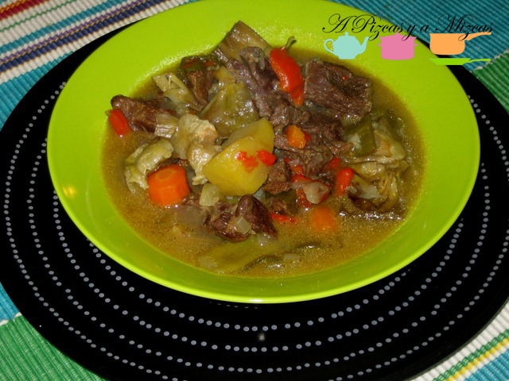
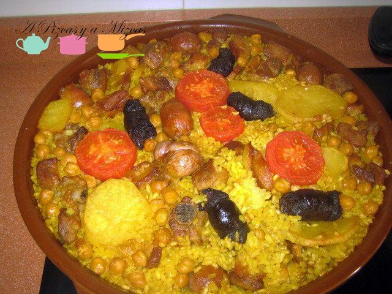
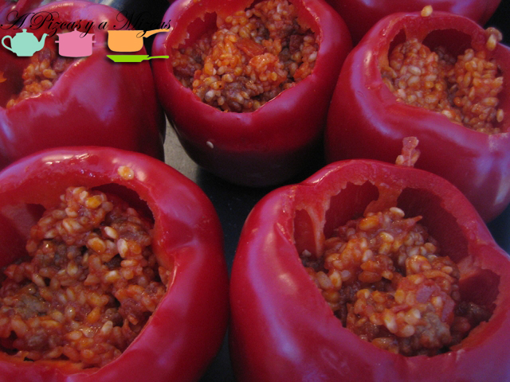
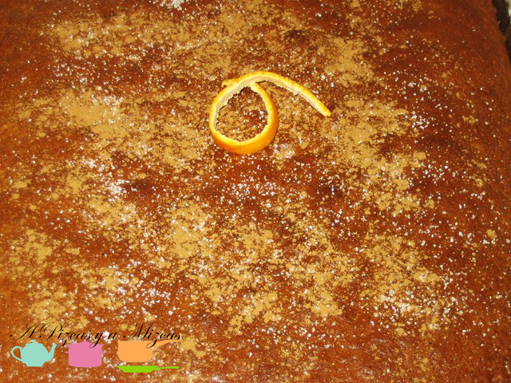
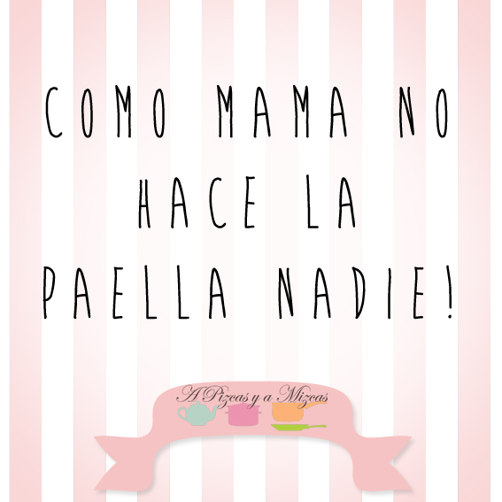

Quedan ya muy pocos días para celebrar el Día de la Madre. Una efeméride que este año tiene una relevancia especial para A Pizcas y a Mizcas. Desde aquí queremos hacer un pequeño homenaje pizquero a todas las madres y, como no podía ser de otra manera, tiene que ver con la cocina, con las recetas de mamá. La verdad es que los sabores son unos de los recuerdos que más profundamente se quedan grabados. Todos tenemos un sabor que nos recuerda a nuestra infancia, a nuestra madre, nuestro preferido. Aquí os dejamos algunos de los nuestros. Vamos a recordar las recetas de mamá!

## Recordando las recetas de mamá

Que vueltas da la vida... ahora que soy madre es cuando más comprendo a la mía. Uno de los recuerdos más divertidos que tenemos relacionados con las recetas de mamá tiene que ver con el [guisadito de ternera](/guisadito-de-ternera-rico-rico/ "Guisadito de ternera rico rico"). Era un plato que Mizcas se comía siempre sin pestañear, realmente le gustaba, pero un día, decidió que no, que no quería ni probarlo e intentaba convencer a su madre que eso a ella no le gustaba. Imaginad la cara de la abuela mizcas! Ese día Mizcas tuvo el guisado de ternera para comer, para merendar y para cenar! Je, je.

Otra de las recetas de mamá mizcas que están indisolublemente ligadas a nuestra memoria es el [arroz al horno](/arroz-al-horno/ "Arroz al horno"). Es el mejor que hemos probado y eso que (chsss, que no se entere nadie... la abuela mizcas no es valenciana de nacimiento y aprendió la receta de un libro). Se ha convertido en un clásico de los viernes y es irresistible, con el arroz en su punto, la morcillita, la panceta, las patatas, los garbanzos. Qué os vamos a contar que no os hayamos contado ya!

Para Pizcas, la memoria infantil de su madre tiene muchísimos recuerdos, que tendremos que ir plasmando en recetas que todavía no hemos subido al blog: las croquetas de cocido, la coliflor gratinada, los calamares encebollados, la paella... Mmmm que rico todo. De las recetas de mamá que sí que hemos publicado de la abuela pizcas, nos quedamos con los [pimientos rellenos de arroz](/pimientos-rellenos-de-arroz/ "Pimientos rellenos de arroz"). Es una receta que os animamos a probar, a la abuela pizcas le salen como a nadie y es un recuerdo imborrable ver esos pimientos enormes que ella prepara (enormes, enormes), de cada uno pueden comer dos personas. En nuestra receta hemos reducido esos pimientos para que no os asusten.

Las recetas de mamá tienen que incluir un dulce. Las meriendas eran uno de los momentos más esperados de Pizcas y aunque la diversidad era mucha: bocadillos de plátano y azúcar con canela, los lingotines con panquemao, el colacao, el bocadillo de chorizo y queso... la fiesta grande era cuando había bizcocho o 'coca' que es como la llamamos en casa. Recuerdamos esa esponjosidad y cómo absorbía el colacao y qué maniobras había que hacer para no mancharse al comerlo de tan cargado como estaba!

Desde aquí: FELICIDADES MAMÁS (primero a las nuestras y luego a todas las demás).

