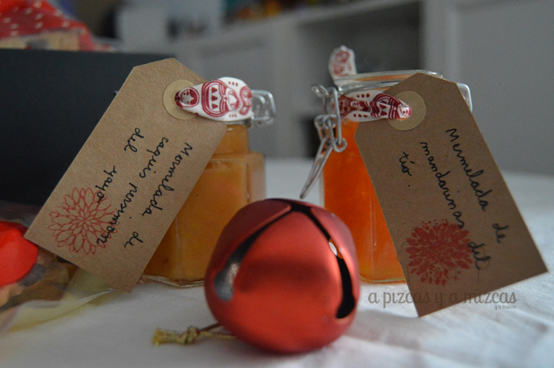
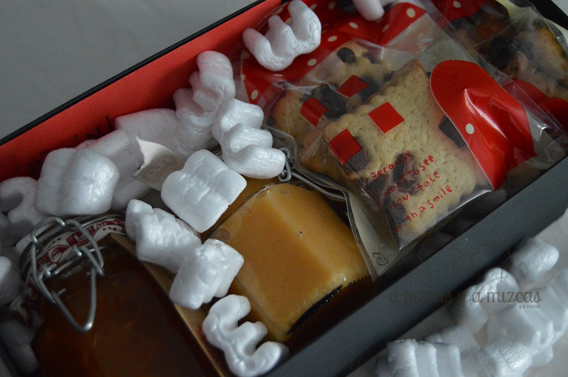
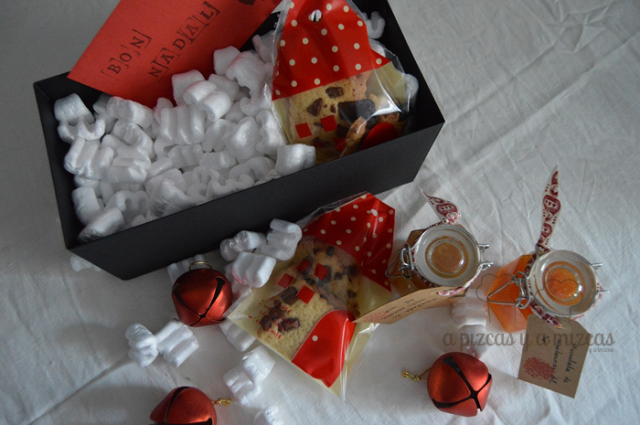
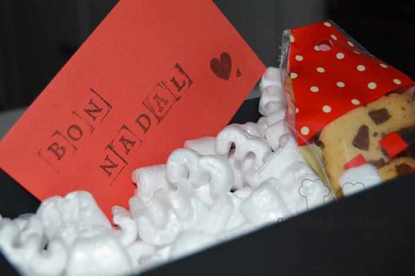
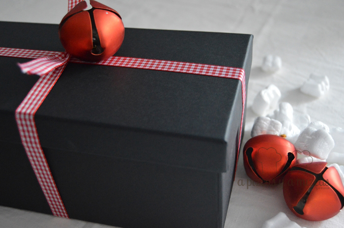

Estas navidades han sido más handmade que nunca, queríamos que las personas más allegadas tuvieran un poquito de la cocina de A Pizcas y a Mizcas en su casa y después de mucho pensar recurrimos a lo que teníamos más cerca a los caquis del iaio y a las mandarinas del tío y así se ideó el regalo dulce personalizado.

Mandamos al iaio Mizcas al campo y nos trajo directo del árbol los mejores caquis y las mandarinas más dulces del campo del tío. Y preparamos una mermelada de mandarina y otra de caqui que pusimos en unos tarros pequeños. En otro post ya os explicaremos cómo hicimos las mermeladas.

Para acompañar a las mermeladas preparamos una galletas, que hemos presentado con diversas variantes. Hemos hecho sólo de mantequilla, otras con chips de chocolate, con canela y azúcar glace y otras especiadas con canela y un toque de nuez moscada. Que también tenemos pendiente de enseñaros cómo las hicimos.

Las galletitas las pusimos en unas bolsitas en forma de casa de [Tape Pink](http://www.tapepink.com/bolsa-celofan/ "Tape Pink") . Y adornamos los botecitos de las mermeladas con unos cartelitos indicando el sabor de cada mermelada: "Mermelada de mandarinas del tío" y "Mermelada de caquis persimon del iaio".

Nos encantó preparar este detallito para todas las personas que queremos... y sabemos de buena tinta que a ellos también les han encantado. Cuando las cosas se hacen con muchooooooo amor siempre salen bien.

