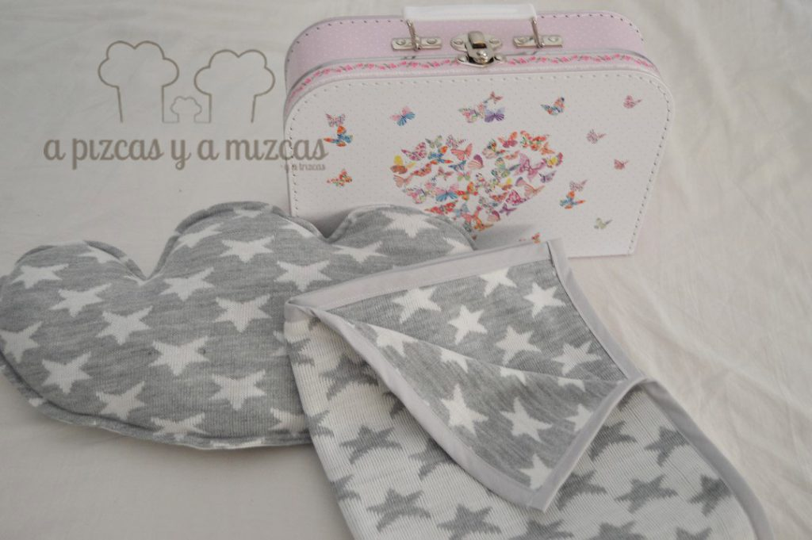
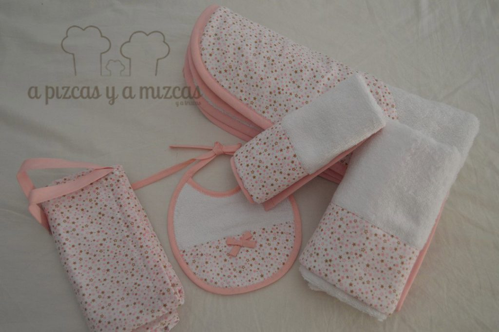
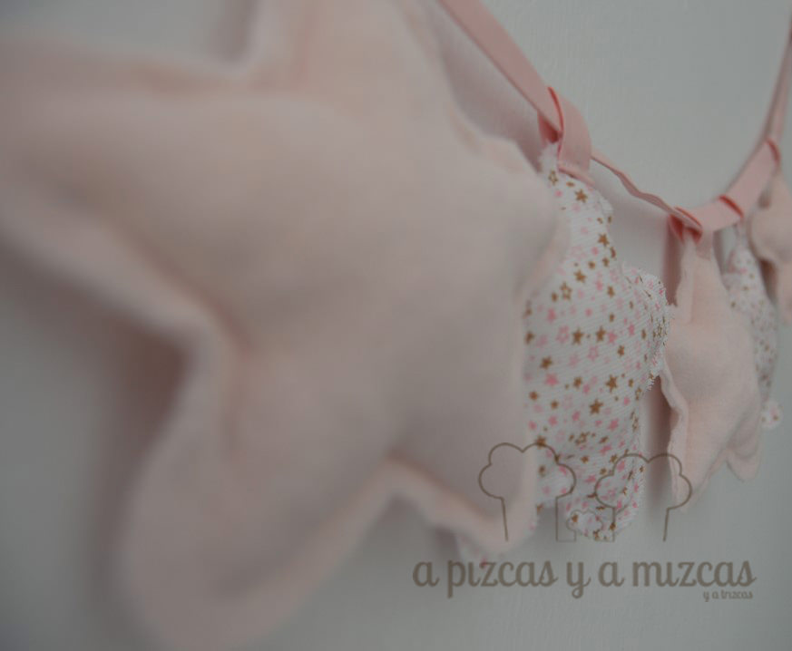
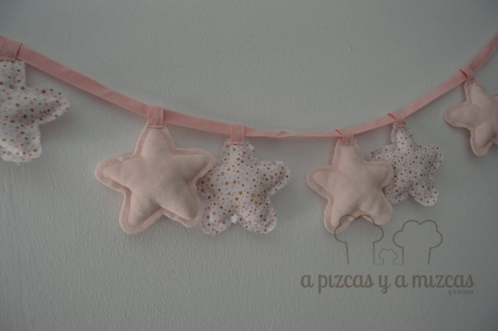

Siempre que nos dan la noticia que un bebé está a punto de llegar nos encanta preparar algo especial y único. Aún nos acordamos cómo nuestros amigos nos dijeron que su familia iba aumentar en unos meses... que alegría nos dio!! En cuanto supimos que iba a ser una niña... nosotros ya nos pusimos a pensar en rosa (Trizcas nos ha acostumbrado que el rosa es un obligado en los armarios de las más peques). Y con un poquito de ayuda de la iaia Mizcas preparamos un regalo para bebé hecho con mucho amor...

Podemos dividir en dos bloques los regalos que preparamos. Por un lado, una mantita y un cojín con forma de nube y por otro un conjunto de capa de baño, toalla, pechito y trapito de lactancia, bolsita y una guirnalda de estrellitas.

## Cómo preparamos el regalo para bebé hecho con mucho amor

Primero hicimos la mantita y el cojín en forma de nube. Buscamos un retalito de tela de lana con dibujos de estrellitas en gris que combina dos tonos de gris. La medida que cortamos la mantita lo podrá utilizar en la minicuna y en el carro. Que calentita va a ir esta peque rodeada de tantas estrellitas! Y lo acompañamos de un cojín en forma de nube con los mismos dibujos.

La segunda parte de regalo está compuesto por una capa de baño, una toalla, pechito, trapito de lactancia y una bolsita para guardar pañales, la muda, juguetes... o lo que decida la peque! Escogimos rizo blanco y para darle el toque rosa escogimos una tela de fondo blanco con estampado de mini estrellitas en rosa (no podía ser otro color :P)

Y por último, preparamos un guirnalda de estrellitas combinando la tela de estampado de mini estrellitas y otra tela suavecita rosa que nos quedó súper bonita (nosotros nos lo decimos todo).

Y para que el regalo nos quedará súper cuqui compramos dos maletitas de cartón con dibujos de mariposas. En una metimos la mantita y el cojín nube y en la otra más grande la capa de baño, pechito, toalla...

Ya estamos descontando los días para poder conocer a esta peque!!

Y si os ha gustado nuestro regalo para bebé hecho con mucho amor pero sois de los que no os lleváis bien con la aguja o queréis preguntarnos o contarnos cualquier cosa podeís poneros en contacto con nosotros a través de nuestro [formulario de contacto.](/contacto/)
