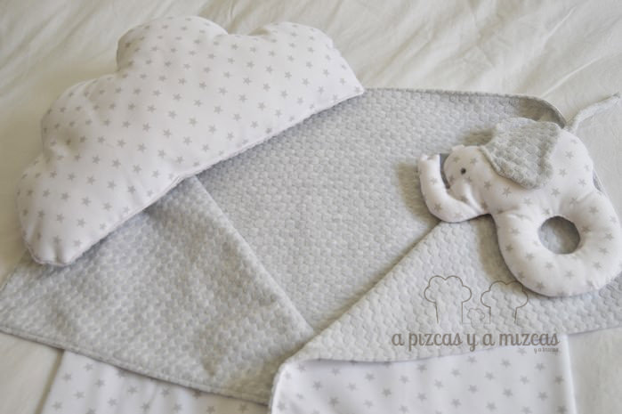

Cuando nos ponemos a preparar un regalo para bebé es inevitable echar la vista atrás y nos acordamos de los primeros días de nuestras vidas con Trizcas... Nos quedábamos embobados mirándola y nos acechaban mil preocupaciones como a todos los papás primerizos... estará bien, tendrá calor, se habrá quedado con hambre.... ufff cómo somos los padres... ji ji ji... y que rápido pasa el tiempo!Esta vez hemos preparado un regalo para bebé compuesto por un arrullo o mantita finita, un mini cojín con forma de nube y un sonajero elefante (no podía faltar el elefante).

Como en otras ocasiones recurrimos a la iaia Mizcas para que nos echara una mano con su máquina mágica... porque nosotros tenemos mucha imaginación pero a veces las manos nos fallan... ji ji ji.

Todo el regalo lo combinamos con una tela estampada de estrellitas grises, una tela que nos parece muy de bebé.

Para hacer el arrullo o mantita fina por un lado cortamos la tela de estrellas y por el otro lado una tela suavecita (como la de los pijamas de bebé) para que el bebé esté a gustito en su mantita.

Para hacer el elefantito sonajero, primero hicimos el dibujo de lo que queríamos y poco a poco fuímos dándole forma hasta que tuvimos lo que queríamos. Y con el patrón a la máquina y justo antes de coser todo pusimos un cascabel grande para que fuera un auténtico sonajero.

Y por último, el cojín en forma de nube con estrellitas por en lado y por el otro con tela suave suave para que el peque se sienta en la nubes. El cojín es ideal para ponerlo en su cunita!

Un regalo ideal para bebé hecho con mucho amor

Ya sabéis si os gustan y queréis algún regalito para un bebé o queréis preguntarnos o contarnos cualquier cosa podeís poneros en contacto con nosotros a través de nuestro [formulario de contacto](/contacto/ "Contacto A Pizcas y a Mizcas").
