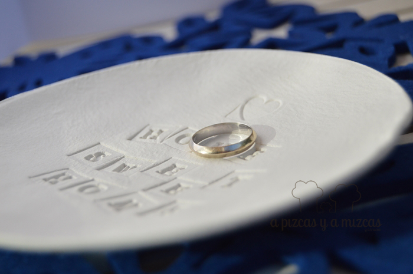

Estas navidades hemos intentado hacer regalitos con nuestras manitas y después de ver un post que publicó [La Chica de la Casa Caramelo](http://www.lachicadelacasadecaramelo.com/2014/11/tres-sencillos-diy-con-pasta-de-modelar.html "La Chica de la Casa Caramelo") nos dio unas cuantas ideas para hacer unos obsequios muy bonitos para unas personitas muuuuy especiales.

Partiendo de la idea de La Chica de la Casa Caramelo pensamos en hacer unas plaquitas para la puerta de la habitación de unos chiquitines que muy prontito nos llenarán el día a día de sonrisas. Y también preparamos un vacía bolsillos para otros amigos con estrella.

## Materiales necesarios para los regalos con pasta para modelar

- Un paquete de pasta para modelar blanca. Lo podéis encontrar en cualquier papelería, bazar multiprecio...
- Unos sellos de goma con el alfabeto y otros con forma de corazón y corona, los nuestros son de Tiger
- Rodillo
- Cuchillo
- Cortapastas

Empezaremos con las plaquitas para las puertas de los chiquitines. Primero amasamos la pasta para modelar como si jugarais con la plastelina, hacéis una bola y luego con la ayuda del rodillo extendéis hasta que se quede del grosor deseado. A continuación  nosotros utilizamos un cortapastas en forma de flor y otro en forma ovalada.

Antes de utilizar los sellos aseguraros que estén bien limpios. Las frases que pusimos fueron en la placa de forma ovalada: "El rey de la casa" y en el de forma de flor o nube: " Baby´s room". En la parte superior, con la ayuda de una pajita, hicimos dos agujeritos para poner después un lazo y poder colgarlo en la puerta de la habitación, dejamos la pajita puesta mientras se secaba.

Dejaremos secar durante uno o dos días. Cuando esté seco completamente lijaremos para que quede liso y suave y con los bordes redondeados. Para terminar pasaremos una cinta y ya tenemos lista una plaquita para la habitación de los más peques. Sencillo y muy bonito.

Ahora os explicamos como hicimos el vacía bolsillos. Utilizamos un plato peqeño de postre y lo cortamos con la ayuda de un cuchillo. Con la ayuda de los sellos pusimos "Home sweet home" y un sello en forma de corazón en la parte superior. Para que adoptara la forma redonda lo introducimos en un bol de ensalada y lo dejamos secar durante dos días. Lijaremos con una lija fina para que los bordes queden bien redondeados y listo para regalar.

