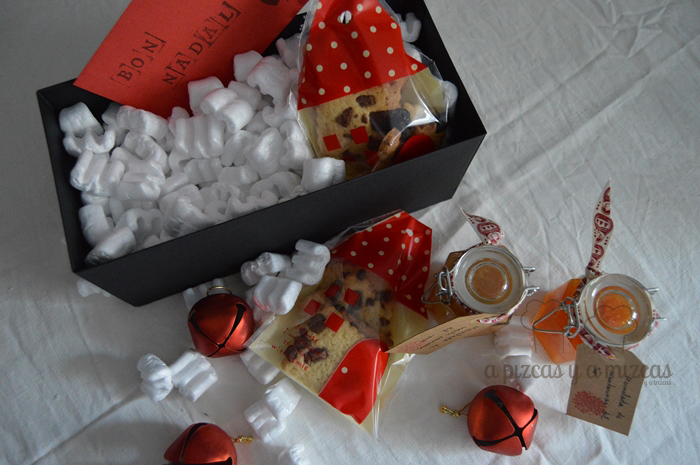
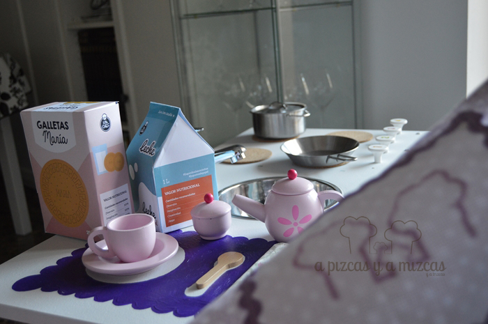
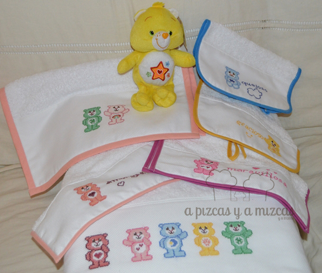
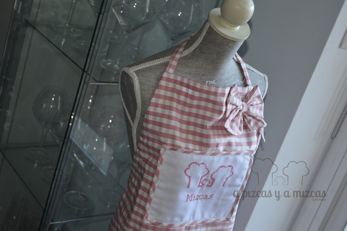
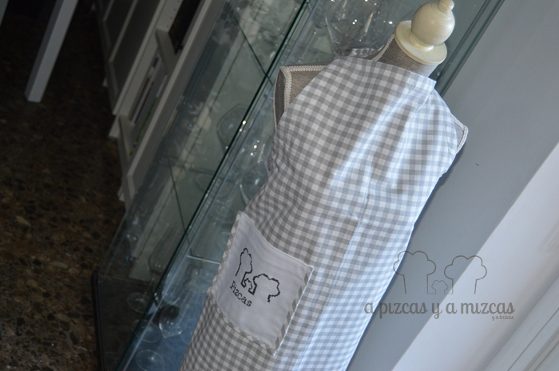
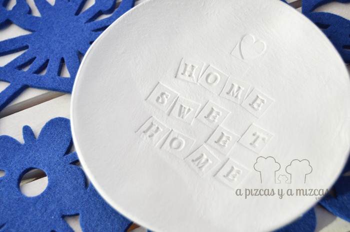
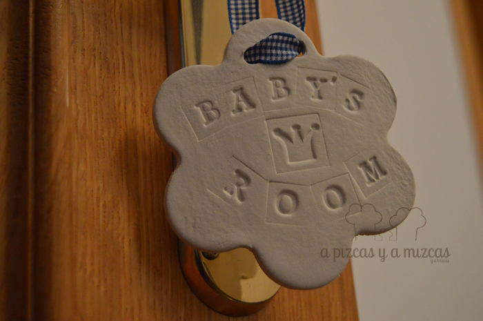
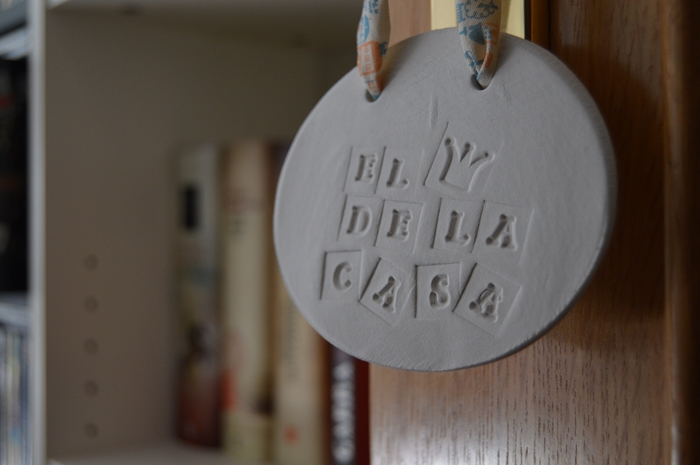
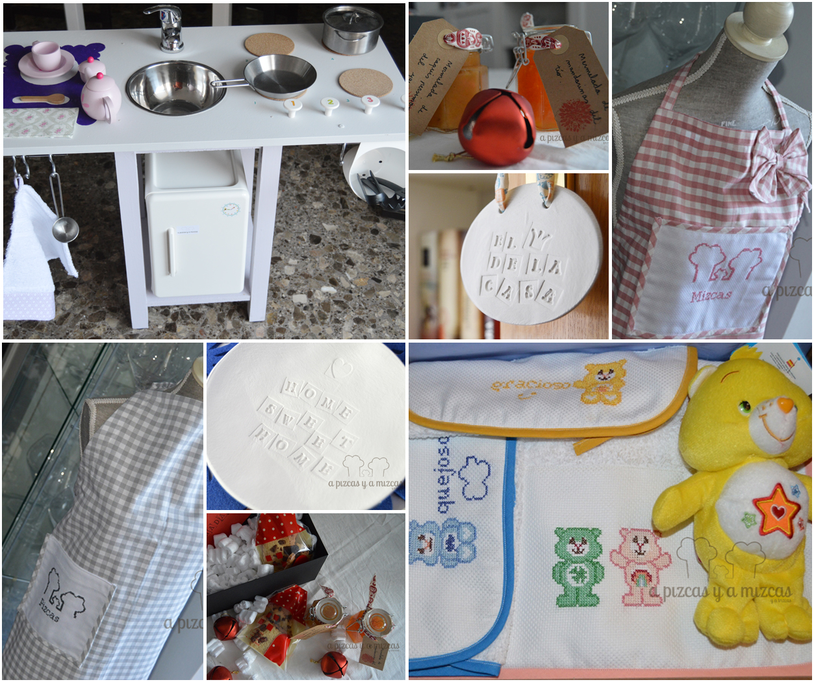

Estas navidades hemos recibido varios encargos de Papá Noel y hemos estado entretenidos entre telas, dulces... y como todo esfuerzo tiene su recompensa así de bonitos nos han quedado los regalos de Navidad hechos con nuestras manitas.

Hoy os dejamos el resumen... pero la próxima semana os enseñaremos como toca todos los regalitos.

## Regalos de Navidad hechos con nuestras manitas

Se nos ocurrió la genial idea de felicitar la Navidad con algo que nos representara y cuál es nuestra mejor tarjeta de presentación: nuestra cocina! Así que preparamos un paquetito lleno de amor del bueno y unos tarritos de mermelada y galletitas.

Otro de los encargos que recibimos fue hacer una cocinita infantil. Así que nos líamos con herramientas y preparamos una súper cocinita. Y la verdad que cuando vimos la cara de su dueña valió la pena todo el esfuerzo. Es que Papá Noel lo sabe todo... jo jo jo

El siguiente regalo es el más amoroso de todos. Preparamos un completo juego de toallas con un montón de osos amorosos bordados a punto de cruz para Trizcas. Y está más que contenta con sus pechitos de los osos y su toalla de baño. Y el duende Mizcas salta de alegría porque lo ha bordado con muchísimo amor.

Este año el hombrecito de rojo también se ha acordado de Pizcas y Mizcas. Hemos recibido unos delantales molones con el logo del #nuevopizcas. Para este regalo tuvimos la ayuda de la yaya Mizcas (que haríamos sin ella) y Mizcas se encargó del bordado. Resultado tenemos los delantales más bonitos del mundo mundial.

Por último, uno de los regalos que más nos gustó preparar por experimentar con la pasta para modelar. Preparamos un vacía bolsillos y dos plaquitas para la habitación de peques. Y está mal que lo digamos, pero nos quedaron muy chulas.

¿Os han gustado los regalos de Navidad hechos con nuestras manitas?

