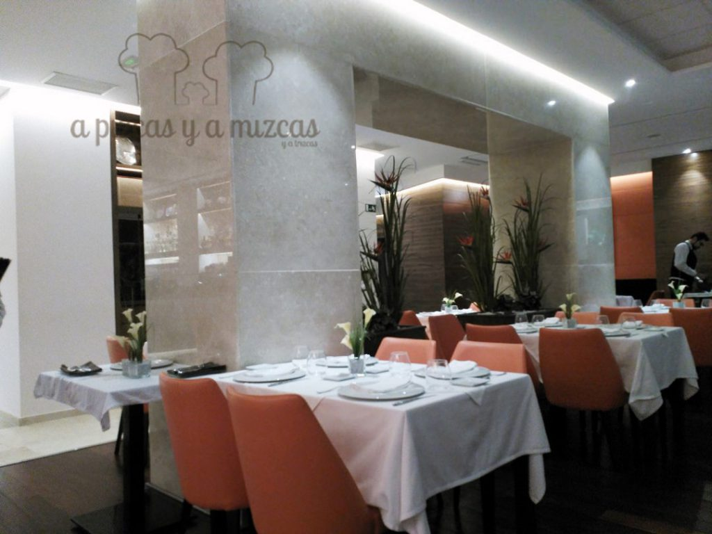
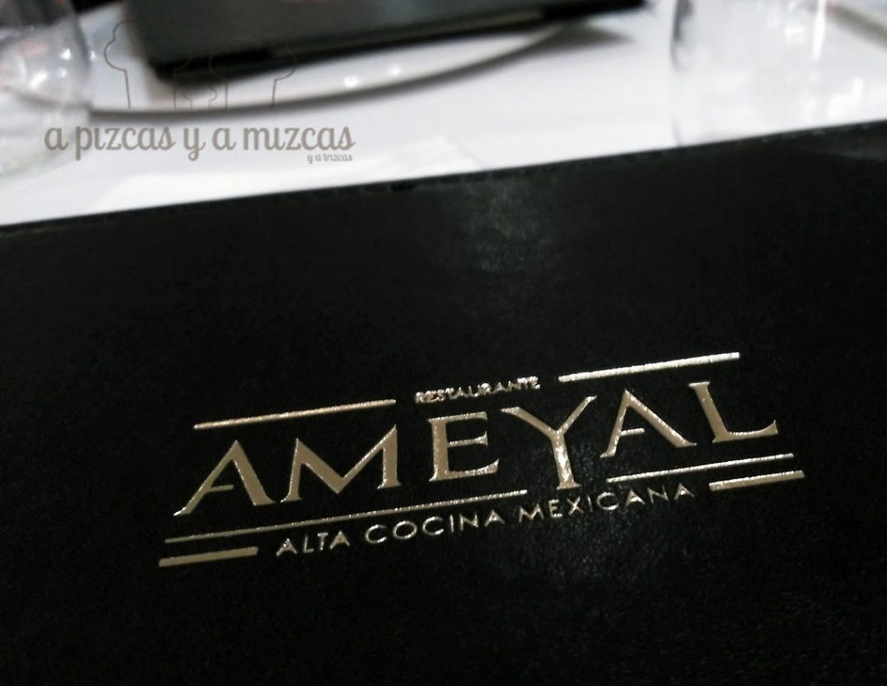
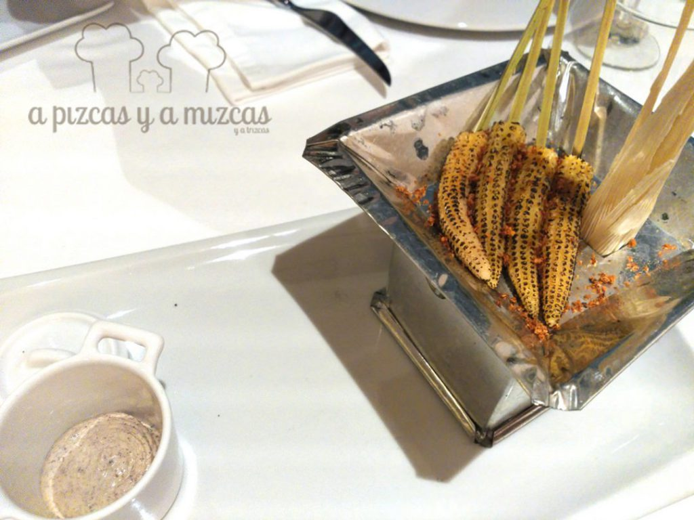
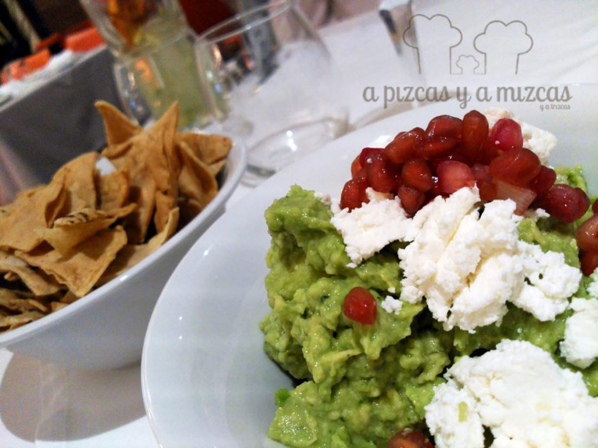
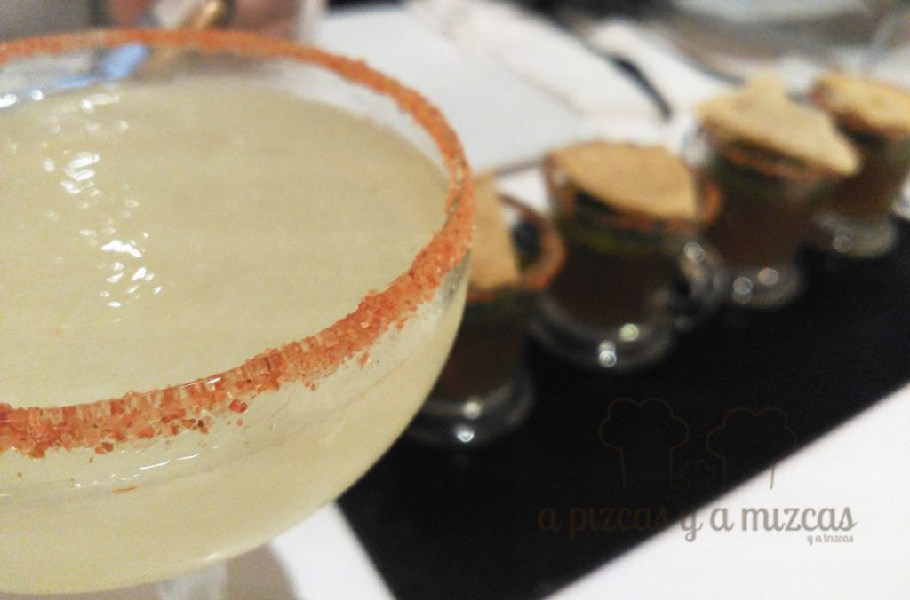
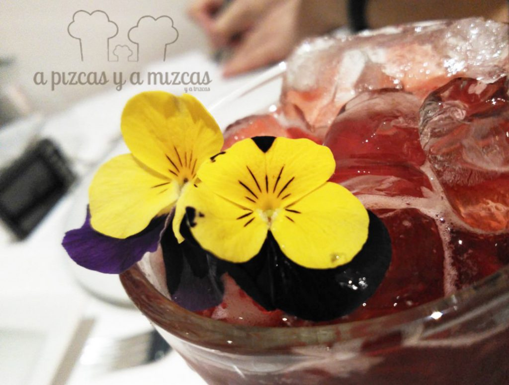

Que vaya por delante que nos encanta la cocina popular mexicana, enchiladas, las chaskas, tacos, los chiles rellenos, burritos, los tamales fajados, los totopos, el guacamole… La lista sería infinita (no hay que olvidar que la gastronomía mexicana alcanzó el estatus de Patrimonio Inmaterial de la Humanidad en 2010). Así que cenar en el Restaurante Ameyal en Valencia (con el epíteto de “alta cocina mexicana”) era de lo más atrayente.  Además de un placer para los sentidos, su propuesta gastronómica huye de tópicos y clichés (vade retro tex-mex) para dignificar la cocina mexicana que llega a nuestro país.

## Nuestra cena en Restaurante Ameyal en Valencia

El [Restaurante Ameyal](http://ameyal.es/) en Valencia abrió sus puertas el pasado mes de marzo, en la céntrica calle Conde Salvatierra, 39. Supuso la materialización del sueño de un mexicano enamorado de España, que eligió la ciudad de Valencia para poner en marcha un restaurante que transmitiera la verdadera esencia de México. Y damos fe de que lo ha conseguido, pues en apenas ocho meses de andadura ya ha sido nombrado Mejor Restaurante Mexicano de España otorgado por la Luxury Travel Guide.

Acudimos a cenar el pasado 10 de noviembre, cuatro personas, y optamos por el menú degustación. Muy completo y compensado, basado en el maíz como hilo conductor (va cambiando según la temporalidad del producto). Hay picante, no tendría sentido que no lo hubiera, pero está muy “europeizado” y el cliente siempre tiene la opción de ajustarlo a su gusto. Además, hay que dejarse llevar y cenar exclusivamente con cócteles (¿por qué no?), muy equilibrados y perfectos para la propuesta gastronómica.

- **Comida**: ⭐⭐⭐⭐⭐
- **Local**: ⭐⭐⭐⭐⭐
- **Servicio**: ⭐⭐⭐⭐⭐

Menú degustación “Fiestas del Maíz”:

Mazorquitas ahumadas (brotes de maíz ahumado al laurel, piquín y dip de habanero y chapulines).

Guacamole ameyal (con el toque personal de queso fresco y granada). Lo hacen al momento con aguacates madurados en planta y es espectacular. Indispensables los totopos de maíz para acompañar.

Salbutes Yucatecos  (carne de cerdo guisada con achiote, naranja y orégano, sobre una infladita de maíz, frijoles refritos, cebolla encurtida y habanero).

Esquites (granos de maíz, limón mexicano y chile piquín).

Cazuela de Rajas (maíz dulce, rajas de chile poblano, chorizo y aire de flor de calabaza).

Consomé azteca de bogavante (con vieira, almeja, gamba y dúo de maíz).

Chile en nogada (chile poblano rellenó de ragú mixto de ternera y cerdo ibérico, frutos secos, nogada tradicional y granada).

Sorbete de aguacate y limón mexicano

Buñuelos de plaza con sirope de piloncillo

Lo acompañamos todo con un cóctel margarita y un vino Albariño.

Además de en la comida, también se rompen tópicos en la arquitectura y la decoración. El trabajo del arquitecto mexicano Alejandro Garzón transmite elegancia y tranquilidad, lejos de tabernas o taquerías. “Es como un buen restaurante que te encontrarías en México”, resume Óscar Asiain, responsable del restaurante.

El chef Mauricio Gómez, un enamorado de España, ha vuelto a nuestro país con el objetivo de ponerse al frente de la cocina de Ameyal para “alejar de la mente de los valencianos la creencia de la cocina mexicana es solo burritos y nachos, y que toda nuestra comida pica, porque es un concepto totalmente tergiversado porque nuestra cocina es mucho más rica en matices y sabores, lo que ocurre es que desgraciadamente lo primero que llega es el fastfood”.

En el Restaurante Ameyal en Valencia hay dos zonas diferenciadas y por lo tanto cada una de ellas tiene una carta concreta. La primera zona, vestida en tonos azules, grises y blancos es la mezcalería donde destaca la coctelería mexicana a base de tequila, mezcal y raicilla, entre otros. En ella además,  se sirven antojitos que es la versión de la tapa española, que es un poco más relajada, más casual pero con sabores muy bien definidos y resaltados.

El precio del menú degustación es de 49 euros, al que hay que sumar las bebidas. Ameyal, en la lengua náhuatl, significa manantial. Y eso es lo que es un oasis que tenemos la fortuna de que esté en Valencia.
