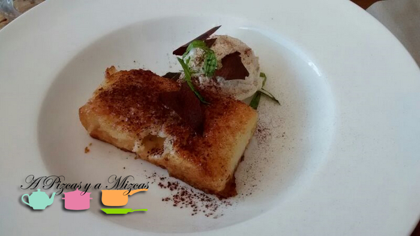

Seguimos con nuestra serie de visitas a sitios chulos para comer en Valencia. Recientemente, fuimos con Ms Green y Mr Brown a descubrir el restaurante [Cocotte & Co](http://cocotteandco.com/ "Restaurente Cocotte and Co") en Valencia (Paseo de la Alameda, 48 Bajo Izquierda). Aunque nosotros acudimos a comer a mediodía, lo cierto es que para desayunar o merendar también tenía todo una pinta estupenda, pero ya será cuestión de hacer otra visita.

## Nuestra comida en restaurante Cocotte & Co en Valencia

Como hemos dicho, fuimos el mediodía de un domingo al restaurante [Cocotte & Co](https://www.facebook.com/cocotteandcovalencia?fref=ts "Página Facebook de Cocotte & Co") en Valencia. En esta ocasión, Trizcas se quedó en casa de los abuelos. Por tanto, fue comida para cuatro. Habíamos reservado con antelación, por tanto, en cuanto llegamos no ofrecieron nuestra mesa, en el interior (también tienen terraza).

A modo de cortesía, y como aperitivo, nos sacaron unas cucharitas de salsa de queso azul con salmón ahumado.

De entrantes, pedimos una cestita de croquetas variadas (de jamón iberico, setas y de bacalao). Nos gustaron bastante. Estaban muy conseguidas y se acercaban mucho al concepto de croqueta casera (con Chicote en la cabeza...).

Luego pedimos, como primeros platos, unos pappardelle con setas y trufa; unos tagliatelle con tomate confitado, albahaca y parmesano y una fideuà con alcachofitas, foie y jamón. Lo mejor, la fideuà, con la pasta en su punto y una buena intensidad de sabor. Todos acabamos metiendo la cuchara.

Como postres, pedimos solo dos: un tiramisú y una torrija casera con leche merengada.

Aquí tuvimos un pequeño incidente, pues el primer tiramisú que salió de la cocina estaba ácido. Lo dijimos al personal de sala, lo retiraron y nos trajeron otro en perfectas condiciones. Además, la casa nos invitó al tiramisú.

Nos apuntamos en la agenda volver para probar los desayunos, brunches y meriendas del restaurante Cocotte & Co en Valencia.
