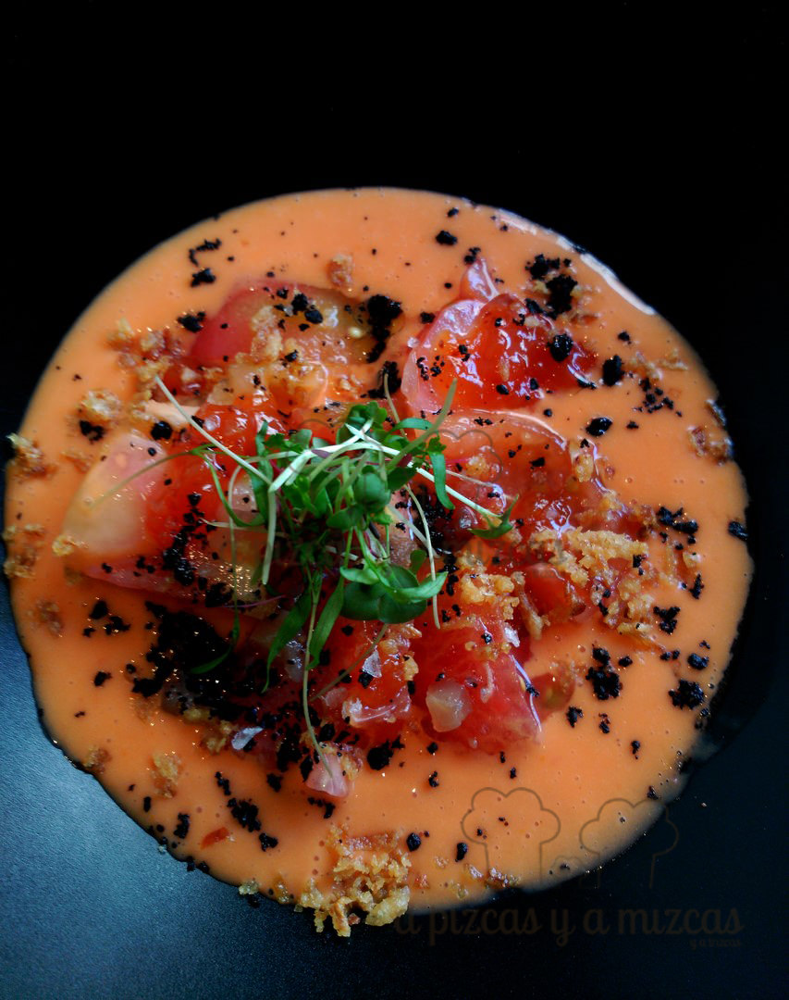

Hay ocasiones en las que, por casualidad, descubres un sitio fantástico. Eso nos ocurrió a nosotros con el restaurante [Come y Calla](http://www.comeycallavalencia.com/), en Valencia ( Poeta Antonino Chocomeli, 1) en pleno barrio de Campanar. Estábamos de compras con Trizcas y se nos hizo tarde, así que cambiamos los planes (teníamos pensado comer en otro sitio) y acertamos de lleno con el restaurante Come y Calla, coordinado por el chef [Alejandro Platero](https://twitter.com/platerochef) ([Macel·lum](http://restaurantemacellum.com/)). Fue muy satisfactorio.

Llegamos a comer sobre las 14.15 horas y nos atendieron muy amablemente. Nos indicaron que deberíamos esperar un poco hasta que nos tomaran nota, pero no fue más de 15 minutos que estuvieron "entretenidos" con una copa de vino rosado, un refresco y un paquete de papas.

## Nuestra comida en Restaurante Come y Calla en Valencia

Aunque se define como una "bocatería valenciana", lo cierto es que comimos de cuchara y tenedor la mar de bien. Su carta ofrecía tres menús diferentes. Optamos por el intermedio, con un entrante del día y degustación de cuatro snacks, más un plato principal (arroz o fideuá).

- **Comida**: ⭐⭐⭐⭐
- **Local**: ⭐⭐⭐⭐
- **Servicio**: ⭐⭐⭐⭐

El entrante fue un salmorejo con tomate valenciano y atún con gelatina de catarino (una variedad de melocotón).

Para empezar un salmorejo

Siguieron los snacks, deliciosos: gazpacho de cereza y huevas de trucha, patata con calamar y salsa thai, torrija con almíbar de melocotón y ravioli de carne cajún con mayonesa de pera.

gazpacho de cerezas y huevas de trucha

ravioli de carne cajún con mayonesa de pera

patata con calamar y salsa thai

torrija con amibar de melocotón

El plato principal de nuestra comida fue el arroz con rape y alcachofas. Nos dieron a escoger si lo preferíamos meloso o seco, y optamos por la segunda opción. Arroz perfecto de cocción y con un sabor concentrado y potente. A Trizcas le gustó muchísimo.

Arroz seco con rape y alcachofas

De postre nos sirvieron un refrescante mouse de aguacate y yogur con toque cítrico.

Mousse de aguacate con yogur

El local es muy agradable, con detalles muy mediterráneos y cuidados. Tiene una terraza que debe ser una delicia por las tardes/noches. Un restaurante que tenemos marcado para volver. Hay vida y gastronomía más allá de El Carmen y Ruzafa y el Restaurante Come y Calle en Valencia es una prueba de ello.

Ahora estamos ya planificando la visita a su "hermano mayor", Macel·lum. Os lo contaremos aquí.
