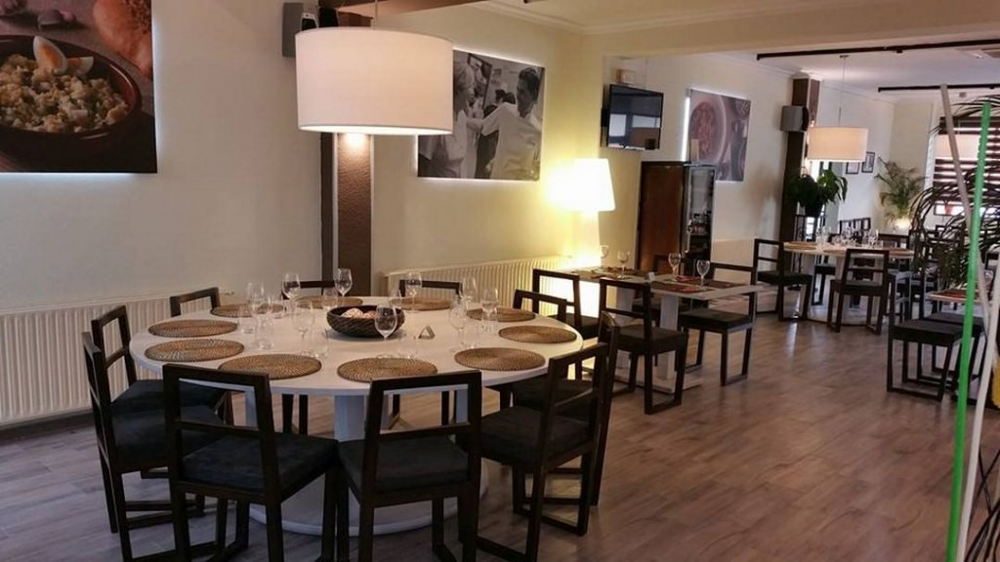
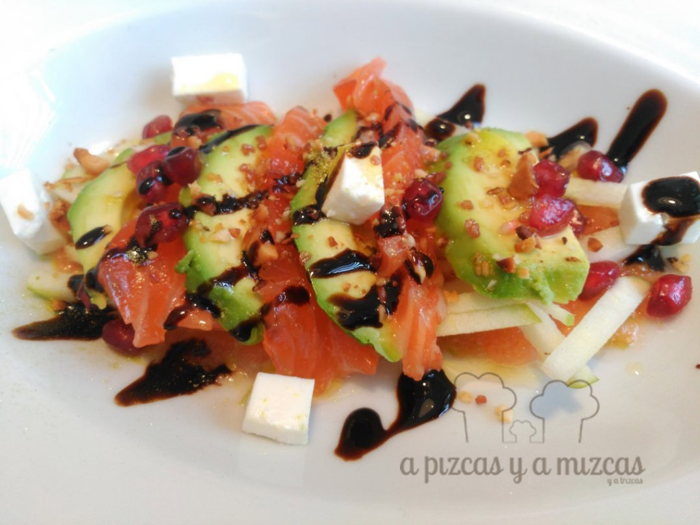
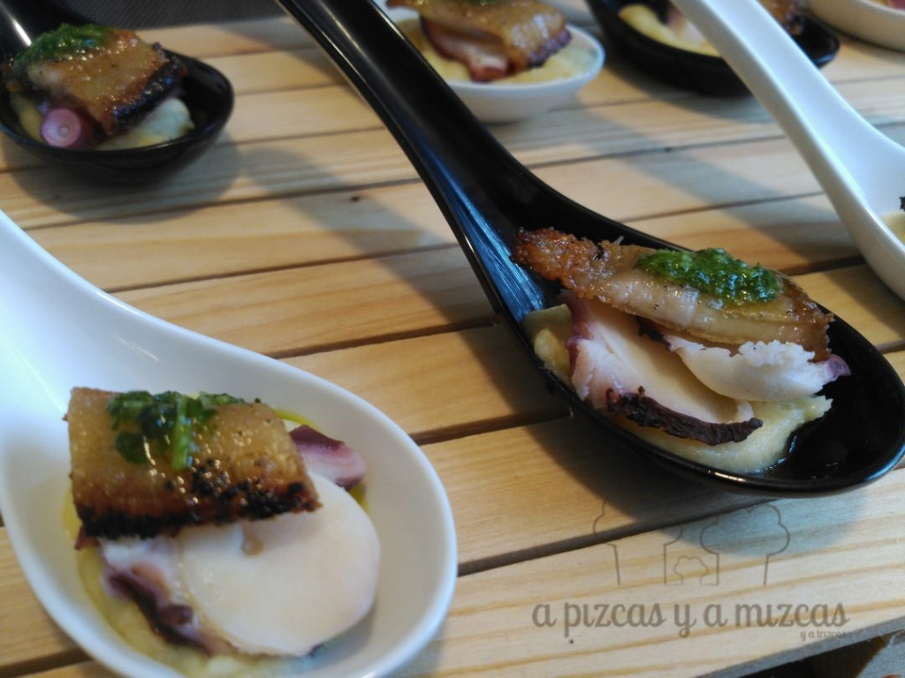
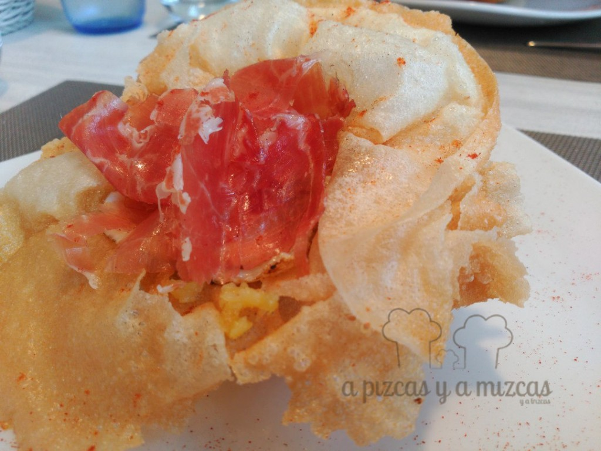
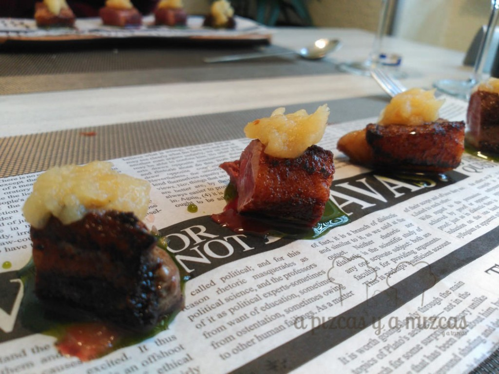
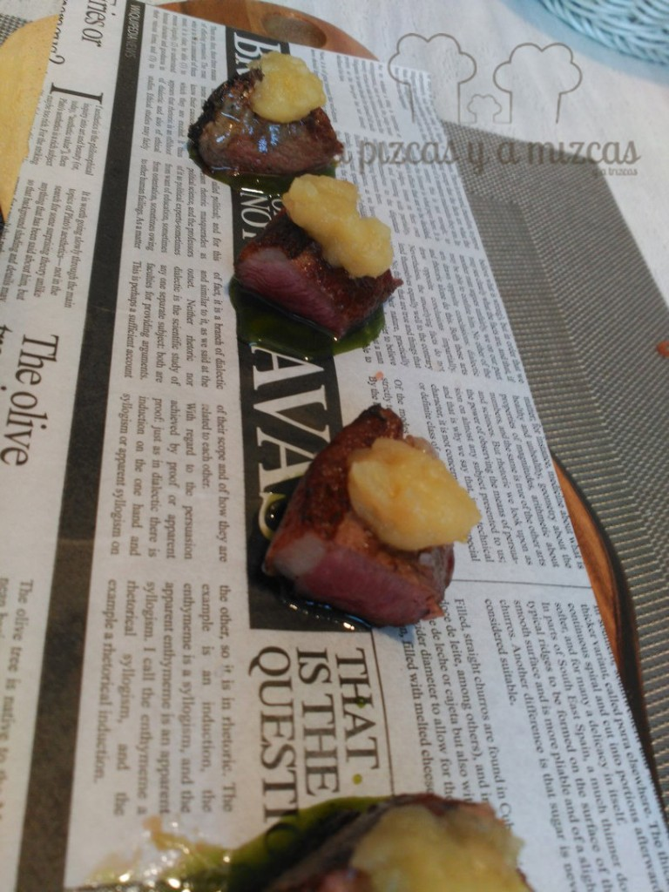
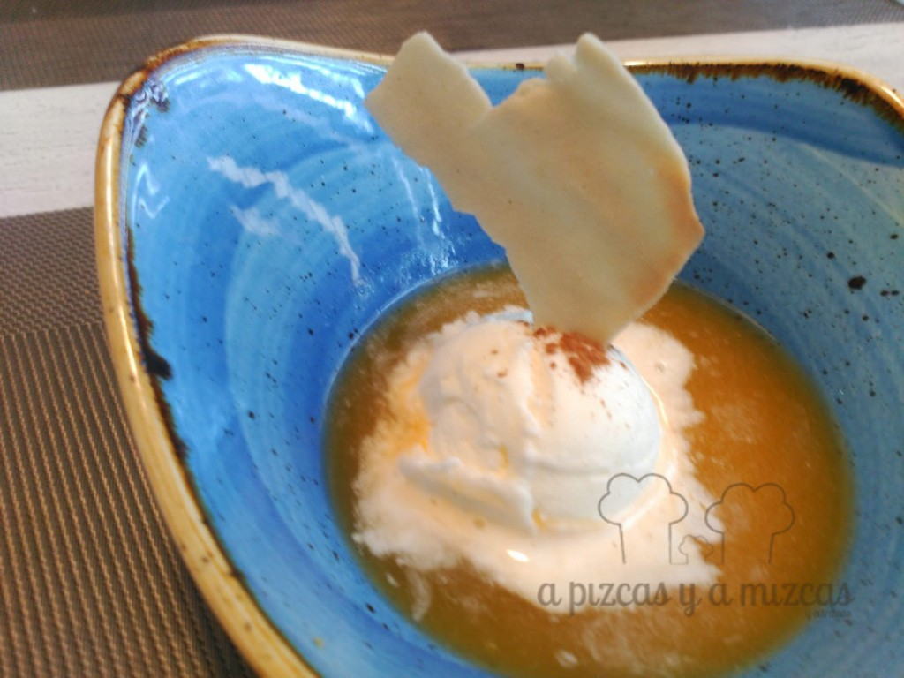

Cuando en gastronomía se une la tradición con el respeto por el producto y la innovación y la formación continua, podemos decir que casi se ha encontrado la fórmula perfecta. Hoy os traemos aquí uno de esos restaurantes en los que esta fórmula es la máxima por la que se guían: [Restaurante El Yantar](http://restauranteelyantar.com/) en Venta del Moro (Valencia). ¿Nos acompañas?

## Restaurante El Yantar, una casa con alma

- **Comida**: ⭐⭐⭐⭐
- **Local**: ⭐⭐⭐⭐
- **Servicio**: ⭐⭐⭐⭐⭐

Este restaurante es el resultado de la fusión de dos cocinas, una arraigada en la más rica tradición de la cocina de la comarca de Requena-Utiel, la otra basada en el conocimiento del producto y en las técnicas culinarias. La primera la firma Pilar Lavarías; la segunda, su hijo Carlos Cervera.

Pizcas ya conocía a Carlos y su cocina, pues es uno de los restauradores más activos últimamente en la región vitivinícola de Utiel-Requena y organiza unos fantásticos maridajes de su cocina con los vinos de la zona. Había probado sus platos en diferentes actos y eventos, pero nunca habíamos acudido a su restaurante a probar su cocina.

Además, recientemente, el Restaurante El Yantar ha inaugurado la remodelación de su comedor. El resultado es un espacio moderno, acogedor, actual y mucho más acorde a la comida que se sirve.

 Foto del facebook de El Yantar Rest

Con los ojos cerrados, dejamos que Carlos eligiera los platos que íbamos a probar. Si leyéndolo disfrutáis, imaginaos en vivo y en directo:

Arrancamos con una ensalada de aguacate, salmón ahumado, manzana, granada y queso fresco de la zona, con vinagre balsámico de higos y tostado de macadamia. Resultó un plato fresco, en el que las grasas del aguacate y el salmón se equilibran perfectamente con los ácidos de la manzana y la granada. Un plato perfecto para abrir el apetito.

 Empezamosss!

La degustación en el Restaurante El Yantar siguió con un entrante que es un fijo en las cartas de Carlos, unas cucharitas de ajoarriero (olé la mano de Pilar), pulpo, papada de cerdo rostida, aliñada con vinagreta de salsa mery (aceite, perejil y ajo) con lima. Para tomar de un bocado. El sello que se va forjando Carlos, comida tradicional de la zona, actualizada.

Después llegó a nuestra mesa una flor de brick, con patatas al montón, huevo de codorniz y jamón ibérico. Una versión divertida de un plato de tradición como las huevos rotos con jamón y patatas.

El plato principal de esta agradable comida en Venta del Moro lo constituyó un sabroso magret de pato, con puré de manzana asada, dulce de mostaza y sal de Hawaii. El punto del magret perfecto y una presentación muy divertida y cómoda, actual.

El postre fue un helado de leche merengada en sopa de zumo de naranja con cointreau y galleta de moscatel.

Hay que destacar el trato de todo el personal, que te hace sentir como de la familia y la clara apuesta de Carlos por los vinos de la D.O.P. Utiel-Requena. Toda su carta de vinos gira en torno a ellos.

Como veis el Restaurante El Yantar en Venta del Moro es todo un soplo de aire fresco en un entorno muy marcado gastronómicamente por un producto como el rico embutido de la zona. Carlos ofrece una comida sin tonterías, reconocible, fresca y honesta. Ajustadísimo en precios y, además, con una oferta de menú del día basada en la cocina de "cuchareo" de Pilar que vale la pena.
