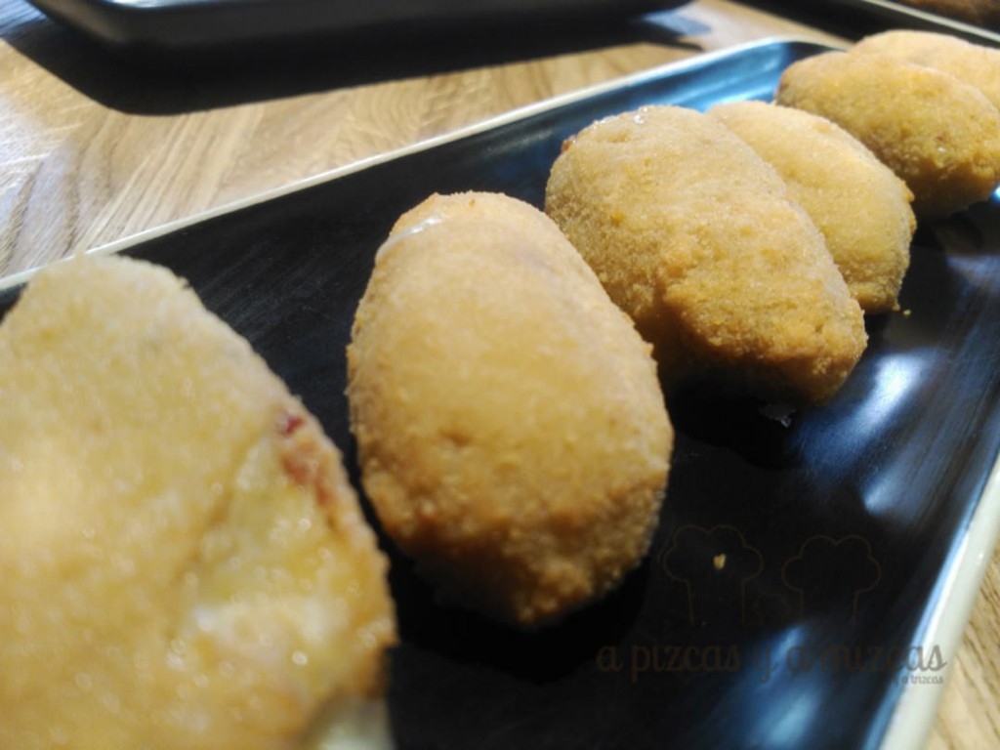

Os traemos hoy un reciente descubrimiento gastronómico en la zona de la Ciudad de La Justicia y la Ciudad de las Artes y las Ciencias de Valencia. Se trata del [Restaurante Elbar](http://www.elbarvalencia.com/), ubicado en la Avenida Instituto Obrero 20. Una iniciativa que lleva funcionando desde el pasado mes de noviembre y que, damos fe, ha revolucionado el ambiente gastronómico del barrio. A continuación os contamos cómo disfrutamos en el Restaurante Elbar.

## Una comida de lujo en el Restaurante Elbar

- **Comida**: ⭐⭐⭐⭐
- **Local**: ⭐⭐⭐⭐
- **Servicio**: ⭐⭐⭐⭐

Acudimos invitados por los responsables del Restaurante Elbar para probar alguna de las exquisiteces de su carta y conocer más sobre el proyecto. Destaca su decoración moderna y actual, muy juvenil y, sobre todo su horario. "Casi mejor contamos las horas en las que estamos cerrados", explica Jairo Varas, responsable de la cocina del local. Y es que prácticamente los fogones no paran. Desde los desayunos (el Restaurante Elbar está vinculado a una oferta hostelera), hasta las copas de la noche, pasando por los almuerzos, comidas, meriendas, tardeo, cenas "a la europea" o cenas "a la española" ...

Hemos dicho que están vinculados a la hostelería, en concreto a la oferta de [Valencia Flats](http://www.valenciaflats.com/), que de esta forma ofrece un servicio integral total, cuidando desde el alojamiento, hasta la gastronomía. Vinculado que no dependiente, pues los propietarios quieren que el Restaurante Elbar tenga entidad propia y vaya si la tiene.

Definen su cocina como cocina de mercado y dentro de ese "cajón de sastre", lo que sobresale son las ganas de Jairo de sorprender al comensal con producto bien tratado y mediante presentaciones novedosas.

Esto es lo que probamos:

- Trinxat de blanquet, con piña acidulada, coliflor y mermelada de naranja. Un aperitivo de cortesía que ofrece el característico sabor de la botifarra blanca que se emplea en e putxero valenciano. Un sabor reconocible y una fresca combinación de la col y la naranja.

- Ensaladilla rusa. Es uno de los platos que permiten ubicar mentalmente a un restaurante. Ensaladilla muy correcta, con algo de exceso de mayonesa. Verduras crocantes y divertida de comer. Aquí veréis la abundancia de las raciones. Que no os asuste.

- Croquetas de rabo de toro. Textura cremosa y sabrosa. Muy ricas.

- Croquetas caprese, con queso mozzarella, tomate seco y albahaca. Una ensalada caprese dentro de una croqueta.
- Ensalada de burrata, con tomate concasé, rúcula, pera cocida y vinagreta de pesto ligero. Un plato que demuestra la calidad de producto con la que trabaja Jairo Varas. La burrata estaba espectacular y el resultado fue una ensalada muy refrescante. Cocina mediterránea, pura y dura, basada en la materia prima.

- "Sashimi" de atún con leche de pepino al curry. Un plato vistoso, que generó el debate entre los asistentes sobre si se podía llamar sashimi o no. Lo cierto es que nos permitió un viaje gustativo más a Latinoamérica que a Asia.

- Tataki de bonito marinado, con crema de chirivía y mayonesa ligera de wasabi. Un punto perfecto para el bonito y muy divertido de comer con la mayonesa.

- Calamar de playa, con verduritas de temporada y praliné de frutos secos. El calamar espectacular. Sabroso y tierno. No nos convenció el praliné, pero Jairo ya ha prometido darle alguna vuelta. La presentación habla por sí misma.

- Pulpo a la brasa, con crema de calabaza asada y tierra de pimentón. Uno de los mejores pulpos que hemos probado últimamente en Valencia. La sustitución del la tradicional patata por la calabaza es todo un acierto y mantiene la tipicidad del "pulpo a feira" con la personalidad de la tierra del pimentón. Para repetir.

- Arroz meloso de pulpo. El Restaurante Elbar ha hecho una apuesta muy fuerte por los arroces. No tiene menú del día, pero a cambio cada día ofrece un arroz meloso, que preparan al momento y que sirven en marmita de hierro. La ración es generosa, como para que dos personas coman perfectamente. Un punto de arroz perfecto y, aunque parezca mentira, muy difícil de encontrar en muchos establecimientos de Valencia.

- Arroz meloso de panceta con champiñones y crujiente de zanahoria. Sabroso y de punto perfecto, como el anterior. La zanahoria en crudité ralladita hace que al comer el "crunch-crunch" invite a una segunda cucharada.
- Costilla a baja temperatura, glaseada con jugo de carne, con crema de coliflor rustida, chips de yuca y milhojas de patata y bacon. A este plato hay que hacerle una escultura. Fantástico.

- Los postres que sirvió Jairo fueron texturas de chocolate (ganache de chocolate, helado de chocolate blanco y tejas de chocolate amargo) y helado de jengibre, con espuma de yogur y crumble de frutos secos.

Es uno de los restaurante que tendremos que ir visitando constantemente, pues la cabeza de Jairo no para y no deja de probar cosas nuevas con su equipo (estuvimos probando una sal de calamar que puede dar mucho juego). Enhorabuena.
