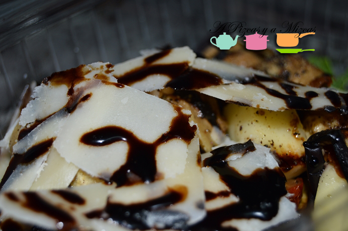

Desde hace unos años la Calle Quart es una de las que más transitamos del barrio del Carmen de Valencia... y Mr Brown y Mrs Green ya nos habían recomendado en varias ocasiones el pequeño rincón de Italia que se esconde en esta calle. En la Calle Quart, 13 se encuentra el restaurante [Il Bocconcino](http://pizzeriavalencia.com/ "Restaurante Il Bocconcino") verdaderamente un pequeño rincón de Italia en Valencia. La frase es literal, es pequeño (como la mayoría de los locales del Barrio del Carmen) pero aún así alberga unas cuantas mesas en las que es posible probar las auténticas delicias italianas, que van más allá de la pasta y de la pizza. Entre otras muchas cosas, tienen auténticos embutidos y charcutería italiana, vinos, cerveza y platos y elaboraciones menos conocidos. Además una de las grandes ventajas es que te lo preparan todo para llevar, así puedes preparar una verdadera cena/comida italiana en casa sin pringarte en los fogones. Esta fue la opción que nosotros elegimos para cenar el otro día.

## Nuestra cena con delicias del restaurante Il Bocconcino

- Rotolo (rollo) relleno de ensalada, mozzarella y jamón dulce.
- Berenjenas rellenas de queso acompañada de brotes de rúcula y lascas de queso parmesano
- Tiramisú casero

Para empezar elegimos los paquetitos de berenjenas y queso acompañados de brotes de rúcula y lascas de parmesano, con reducción de vinagre de módena. Y después continuamos con el rotolo. Una delicia que ya habíamos probado en anteriores ocasiones. Es una alternativa mucho más sana a la mayoría de los kebab que venden por ahí. El rotolo está relleno de ensalada, mozzarella, tomate, jamón dulce y es un lujo comérselo recién sacado de la plancha, calentito y con el queso derritiéndose. Nosotros cada vez que pasamos por la puerta del restaurante Il Bocconcino nos huele maravillosamente bien a su rotolo... es casi imposible resistirse.

Y para terminar una auténtica cena italiana no podía faltar el famoso tiramisú casero... y que va a decir Mizcas de este postre que le súper encanta...

Además de la comida, el trato del personal del restaurante Il Bocconcino de Valencia es fantástico. Se nota que el restaurante respira ambiente familiar por todos los lados y, sobre todo, que respetan su comida. Somos muy fans.
