Se acercan las fiestas de Navidad y uno de los restaurantes a los que más cariño le tenemos, el [Restaurante Julio Verne en Valencia](/restaurante-julio-verne-en-valencia/), ya ha presentado sus menús navideños. Su jefe de cocina, Juan Exojo nos plantea, siguiendo su estilo inconfundible, propuestas gastronómicas divertidas, con fusiones que sobre el papel pueden resultar incomprensibles, pero que luego cobran sentido a través de unos sabores intensos y medidos. Él define su cocina como “ideas alborotadas”, pero lo cierto es que logra que todo ese “alboroto” acabe en platos coloridos. De lo mejor para comer y o cenar en la Zona de Viveros o en el entorno del Paseo de la Alameda de Valencia.

Para presentar su oferta gastronómica de estas navidades, el Restaurante Julio Verne congregó a un buen grupo de amigos y Juan Exojo preparó una cena en la que se combinaron diversos platos de los menús de #NavidadEnJulioVerne. Todos ellos fruto de la filosofía de Juan Exojo, en la que se combinan sus orígenes manchegos, con cocina de aquí y de allí, siempre con una base tradicional. Platos que en un primer momento parecen alocados, pero que al probarlos evocan a recetas clásicas, pero revisitadas. Lo dicho, comer en el Restaurante Julio Verne es muy divertido.

## El menú degustación del Restaurante Julio Verne que probamos consistió en:

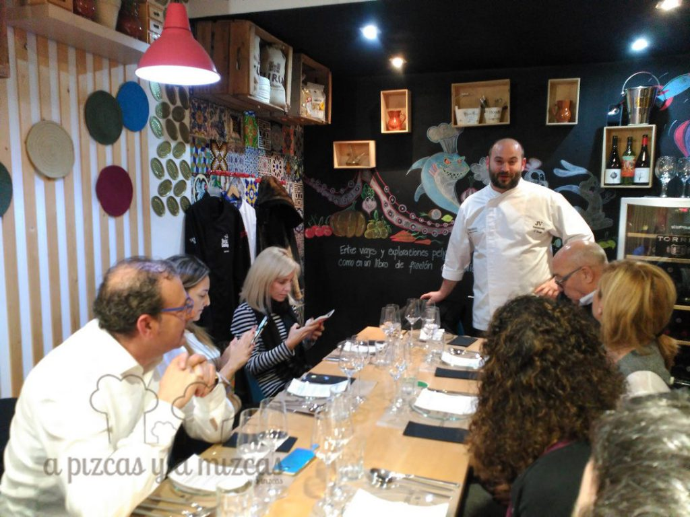

- Un snack de crujiente de mandioca picante con lima y guacamole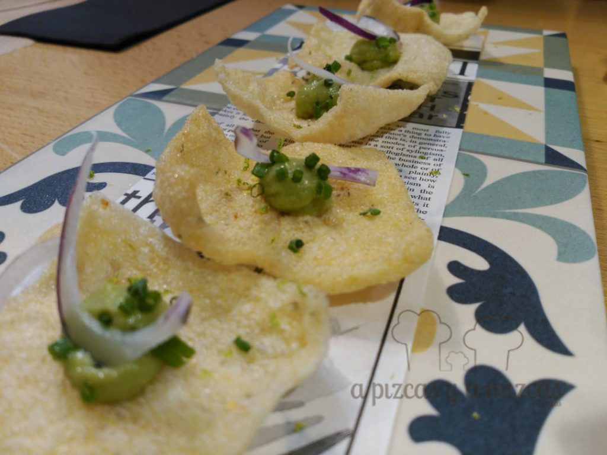
- Tartar de gambas con bullabesa cítrica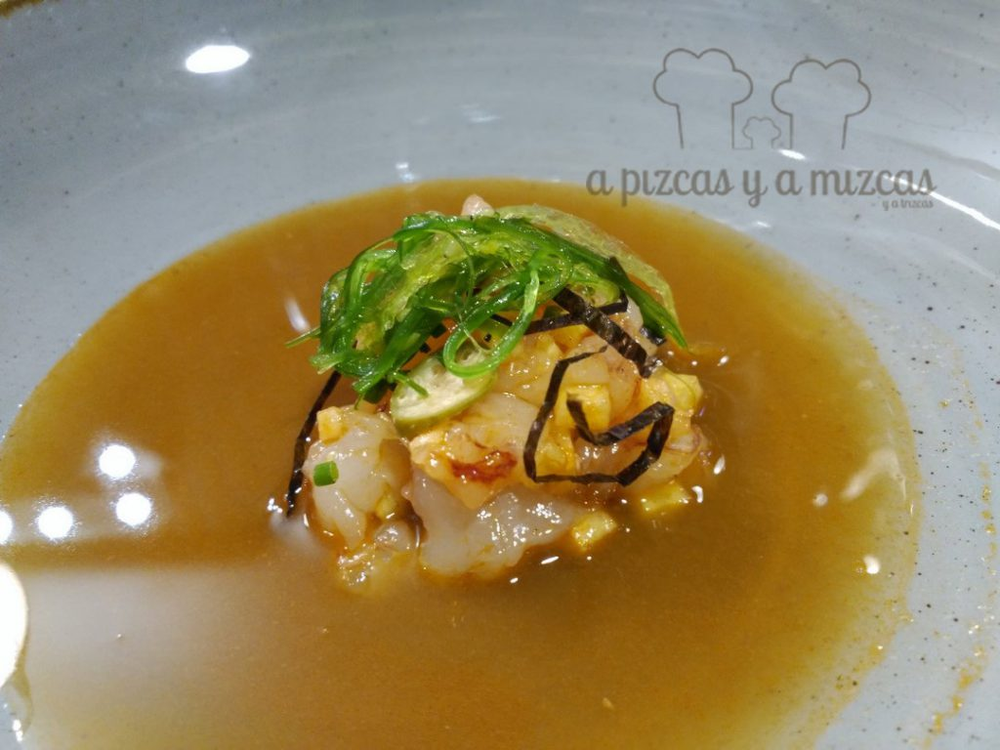
- Dumpling de pollo al ajillo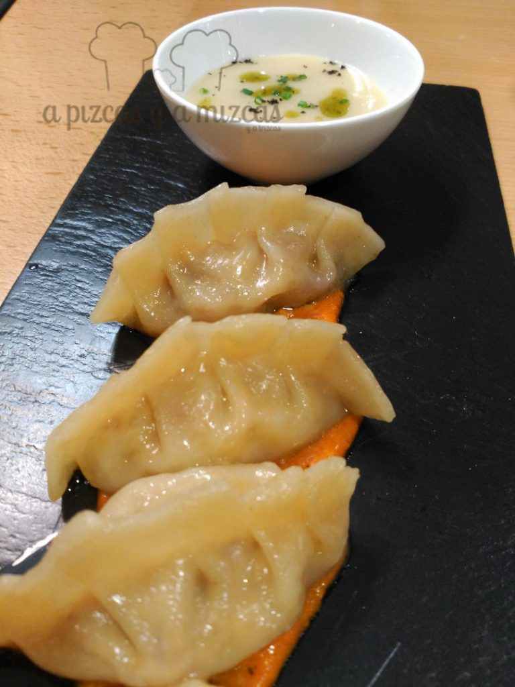
- Bombeta de carrillada melosa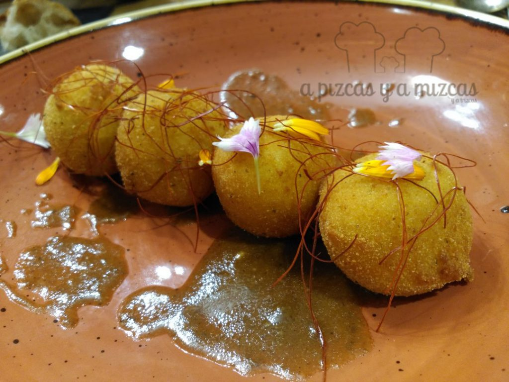

- Guiso de garrofó con careta, caldo reducido de all i pebre y anguila ahumada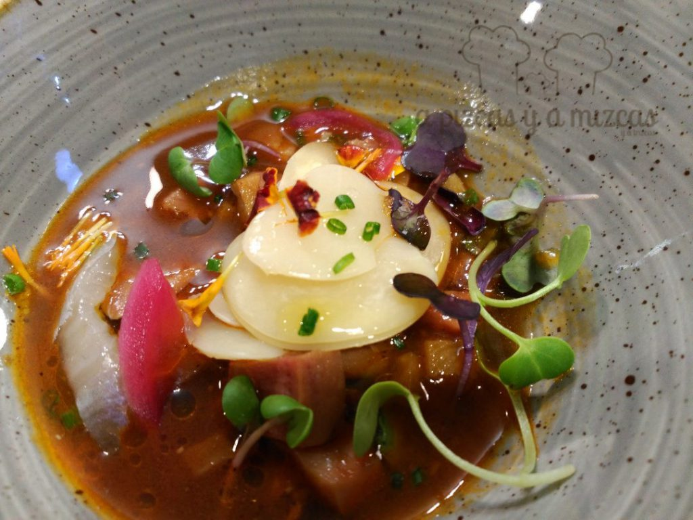
- Merluza al vapor con berenjena de Almagro y perona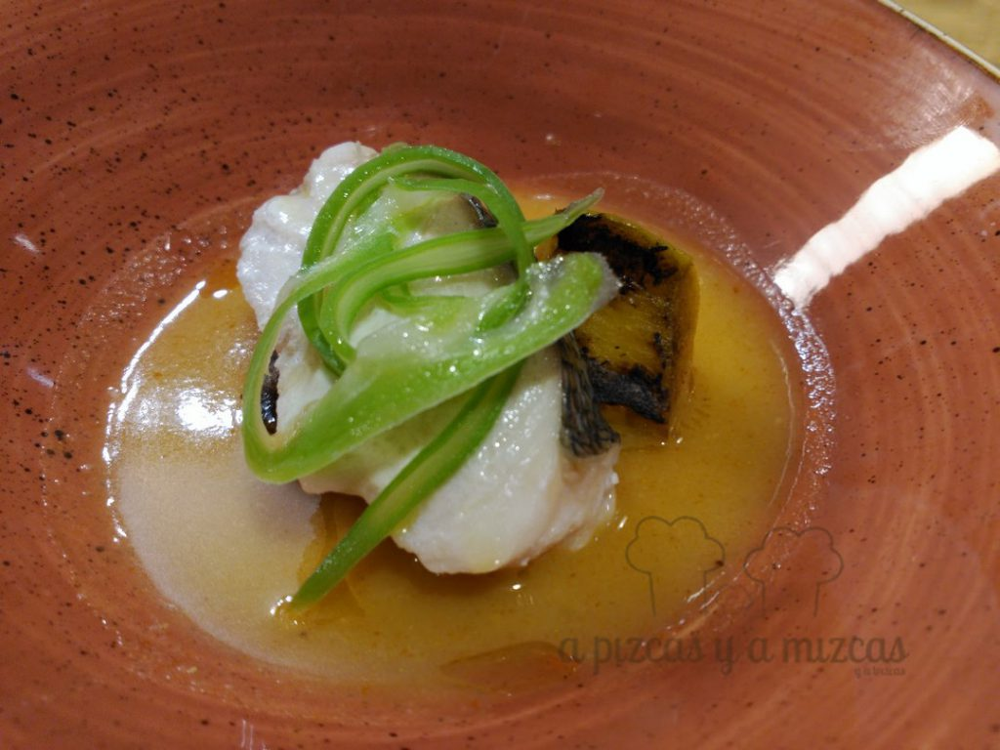
- Presa ibérica con chimichurri y yuca frita
- Calabaza, limón, miel de eucalipto y bizcocho de especias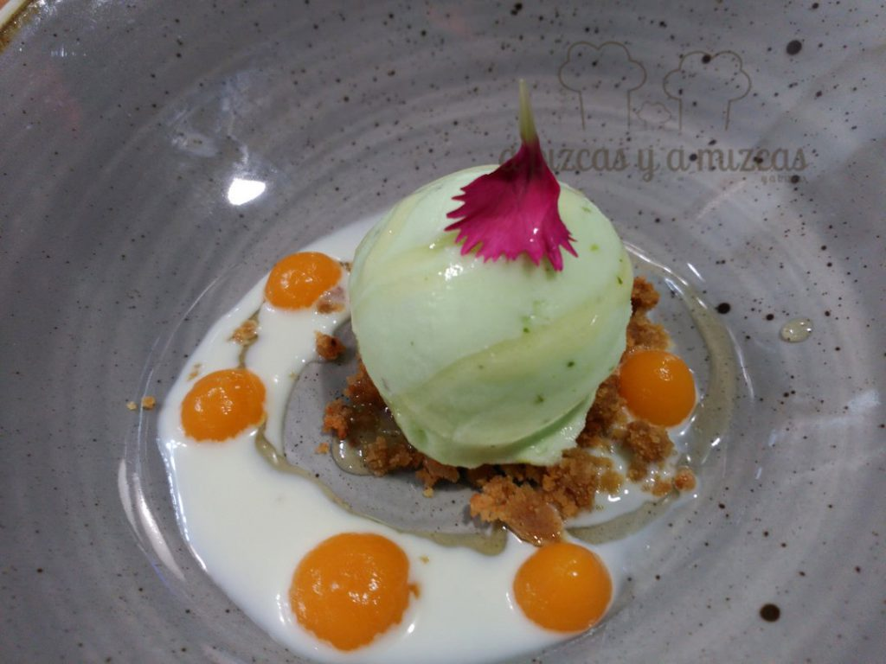

Los vinos que acompañaron el menú degustación fueron:

Rebels de Batea 2015, elaborado con Garnacha Blanca (D.O.P. Terra Alta): Intenso, aromas de fruta blanca de hueso (albaricoque, melocotón), alguna nota cítrica alimonada y de flores blancas algo pasadas. Ligero vegetal (hinojo). Boca amplia y grasa, cálido.

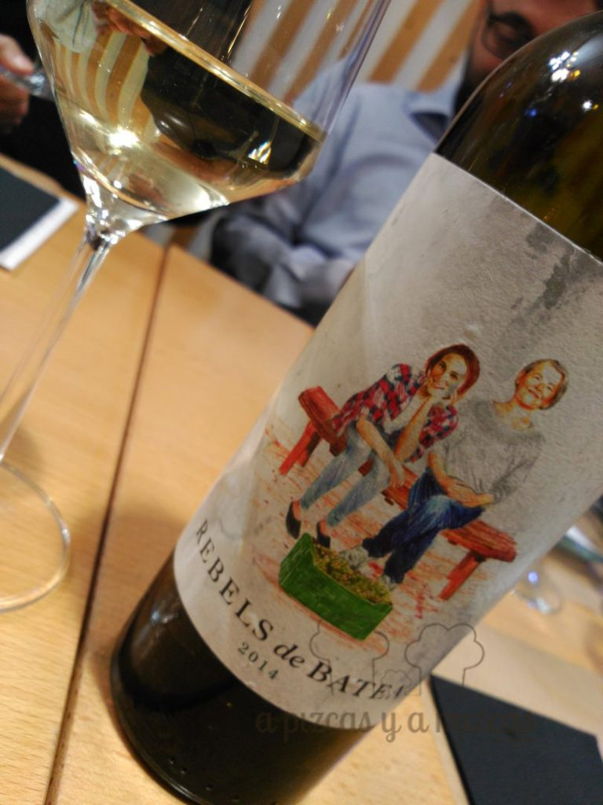

Cava Agustí Torello Gran Reserva Barrica 2011 (100% Macabeo), (D.O.P. Cava): El vino base ha sido envejecido durante seis meses en barricas de roble francés, para pasar luego un mínimo de 30 meses en rima. Un cava muy elegante, con un color evolucionado precioso, con gran expresión de las levaduras, que dejan paso a aromas de fruta como manzana Golden bien madura y en pastelería (tarta de manzana sobre hojaldre) y especias dulces. Notas amieladas y ligeramente cítricas. Boca elegante con buena acidez. Gustó mucho.

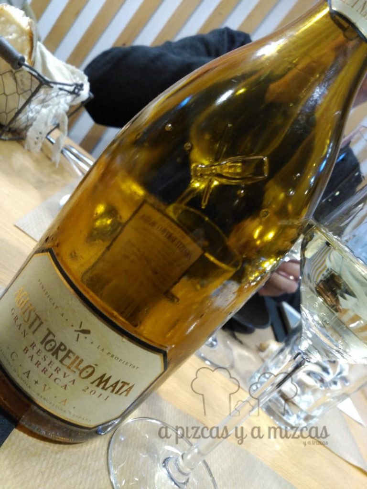

El Senat del Montsant 2013, elaborado con Syrah, Samsó y Garnacha (D.O.P. Montsant). Encontramos fruta roja y cereza en licor. Algo de caramelo tostado, que se refresca con hierbas aromáticas y especias como el clavo y la pimienta. Elegantes ahumados y torrefactos. Buena acidez y un tanino presente pero suave.

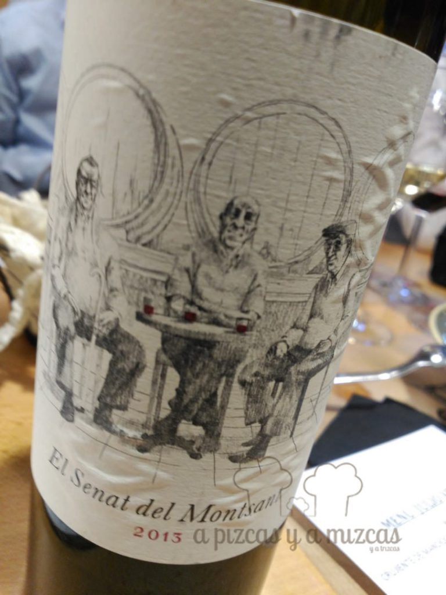

Como hemos dicho este menú era para presentar algunos de los platos que los comensales podrán encontrar en Restaurante Julio Verne estas navidades. Por ejemplo, el menú para el Día de Navidad que propone es el siguiente:

**Snacks**

- Pan de gambas y matices
- Cucurucho de foie y manzana caramelizada
- Tomatitos, hummus, caballa en salazón, pesto y parmesano

**Entrantes**

- Alcachofas con chopitos y su yema
- Guisito de garrofón, rábano negro, careta y setas

**Segundo (a elegir)**

- Arroz a banda de “puchero de Navidad”
- Arroz de puntilla, gambón y rebollones
- Merluza al vapor con berenjena de Almagro y su consomé

**Postre**

- Caballa, limón, eucalipto y bizcocho de especias
- Dulce de Navidad

Todo por 38,5 euros por persona, bebidas no incluidas.

También ofrecen varios menús especiales para comidas de empresa. Uno con tres entrantes, plato principal a elegir y postre, por 26 euros por persona con las bebidas durante el menú (agua, cerveza o vino) incluidas. Otro al mismo precio (26€) basado en tapas al centro (seis tapas) y postre Otro con snack inicial, tres entrantes, plato principal a elegir y postre, por 30,5 euros por persona con las bebidas durante el menú incluidas. Y un tercero a base de tapas al centro (snack, cuatro tapas al centro y un rico steak tataki para compartir y postre), por 30,5 euros por persona con las bebidas durante el menú incluidas.

Además, ahora el Restaurante Julio Verne también se convierte en una fantástica opción para un regalo de navidad original, pues han preparado unos vales regalo, con los que puedes regalar/te un menú degustación lleno de ideas alborotadas, o no tanto.

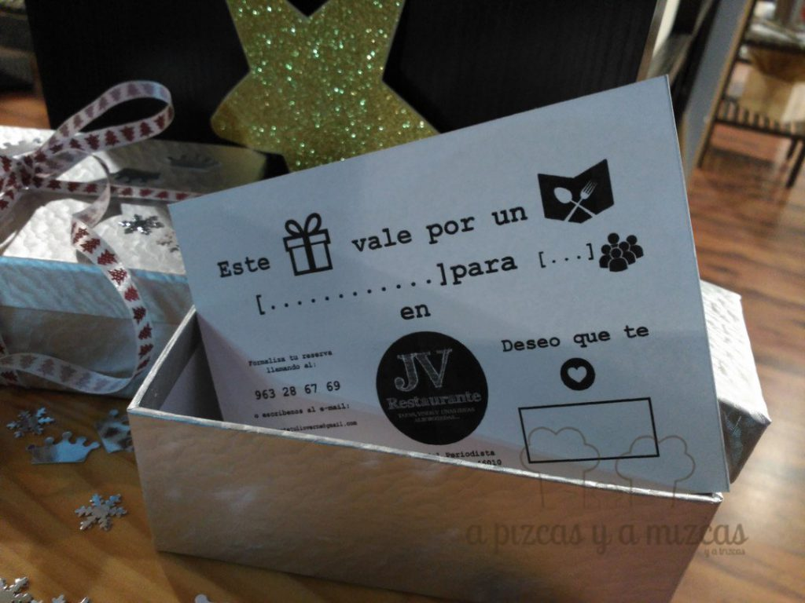
