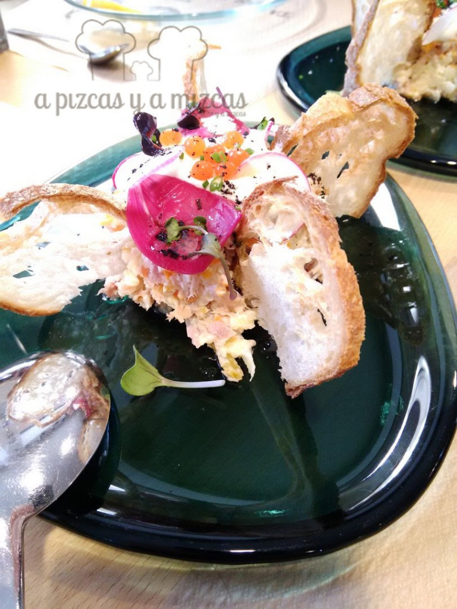

Tras la Alameda y muy cerquita de los Jardines de Viveros de Valencia hay un restaurante que merece la pena conocer. Se trata del [Restaurante Julio Verne](https://www.facebook.com/Julio-Verne-Restaurante-350550118379299/?fref=nf) (calle Periodista José Ombuena, 5). Después de la locura fallera, decidimos ir a probar el menú de tapas que propone su chef, Juan Exojo, y aunque nos tentó el menú manchego (temporal y ya no disponible), no nos atrevimos con él...

## Nuestra comida en Restaurante Julio Verne en Valencia

Acudimos un domingo a la hora de la comida y menos mal que reservamos con antelación, porque el local se llenó, muestra del buen hacer de todo el equipo. Un local acogedor y un servicio atento a cargo de Cristina Ibáñez, con una sonrisa eterna.

 Restaurante Julio Verne

- **Comida**: ⭐⭐⭐⭐⭐
- **Local**: ⭐⭐⭐⭐
- **Servicio**: ⭐⭐⭐⭐⭐

 Restaurante Julio Verne

El menú de tapas incluyó:

- Aperitivo de pan de gambas con guacamole (cortesía)

- Ensaladilla con caviar de salmón

- Tartar de atún con manzana, guacamole y aceite de albahaca

- Filipinos de foie

- Patatas bravas ahumadas en conserva

- Boquerones en tempura con salsas agridulces

- Manzana, vainilla avellana y jengibre

Un menú variado y divertido de comer, como todo lo que hace Juan Exojo. A destacar las bravas, posiblemente una de las más ricas de Valencia. Servidas en un bote de conserva hermético y ligeramente ahumadas. La salsa de tomate que las acompaña es inconfundible.

Del mismo modo, sorprenden los filipinos de foie con chocolate blanco. Un bocado exquisito y que funcionó muy bien a mitad de menú para preparar los paladares para los sabores más fuertes.

La peque trizcas picó de todo un poco (le chiflaron las bravas), pero Juan no tuvo inconveniente en prepararle una tortilla.

Lo dicho, vale la pena salir del "circuito oficial" u oficioso y dejarse tentar por Julio Verne. Si miras la gastronomía con la curiosidad de un niño y el tesón y disciplina de un cuurante nato, el resultado es éste.

> "La última maravilla siempre es la más sorprendente, y si esta progresión se mantiene no sé en qué parará todo esto" Julio Verne en 'Veinte mil leguas de viaje submarino'.
