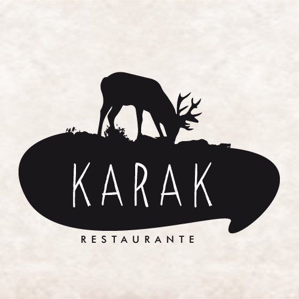
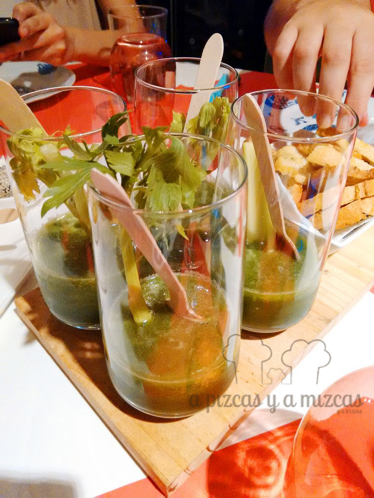
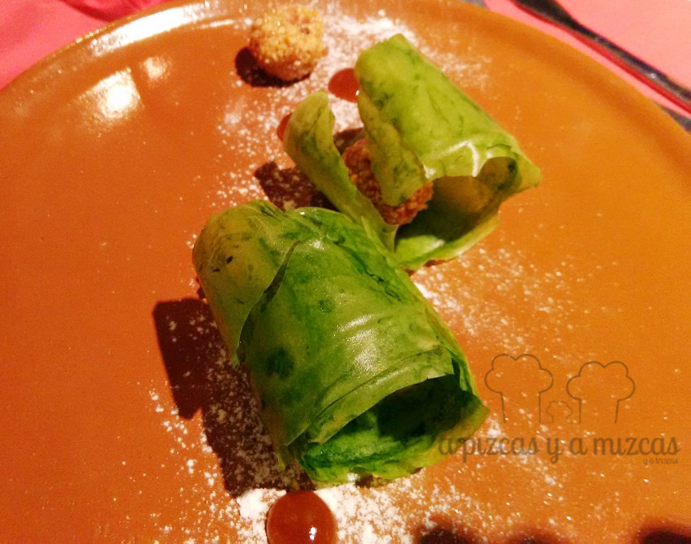
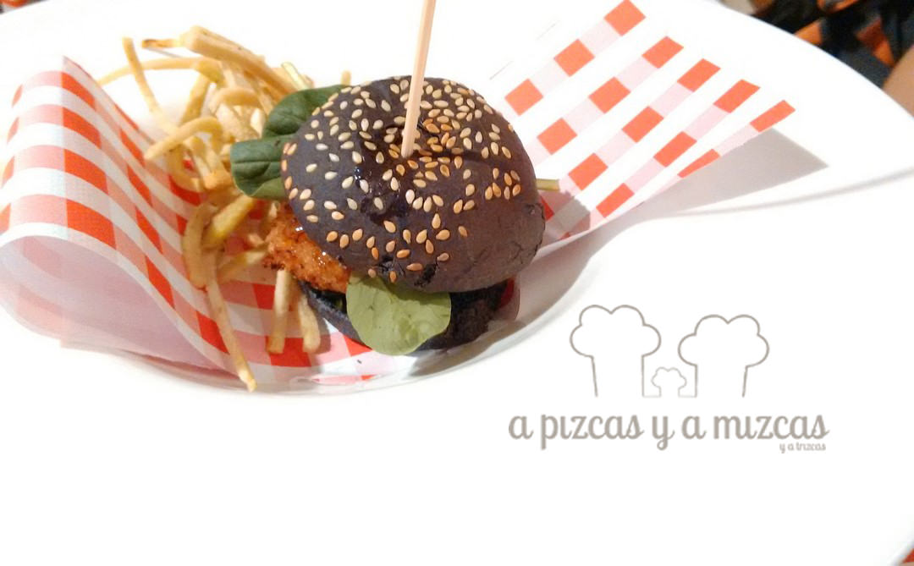
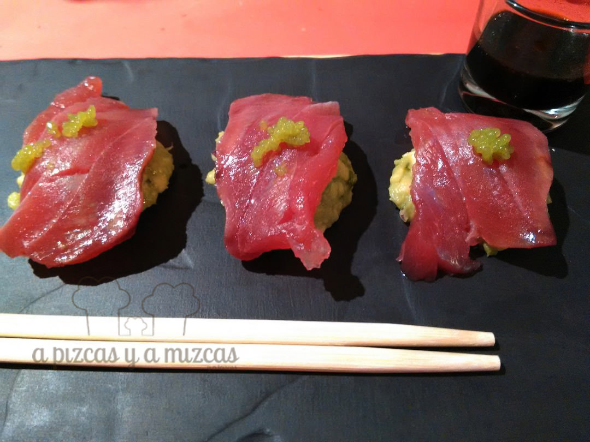
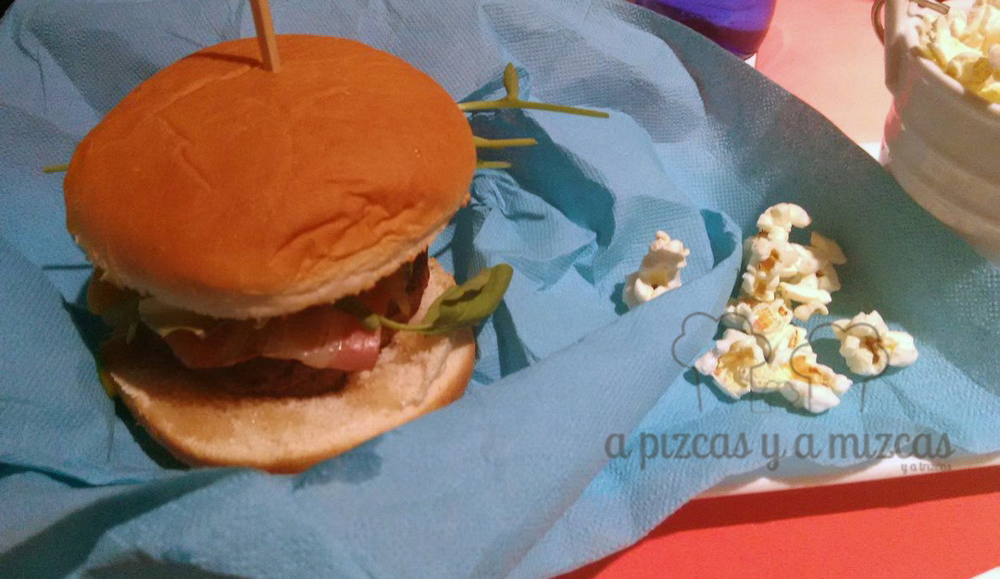
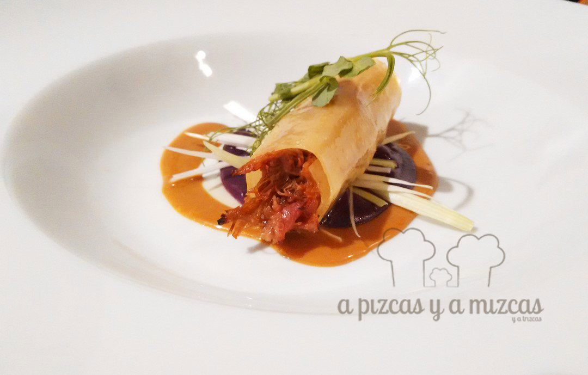
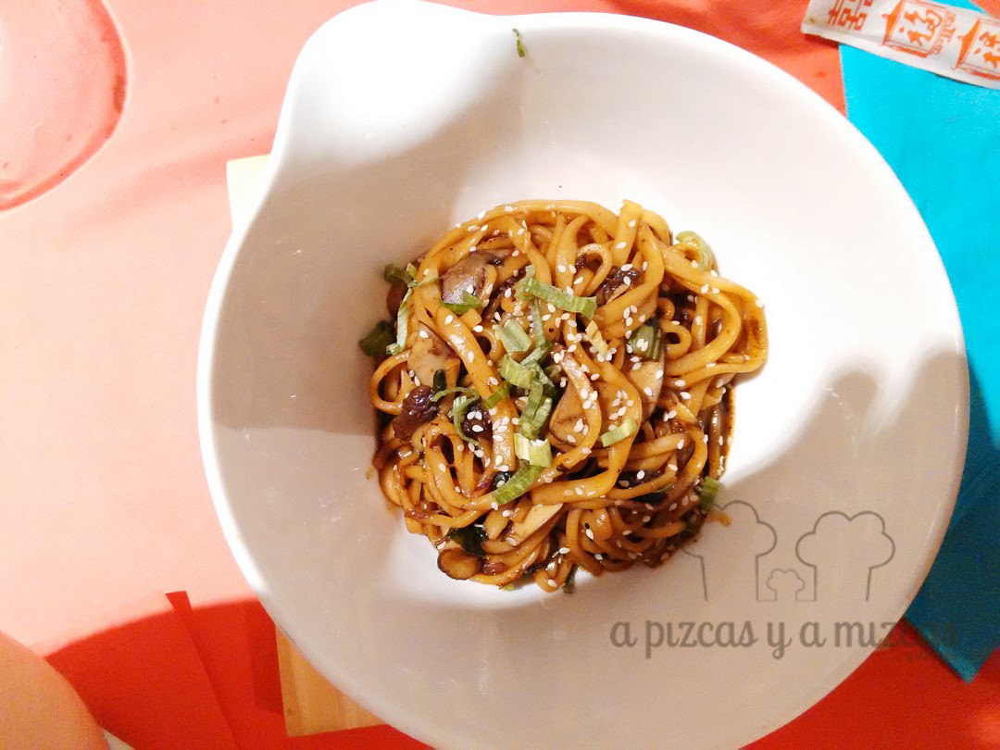

El otro día, para celebrar los cumpleaños de Mrs. Green y de Pizcas nos juntamos con nuestros espías favoritos. Y nos dejamos recomendar por ellos. No habían hablado hace unas semanas de un local en el barrio del Carmen de Valencia: [Restaurante Karak](http://www.restaurantekarak.com/) y nosotros no lo dudamos. Así que reservamos para cenar en este restaurante, que está ubicado en la calle Baja, número 42. Fue una cena muy agradable, si quieres saber en qué consistió, sigue leyendo.

Trizcas también vino al Restaurante Karak y aunque ella ya había cenado (habíamos quedado para cenar con Mrs. Green y Mr. Brown a las 22.30 horas), el servicio fue muy atento con ella y no pararon de tener detalles con la peque (minigalletas Chips Ahoy y mini Oreo, un lápiz...) que la tuvieron entretenida todo el rato.

## Nuestra cena en Restaurante Karak Valencia

La valoración del Restaurante Karak Valencia

- **Comida**: ⭐⭐⭐⭐
- **Local**: ⭐⭐⭐
- **Servicio**: ⭐⭐⭐⭐

Por tanto, éramos cuatro adultos para cenar. Nos decantamos por el menú de noche que nos pareció muy completo y muy sugerente. Esto es lo que cenamos:

\- Entrantes para compartir, que consistió en hummus casero, croqueta de morcilla con compota casera de pera y un batido depurativo de melón, manzana, apio y espinacas.

Empezamos con un batido depurativo

\- A continuación, cada uno eligió un primero y un segundo:

\- Mizcas y Mr. Brown abrieron con unas bolitas de foie y crocanti de almendra con polvo de plata y gel de mango y comino, con crujiente de alga wakame.

\- Mrs. Green apostó por una mini hamburguesa de gambón con chips de boniato.

\- Pizcas eligió un plato de atún marinado con aguacate y perlas de masago.

\- Como segundo, Mizcas y Mr. Brown volvieron a coincidir y escogieron la hamburguesa de ternera casera con, bacon, queso de cabra y cebolla caramelizada al vino tinto (la sirven con guarnición de palomitas de maíz).

\- Mrs. Green se decantó por un jugoso rollito de pato

\- Pizcas se zampó un bol de noodles con rabo de toro.

Quedamos tan llenos que no dejamos hueco para el postre, pero volveremos a probarlos.

Un menú muy competitivo, por 15 euros (sin incluir bebida y postre). Pizcas pidió vino por copa y sólo le ofrecieron el vino de la casa, que no es demasiado bueno, pero no había otra opción ya que el resto se decantó por refrescos. Lo deben mejorar.

Todo estaba bastante bueno y tienen una presentación y un emplatado muy cuidado, lo que eleva la percepción de calidad y hace que comer en Karak sea muy agradable.
