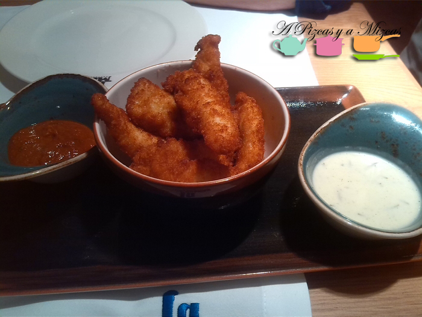
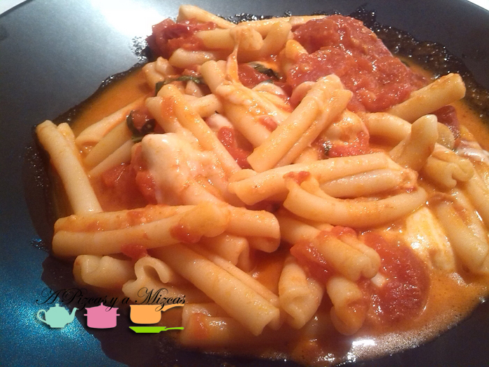
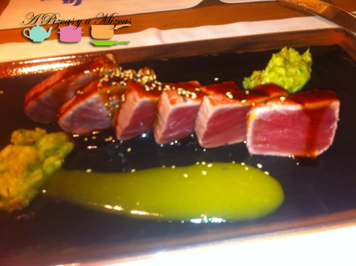
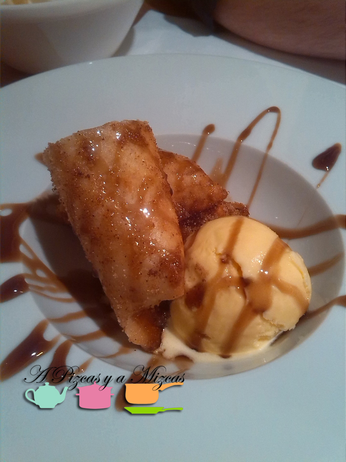
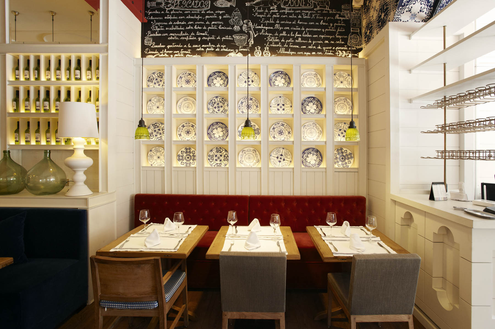

Hoy volvemos a salir de los fogones. Hay días en los que apetece salir a pasear por el centro de Valencia: Pizcas, Mizcas y Trizcas, sin tener la preocupación de mirar el reloj y luego, comer por ahí. Hace poco que acudimos a comer al restaurante [La Mary Valencia](http://www.lamaryrestaurant.com/es/restaurantes/7-la-mary-valencia "La Mary Valencia"). Está ubicado en la calle Félix Pizcueta 6, en el mismo centro. El local es muy espacioso y su decoración es muy agradable. Hay que tener en cuenta que el restaurante [La Mary](http://www.lamaryrestaurant.com/es "Restaurante La Mary") es un restaurante franquiciado, pero ello no tiene que suponer ningún prejuicio, al menos para nosotros. Acudimos abiertos de mente y con hambre...

## Nuestra comida en Restaurante La Mary Valencia

Antes de pasar a describir nuestra experiencia, así es como describen ellos mismos su comida: "nuestra oferta gastronómica siempre se ha basado en unas materias primas frescas y de primerísima calidad, resultando un restaurante de cocina tradicional, mediterránea y de mercado".

Lo cierto es que la carta es de lo más sugerente... entrantes, ensaladas, arroces, pastas, carnes, pescados... hasta platos infantiles.

Como hemos dicho, nosotros fuimos un mediodía. Acudimos pronto, para poder darle la comida a Trizcas y la verdad que fue un acierto, pues luego se llenó bastante. Así, nos pudieron acomodar a los tres y al carrito.

Para compartir pedimos las tiras de pollo crujiente con dos salsas. Un entrante correcto y generoso en cuanto a cantidad. Poco sorprendente.

Mizcas pidió casarecce a la sorrentina. Fue, sin dudas, la decepción de la tarde. La base de la salsa sorrentina es el tomate natural o pelado en conserva, luego la cebolla, la albahaca, la mozzarella... y la clave es cocinarla a fuego lento durante al menos una hora. El plato que salió a nuestra mesa carecía de esa cocción lenta, el tomate "nadaba" en su jugo y su sabor también delataba que no se habían concentrado todos los aromas y sabores en una larga cocción.

Sin embargo, Pizcas quedó encantado con su tataki de atún, aguacate, mango y salsa teriyaki. El pescado estaba en su punto justo de cocción. Sabroso, respetuoso con el producto. Rico, rico.

En los postres de nuestra comida en el Restaurante La Mary Valencia, Mizcas pidió una de sus debilidades, una copa de tiramisú. De sabor estaba fantástico, pero la textura era demasiado líquida para su gusto. Tal vez por eso sale en copa, pero estaba muy rico. Pizcas, por su parte, eligió el rollito crujiente de manzana y mascarpone con helado de vainilla. Impresionante.

Salvando el detalle de la pasta, la experiencia fue positiva. Le tenemos que dar otra oportunidad, para probar más platos de su carta.

