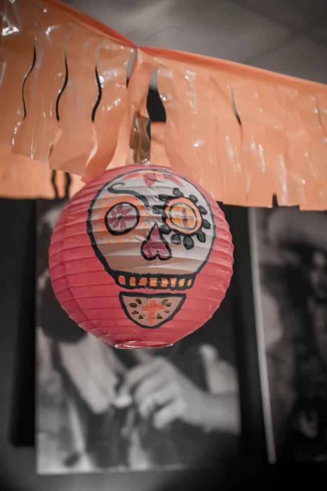
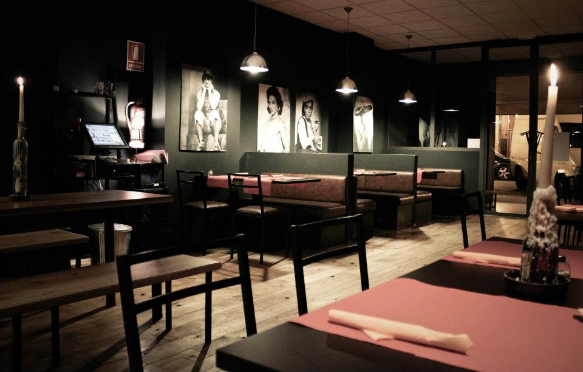
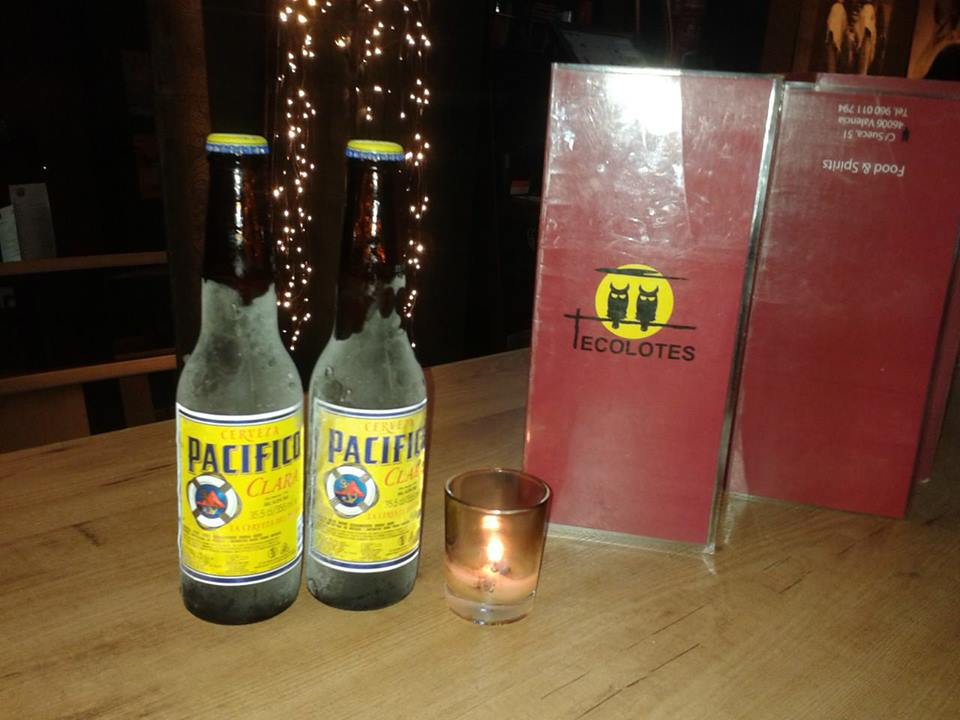
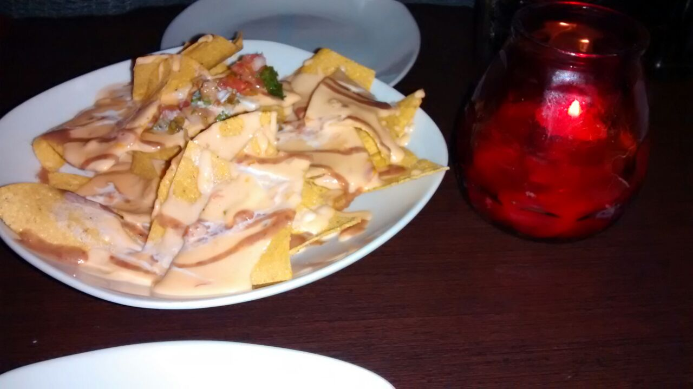

Nuestros agentes infiltrados Mrs. Green y Mr. Brown vuelven a la carga y recientemente nos han pasado el dossier de una cena que celebraron en el [restaurante mexicano Tecolotes en Valencia](https://www.facebook.com/TecolotesRestaurante/info?tab=overview "Facebook Tecolotes Valencia"), en el barrio de [Ruzafa](/tag/ruzafa/). Salieron con buenas impresiones.

Los espías de A Pizcas y a Mizcas fueron a cenar con otra pareja. Pidieron para compartir al centro y lo que más les gustó de lo que probaron fueron los nachos, las enchiladas entomatadas y el postre (en este caso un crepe con dulce de leche, helado de vainilla y caramelo).

El restaurante mexicano Tecolotes forma parte de una cadena, el otro local lo tienen en el centro comercial Heron City.

> Hacen espectáculo de mariachi en vivo y el ambiente es bastante agradable.

## La valoración del restaurante mexicano Tecolotes

- **Comida**: ⭐⭐⭐⭐
- **Local**: ⭐⭐⭐
- **Servicio**: ⭐⭐⭐⭐⭐

La comida es muy sabrosa y divertida y, sin duda, lo mejor de todo fue el servicio. Nosotros nos lo apuntamos para ir a probar.

Ya sabéis que en A Pizcas y a Mizcas también nos hemos atrevido con las recetas de [comida mexicana](/tag/mexicana/ "Nuestras recetas mexicanas")

