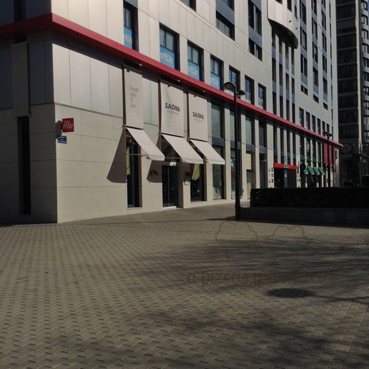
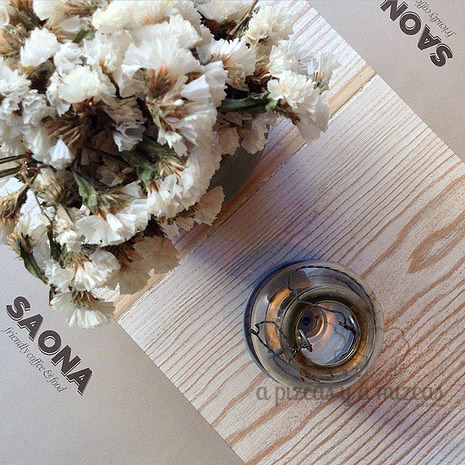
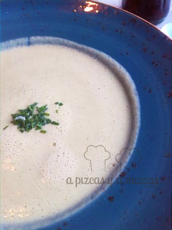
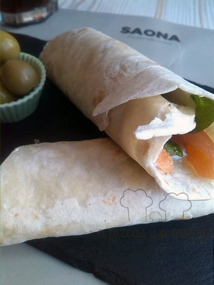
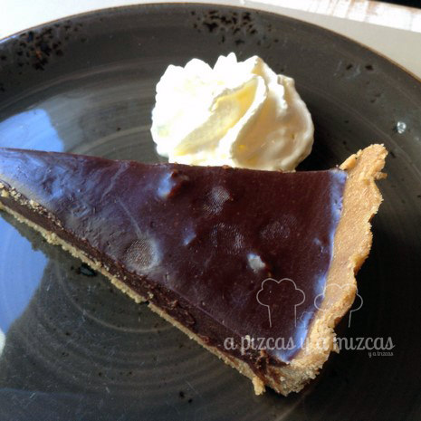
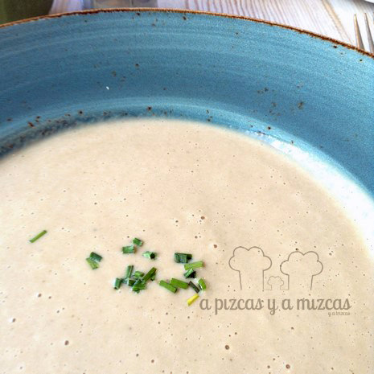
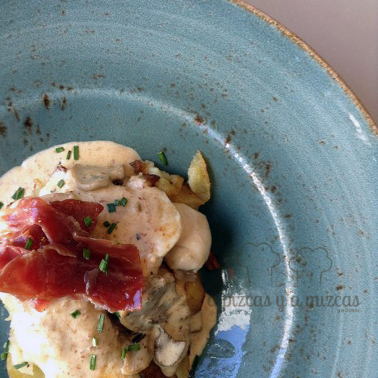
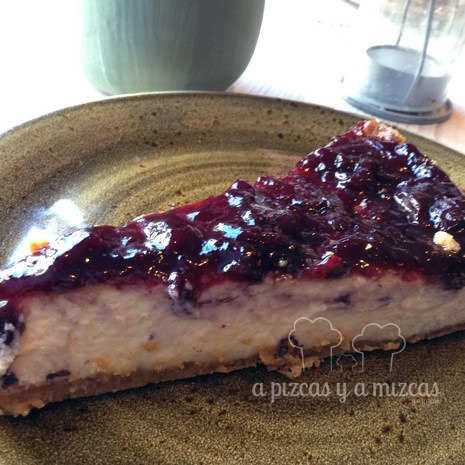

Hay encuentros por casualidad que cristalizan en una relación duradera. El nuestro con el restaurante Saona tiene visos de ser así. Hace unas semanas, paseando por la Gran Vía Marqués del Túria de Valencia (lo están ampliando) vimos un local súper chulo, con una decoración muy de tendencia (con aires mediterráneos, que te transportan casi a Formentera). Se trataba del restaurante Saona. Mizcas lo apuntó en su agenda, como pendiente de visita. Recientemente nos invitaron a ir al otro local que tienen en Valencia (en la avenida Cortes Valencianas, número 26) y aquí os contamos nuestra experiencia en el [Restaurante Saona](https://www.facebook.com/SaonaVlc?fref=ts "Página de facebook Restaurantes Saona").

El restaurante Saona no es pretencioso y esa es su gran virtud.

> Sabores reconocibles y materias primas sencillas pero de alta calidad. Además, el precio es uno de los más ajustados que hemos visto últimamente en restauración.

Si mantienen este nivel la cadena del restaurante Saona se va a convertir en un referente.

Su lema es "Friendly coffee & food" y hace honor a la verdad. La decoración en tonos pastel (mucho chalkpaint) y los detalles como las sillas de enea le aportan un toque cálido y acogedor. Aunque sea la primera vez que vas, te sentirás como en casa. Ofrecen desde desayunos, hasta cenas y copas, pasando por almuerzos y comidas.

La carta ha contado con el asesoramiento de [Barbará Amorós](http://cateringbtc.com/ "Blog Barbará Amorós, Bárbara te cocina"), cocinera participante en la primera edición de [Top Chef (Antena 3).](http://www.antena3.com/programas/top-chef/ "Programa Top Chef, Antena 3")

## Nuestra comida en el Restaurante Saona

- **Comida**: ⭐⭐⭐⭐
- **Local**: ⭐⭐⭐⭐
- **Servicio**: ⭐⭐⭐⭐

Acudimos al restaurante Saona a comer el sábado pasado, con reserva previa. Llegamos a las 14.00 horas y tenían nuestra mesa lista al instante. La zona en la que se encuentra, en la avenida Cortes Valencianas, 26, es una de las áreas de crecimiento de la ciudad, junto al que será el futuro campo del Valencia C.F.  y con numerosos edificios de oficinas. Nosotros aparcamos sin problemas, pero no sabemos si fue casualidad o no.

Dejamos a Trizcas con la iaia Mizcas, para poder "desconectar" un rato y aprovechar la mañana del sábado para hacer varias gestiones.

Vimos que el Restaurante Saona tenía un menú que sonaba fantásticamente por un precio alucinante: sólo 9,90 euros e incluye un entrante, un plato principal, postre y bebida. No lo dudamos y comimos de menú (tenemos pendiente acudir a cenar a la carta, pues promete). Vimos unas hamburguesas que tenían una pinta deliciosa y hacen pasta fresca casera.

Esto es lo que pedimos:

Mizcas

- Crema de calabacín y parmesano: ligera y calentita para combatir el frío de enero

- Wrap de salmón: sabroso

- Tarta de chocolate con nueces: aconsejable si eres adicto/a al chocolate. Si no, puede ser algo empalgosa.

Pizcas

- Crema de boletus: suave, casi como la que preparas en casa

- Solomillo de pollo de corral con crujiente de jamón ibérico y patatas a lo pobre: la carne resultaba muy jugosa y la combinación de sabores un acierto

- Tarta de queso con arándanos

¿Qué os parece? Nosotros quedamos encantados. Las cantidades son las justas y la sensación es de que has comido en un lugar que se preocupa por la calidad de lo que sirve. Si a todo eso le sumamos que por poco más de 20 euros (pedimos cafés) comimos dos adultos, nuestra valoración es muy positiva. Además, verás decenas de ideas de decoración que querrás aplicar inmediatamente (la vajilla de cerámica es una pasada).

Como hemos dicho antes, restaurante Saona no busca hacer "filigranas", pero ese es su punto fuerte. Encontrarás un servicio correcto y una comida muy bien hecha, sin trampas, con ingredientes básicos, pero de calidad y que han sido respetados. Muy recomendable. Nosotros volveremos.
