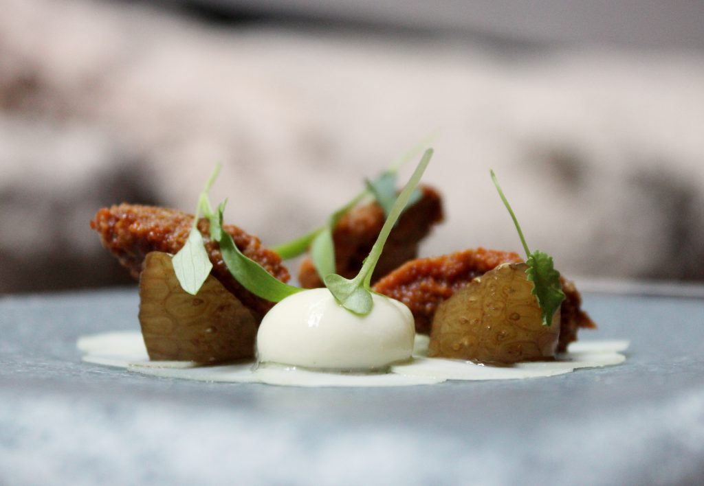
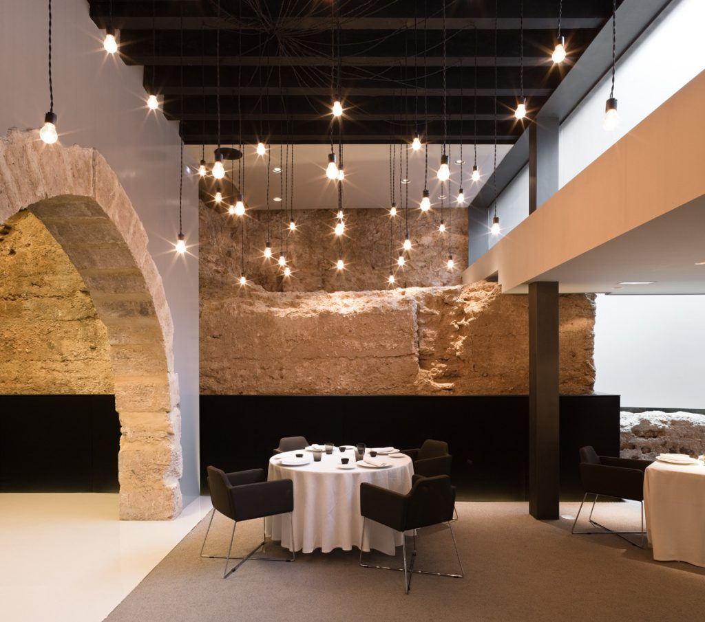
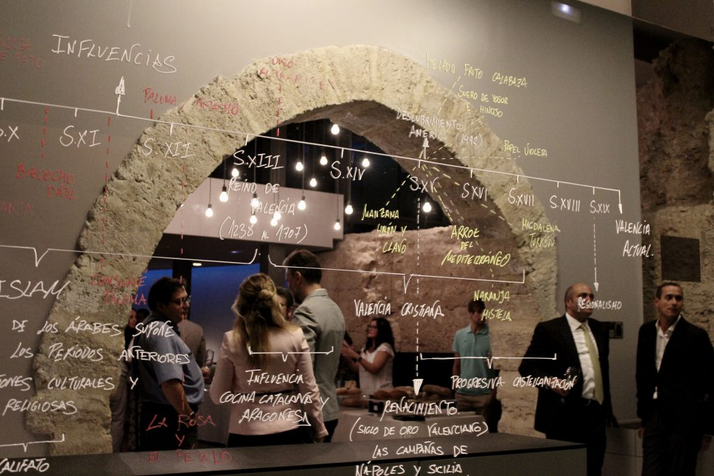

El pasado 26 de septiembre descubrimos un lugar fantástico, casi mágico en las entrañas de Valencia. Se trata del [Restaurante Sucede](http://www.sucede.com), en la calle Almirall, 14. Un local que destila la más antigua historia de la ciudad y que alberga un restaurante comandado por Miguel Ángel Mayor, ex-Mugaritz, ex-Arola y sobre todo ex-Bulli. Un proyecto que busca fusionar espacio y cocina con la historia de la ciudad como espejo, como relato e hilo conductor.

Sucede no se entendería sin su simbiosis con Caro Hotel, que ha realizado una fuerte apuesta por una gastronomía cosmopolita, de alcance universal, pero que pone todo su acento en lo local.

## ¿Qué comer en Restaurante Sucede?

A través de sus dos menús degustación, el Restaurante Sucede se sumerge en las distintas civilizaciones que habitaron la ciudad de Valencia (romana, árabe, cristiana) y en su legado culinario, pero huyendo del clásico enfoque de simple revisión de recetas.

Mientras el menú corto (4 secuencias, 18-20 creaciones, 60 euros) da rienda suelta al caudal creativo del chef, el menú largo (9 secuencias, 36-40 creaciones, 80 euros) sube aún más la apuesta y establece sutiles pero rigurosas reglas en cuanto a ingredientes, técnicas culinarias, pautas de servicio y formas de degustación, que requieren la implicación del comensal. Todo ello con la intención de una experiencia lúdica, con el sello Bulli presente en cada detalle: desde la conceptualización, siempre creativa, hasta la precisa ejecución de cada plato.

Además, se ofrece un menú de medio día de 25 euros que nos morimos por probar y siempre se puede comer a la carta (media 50 euros).

El resultado es una sinfonía gastronómica que asombra, que apela a la emoción de lo temporal y que consigue sublimar el espacio que alberga el Restaurante Sucede, que se halla literalmente seccionado por la muralla árabe que cerraba Valencia en el siglo XII y que fue destacado en 2014 por la editorial alemana Taschen como uno de los restaurantes más bonitos del mundo. Precisamente la sala, otro de los grandes baluartes del proyecto, está dirigida por la _maître_ Cristina Prados, jefa de sala y encargada también de armonizar las diversas propuestas gastronómicas con las más de 500 referencias de vino que reposan en la bodega.

  

Además de una orientación gastronómica de primer nivel, la propuesta del Restaurante Sucede levanta el telón con la colaboración de agricultores locales, historiadores de la Universitat de València y artistas cerámicos, pero con la vista puesta en la futura rehabilitación de la renacentista Casa de La Serena en Alfara del Patriarca, incorporada recientemente al proyecto de Caro Hotel. Será en este enclave donde se cerrará el círculo: un espacio para eventos, un laboratorio de I+D gastronómico y un programa de recuperación de especies autóctonas en la propia huerta permitirán consolidar el insólito ejercicio que ha dado comienzo ya en el local de la calle Almirall, 14.

Cierra domingos noche y lunes.
