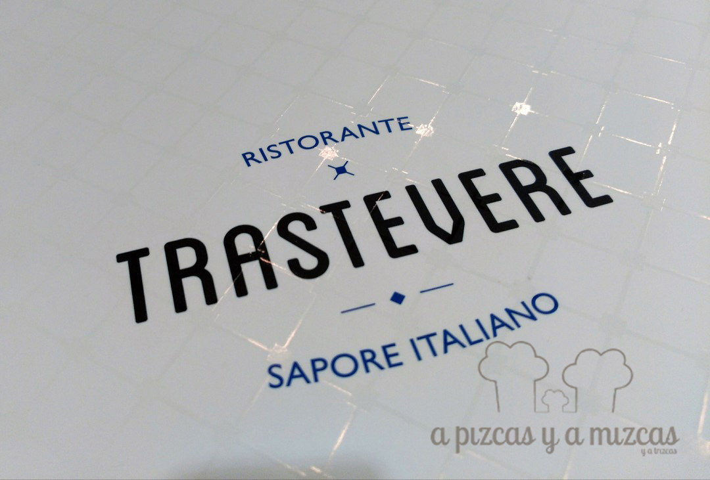
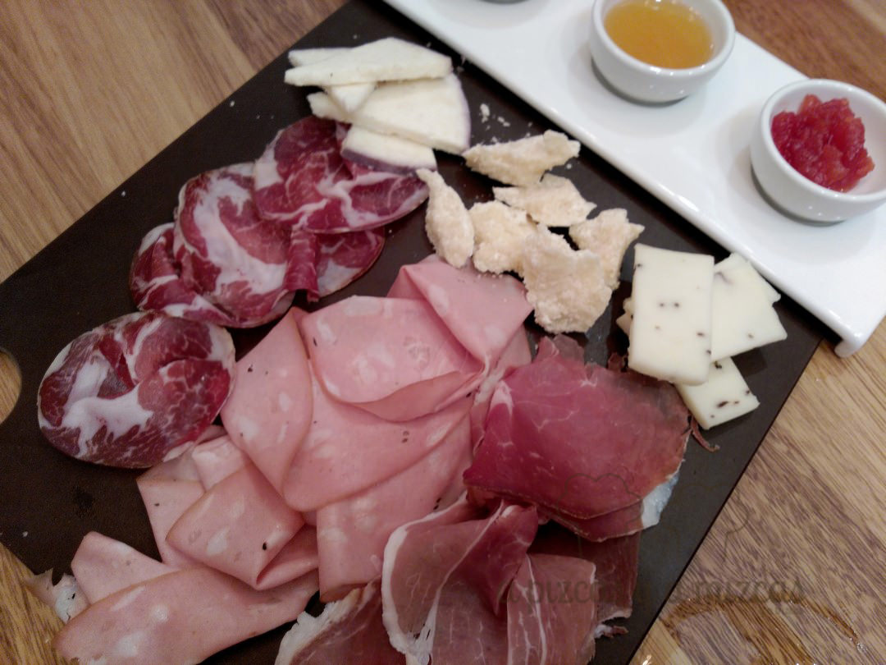
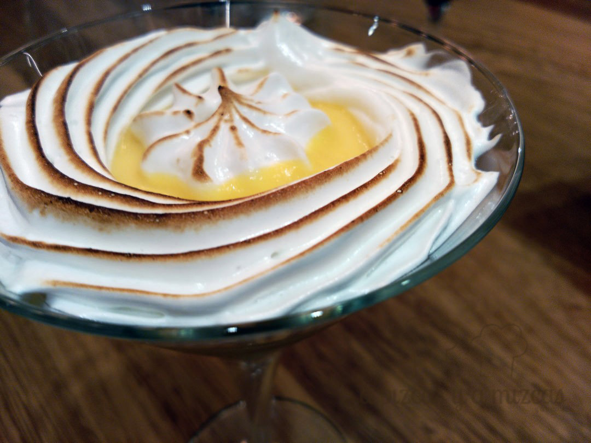

Recientemente conocimos la oferta gastronómica del [Restaurante Trastevere](https://es-es.facebook.com/trastevereaqua/) en el Centro Comercial Aqua, de Valencia y nos sorprendió su propuesta diferente y su fidelidad a la tradición culinaria de las diferentes regiones de este país. Un restaurante italiano que se aleja de los tópicos y con un espacio moderno y elegante. ¿Quieres conocer más sobre Trastevere?

## Nuestra comida en el Restaurante Trastevere en el Centro Comercial Aqua

- **Comida**: ⭐⭐⭐⭐
- **Local**: ⭐⭐⭐
- **Servicio**: ⭐⭐⭐⭐

Como decíamos antes, la carta de Trastevere (963 30 11 72) va más allá de la clásica propuesta de otros restaurantes italianos, gracias a su visión más completa, fresca e innovador. Su difrencia se pasa en la fidelidad a la auténtica comida del país y por acercar sus recetas más desconocidas a nivel internacional, por elaborar una propuesta con productos de gran calidad traídos expresamente desde allí, y por “italianizar” grandes recetas internacionales.

La carta es muy clara y de un vistazo permite recorrer los sabores de Italia. Además, es amplia, pero no excesiva, por lo que el comensal no acaba "perdido" en una carta que casi casi hubiera que encuadernar.

Para abrir boca, la propuesta de aperitivo (antipasti), probamos un grill de verduras acompañado de queso parmesano y patatas fritas a la trufa. También son recomendables las bruschettes, que se componen de cuatro focaccias como la Mantovane (aceite y foie, verduras, mortadela al tartufo y parmesano) y la Trii (aceite con salmón, tomate de Puglia, bacalao y alcachofa).

Destaca la calidad de los quesos y de los embutidos, seleccionados de entre pequeños proveedores italianos. Con ellos, preparan y cortan al momento, a la vista de los comensales unas completas tablas. Entre las propuestas, se pueden degustar productos con Denominación de Origen Protegida que difícilmente se encuentran en establecimientos españoles, como por ejemplo la mortadela al tartufo, salame milano, culatello, prosciutto di Parma y la coppa. Los amantes del queso encontrarán en el Restaurante Trastevere una curada selección con ricos quesos como el pecorino al tartufo, parmigiano reggiano, gorgonzola, taleggio o testun al barolo. Las tablas las presentan acompañadas de "mostardas" de Cremona y de miel a la trufa.

Probamos también una ensalada di caprino e guanciale con pomodoro di Puglia. Una ensalada en la que un sabroso queso de cabra está envuelto en guanciale (una especie de panceta que proviene de la carrillera del cerdo y con la que originalmente se hace la famosa salsa carbonara), junto con nueces caramelizadas, unos tomates confitados y en conserva y una original vinagreta de piña colada. A continuación, un fresco tartar de mortadella al tartufo con burrata.

Las pizzas del Restaurante Trastevere en el Centro Comercial Aqua son espectaculares. Sin duda tienes que probar las pizzas palermitanas, que se elaboran según la tradición “fornaia” de Palermo. Su masa se hace con masa madre de pan y queda más "panificada" y esponjosa. Probamos la palermitana de foie, con cebolla caramelizada, setas, foie y confitura de tomate. También hacen pizzas muy, muy, muy finas (alla pala) y no pudimos dejar de probar la Costa Bianca (con mozzarella, pecorino tartufato, coppa, cebolla pochada y tiras de calabacín).

Cómo no, también disponen de una cuidada selección de pastas. Su propuesta se divide por regiones y podemos conocer los platos más típicos de Emilia Romagna, Lazio, Plugia, Sicilia, Piemonte y Liguria que van desde los Tagliatelle a los Ravioli, Papardelle o Spaguetti, a otras propuestas con tipos de pasta fresca y rellena poco conocidas, así como acompañamientos tan exquisitos como la sepia, almejas y mejillones con tinta de calamar o Raviolis del Plin all”Arrosto di Vitello con jugo alla diavola, rellenos de carne.

La selección de vinos es comedida, pero adecuada. Recomendamos el Chardonnay del Veneto y el Chianti Reserva. Perfectos para acompañar todos los platos.

Para acabar con un buen dulce, optamos por el Dolce Limone Amalfitano con crema de limón, bizcocho y merengue o la Brioscia siciliana que representa otra forma de comer el helado fuera del clásico cono o copa, sirviéndolo en un tradicional brioche italiano.

¿El precio? Bastante asequible, a la carta por unos 20 euros por persona (sin bebida).

Y así terminó nuestro viaje por Italia. Ci torneremo presto.
