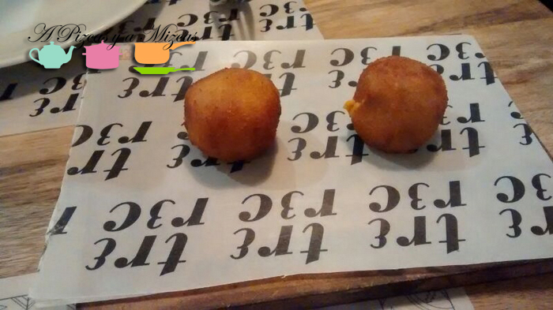

Con esta entrada sobre el [**Restaurante Trece**](http://www.trece.co/ "Restaurante Trece en Valecia") en Valencia empezamos una nueva serie de entradas en el blog gracias a la colaboración de los **pizqueros Ms. Green y Mr. Brown**. Ellos se han convertidos en auténticos **espías** de Pizcas y Mizcas y nos contarán a todos sus experiencias en varios [restaurantes](/restaurantes/ "Restaurantes") de la ciudad de Valencia. Comenzamos con el Restaurante Trece en Valencia, situado en la calle Calatrava, número 12 de la capital del Turia.

En estas crónicas pizqueras lo esencial será la concreción y la síntesis, para, **de un vistazo**, poder tener claro si nos gustó o no el lugar en cuestión. Así, los Ms. Green y Mr. Brown se encargarán de puntuar del 1 al 5 la **comida**, el **local** y el **servicio**.

## Restaurante Trece en Valencia

Nuestros espías fueron a cenar al Restaurante Trece en Valencia. Sus puntuaciones fueron las siguientes:

- **Comida**: ⭐⭐⭐⭐
- **Local**: ⭐⭐⭐⭐⭐
- **Servicio**: ⭐⭐⭐⭐⭐

Lo que pidieron para su cena en Restaurante Trece fue:

- Patatas gallegas al estilo Sergi Arola

- Croquetas de sobrasada de Mallorca y queso de Mahón

- Mini hamburguesa de buey con corazón de foie, cebolla y crema de hongos y trufa
- Mini hamburguesa de buey con escamorza, tomate seco y crujiente de jamón ibérico

- Crema de mascarpone con tropezones de brownie

Nos dijeron que estarían encantados de repetir cena en Restaurante Trece. ¿Vosotros lo conocíais? ¿Qué tal vuestra experiencia?

Si queréis convertiros en espías pizqueros, poneros en contacto con nosotros a través de los comentarios a esta entrada y estaremos encantados de hacernos eco de vuestras opiniones y descubrimientos.
