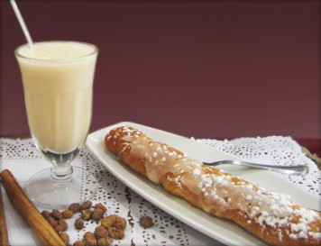

Las imágenes valen más que 1000 palabras... así que la entrada de hoy es un resumen de imágenes de uno de los días más falleros...

Hemos empezado el día desayunando los típicos buñuelos con chocolate.")

A la hora de la comida no podía faltar el aperitivo, ensalada valenciana y la gran protagonista la Paella")")")")

Y para seguir con la marcha... para merendar horchata. Nos han faltado los fartons... lo dejamos pendiente...
