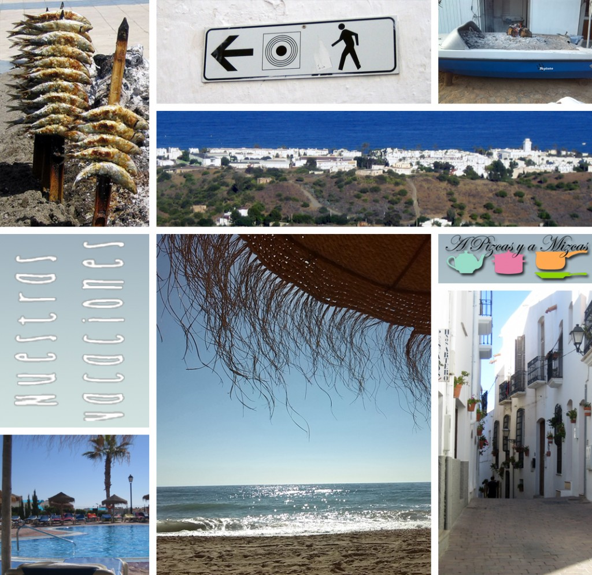

Ya llegó septiembre y creo que me tengo que ir.... el curso ha empezado ya.... Hemos vuelto! Y lo hacemos con muchas ganas y con las pilas cargadas, después de unos días de descanso que os resumimos en estos retratos de vacaciones. Hemos podido recargar las pilas y trabajar en varias ideas para el blog en esta nueva temporada.

Para que no se nos haga demasiado dura la vuelta a los teclados, tendremos siempre presentes estas imágenes, que son las que resumen parte del parón vacacional de **A Pizcas y a Mizcas**, así en cualquier momento podremos "escaparnos" a las playas de Mojácar, en Almería, donde nos lo pasamos en grande.

## Sardinas y playas en nuestros retratos de vacaciones

Durante estos días descubrimos otra forma de comer sardinas, al [espeto](http://es.wikipedia.org/wiki/Espetada). Intentaremos hacer algo parecido en casa... que nos recuerde esos días en Almería.

Recorrimos las calle empinadas de Mojácar... pero el esfuerzo de las cuestas tuvo su recompensa al llegar a lo alto del mirador del Castillo y ver una panorámica de las playas de Mojácar. Un pueblo con mucho encanto, en el que las paredes encaladas realzan los colores de flores y puertas en sus casas.

Estuvimos alojados en [el hotel Marina Mar](http://www.servigroup.com/contenidos/hoteles/servigroup_marinamar.html "Hotel Marina Mar, todo pensado para los pequeseres"), eran las primeras vacaciones fuera de casa de Trizcas, así que optamos por este establecimiento con ambiente familiar y, la verdad, es que volvimos encantados. La habitación era muy espaciosa y la comida muy variada, además, todo estaba pensado para facilitar la tarea de los padres/sherpas, así que había tronas, microondas... todo a disposición de los progenitores para atender a los pequeseres.

Disfrutamos como enanos en sus piscinas y en la playa de Mojácar, aunque a Trizcas eso de que la arena se le quedara pegada en las manos, en los pies, en el culete... no le hizo mucha gracia. Pero aprendió a nadar con los manguitos y a "independizarse" en el agua. A ver quién era el guapo que la sacaba del agua.

En una próxima entrada os contaremos el resto de las vacaciones y qué ideas tenemos para el nuevo curso... id preparando los cuadernos.
