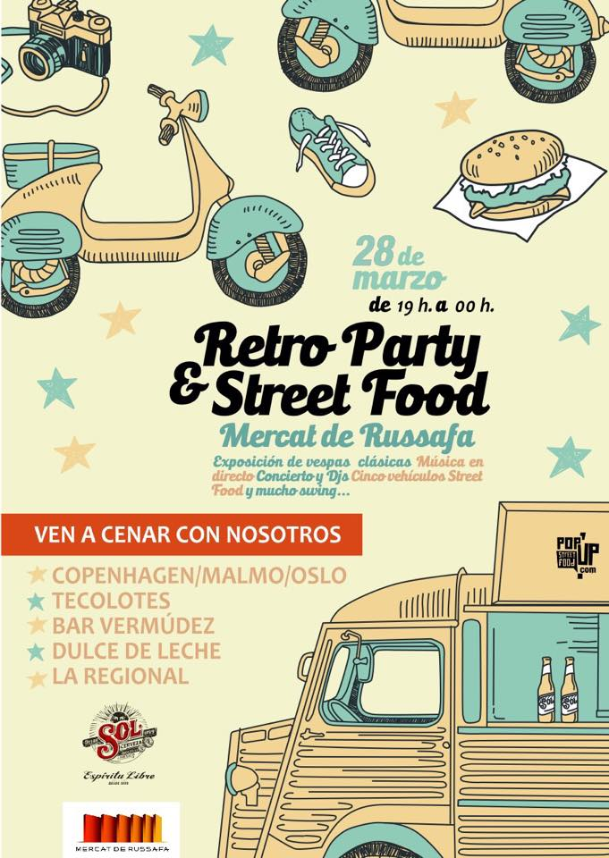
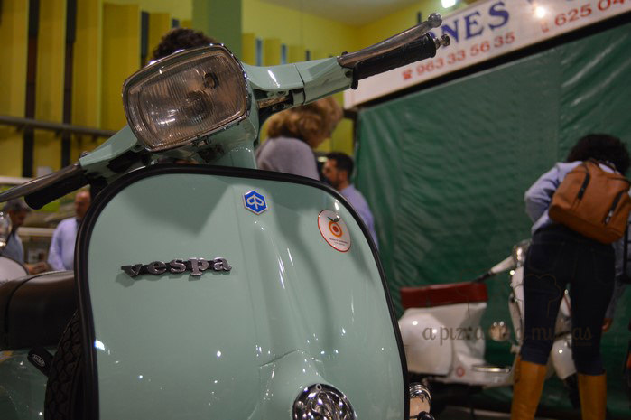
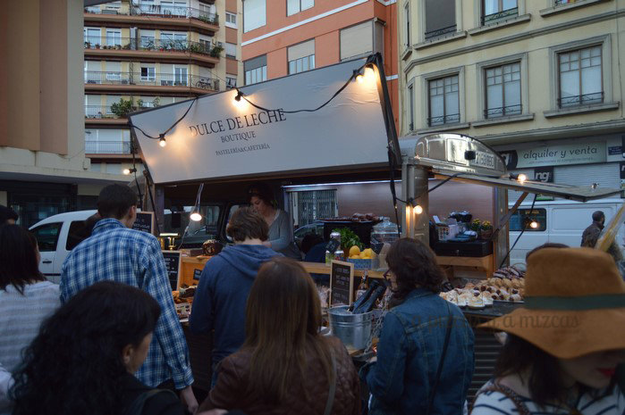
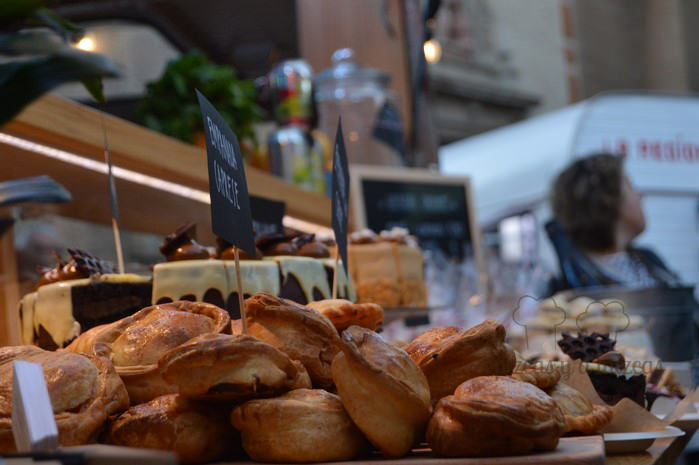
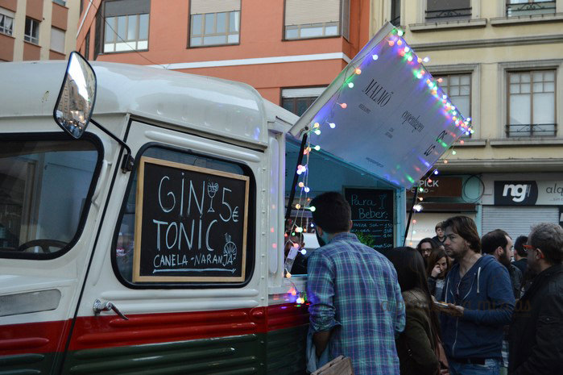
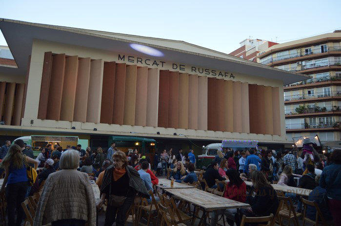
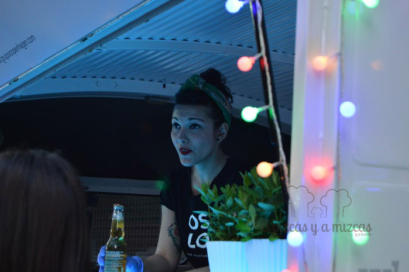
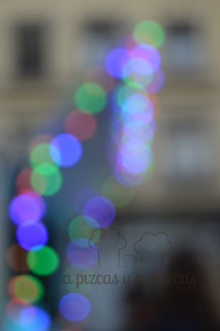

Después de varios días en los que la lluvia no nos dejaba poner prácticamente un pie en la calle, el sol ha vuelto a Valencia y la subida de las temperaturas coincidió con el evento Retro Party & Street Food [Ruzafa](/tag/ruzafa/ "Ruzafa"), organizado en el [Mercat de Russafa](http://mercatderussafa.com/ "Mercat de Russafa") (Valencia), el 28 de marzo y que fue todo un éxito.

La [Asociación de Vendedores del Mercat de Russafa](http://mercatderussafa.com/ "Mercat de Russafa") consiguió su objetivo y creo una auténtica fiesta de puertas abiertas dedicada a toda su clientela y, también, a todas aquellas personas que quisieron sumarse a la iniciativa.

A nosotros nos atrajo de la retro party & street food Ruzafa en primer lugar la presencia de varios [food trucks](/food-trucks-comida-sobre-ruedas-en-valencia/ "Food trucks: comida sobre ruedas en Valencia"). Ya habíamos tenido la experiencia en las pasadas fallas y queríamos probar ésta que, además, firmaban algunos de nuestros sitios favoritos de Ruzafa.

## La Retro Party & Street Food Mercat de Russafa incluyó:

- Exposición Vintage de [Vespas & Lambrettas clásicas](http://www.clubvespalambretta.com/ "Club Vespa Lambretta Valencia") en el interior del Mercat

- Fashion Shootings con modelos de Fashion&Art MGMT, vestuario de Kauf Vintage, beauty de Leles Estilistas, bloggers y fotógrafos en vivo
- Música en Directo con la actuación de Lupe Catalá y su grupo
- Los bailes de Spirit Valencia Lindy Hop, una comunidad de bailarines apasionados por el Swing y el Lindy Hop
- Con la participación de DJ Blanch-M, para animar la velada entre los directos y actuaciones
- Y… el Street Food Market con deliciosos bocados en la explanada exterior con furgonetas habilitadas, firmadas por [Malmö, Copenhagen y Oslo](http://grupocopenhagen.com/# "Grupo Copenhagen") con su oferta vegetariana; [Tecolotes](/restaurante-mexicano-tecolotes-en-valencia/ "Restaurante mexicano Tecolotes en Valencia") y su apuesta por los platos mexicanos; [Dulce de Leche](/el-brunch-de-dulce-de-leche-en-ruzafa/ "El brunch de Dulce de Leche en Ruzafa") con sus deliciosas tartas; el nuevo espacio [Bar Vermúdez](https://www.facebook.com/barvermudez "Bar Vermúdez") y [La Regional](https://www.facebook.com/laregionaldecomidas?fref=ts "La Regional ") con innovadoras recetas de toque autóctono

Nos encantó el ambiente que se creó. Muy familiar. Además, los más pequeños se lo pasaron en grande. Trizcas estuvo bailando todo el rato en el centro de la pista, al son que le marcaba el DJ. No hubo forma de sacarla de allí.

Para cenar en la Retro Party & Street Food Ruzafa optamos por la furgoneta de La Regional. Aún no los habíamos probado. Elegimos dos molletes, "El Guiri" y "El Guiri 2.0", ambos a base de lomo de cerdo, uno con salsa de yogur y el otro con verduras encurtidas. Muy ricos. Trizcas eligió una empanada de carne de la food van de Dulce de Leche.

La respuesta de la gente de Ruzafa fue fantástica y superó ampliamente las expectativas.

> El Mercat de Russafa se dio a conocer y os invitamos a que os acerquéis hasta él para hacer la compra o simplemente pasar una mañana. A nosotros nos parece un plan perfecto.

