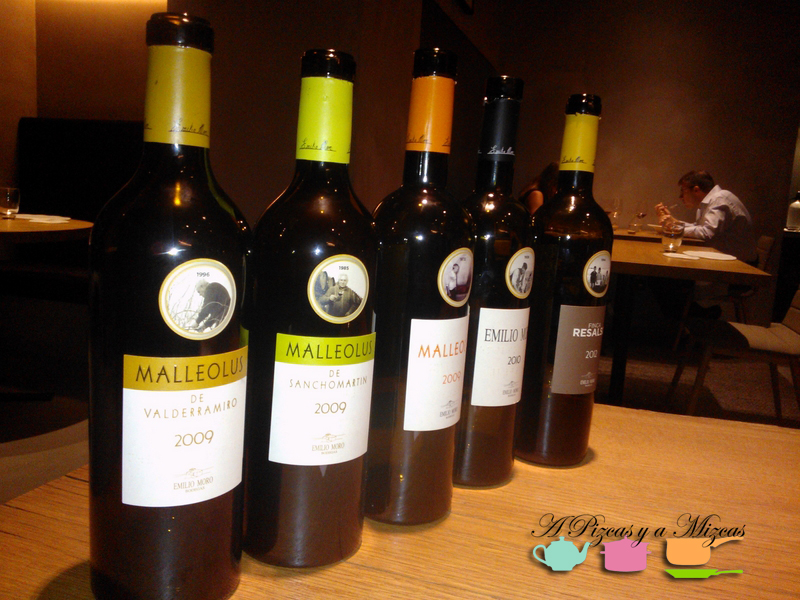
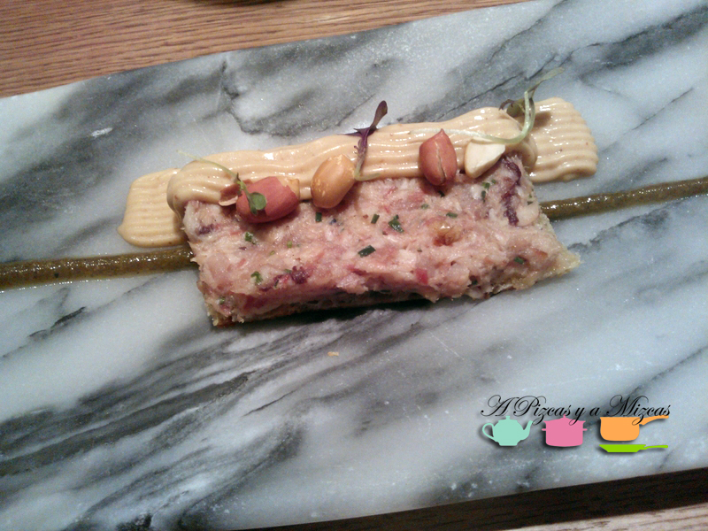
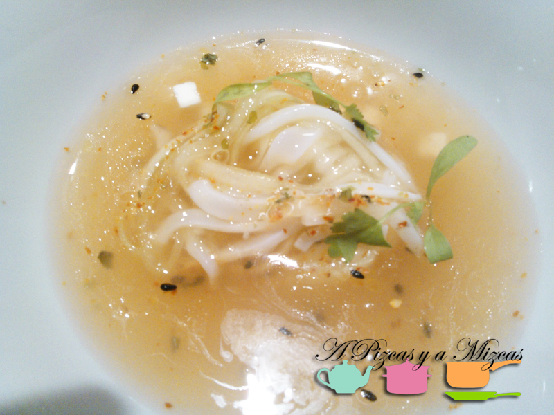
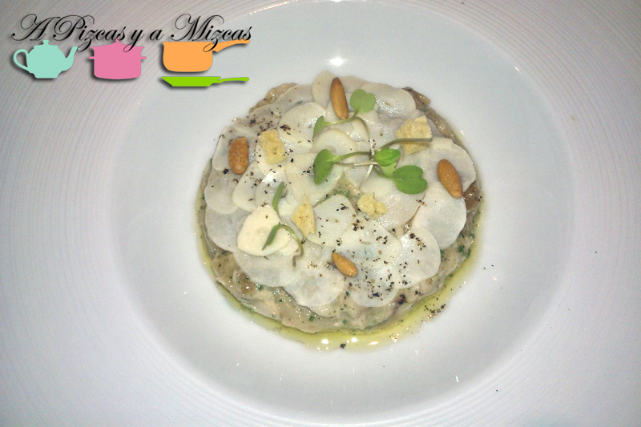
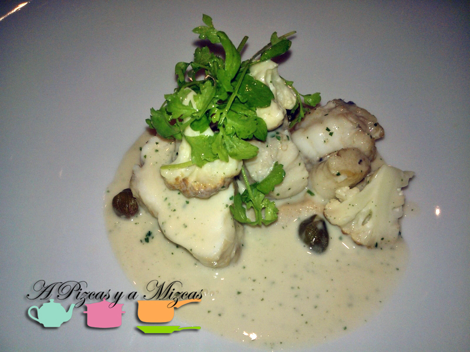
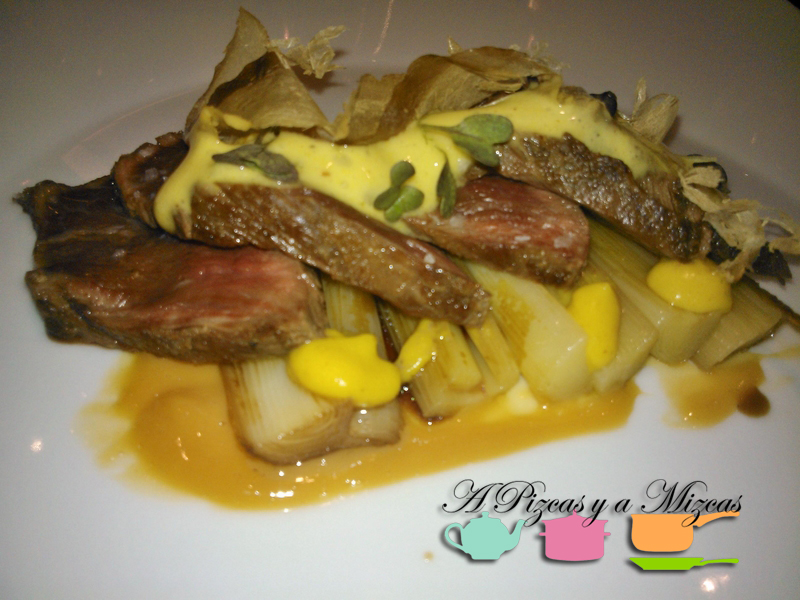
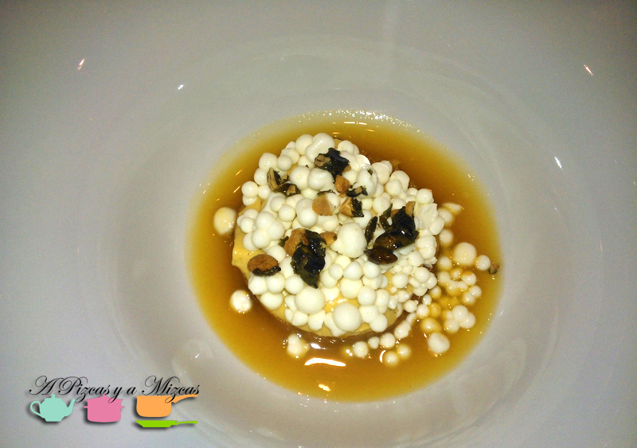

Que tu trabajo sea capaz de agitar las mentes de sus destinatarios, de espolear la llama de la inspiración debe ser fantástico. Esa sensación es la que debe tener el chef [Ricard Camarena](http://www.ricardcamarena.com/ "Ricard Camarena Restaurant") cada vez que se acuesta después de un día de servicios al frente de su restaurante en Valencia. Nosotros tuvimos la fortuna de dejarnos seducir por Ricard Camarena recientemente, gracias al trabajo de Pizcas y hemos quedado totalmente encantados, sorprendidos. Nos divertimos comiendo y eso es fundamental: afrontar cada plato con la curiosidad de un niño. Os trataremos de relatar a continuación nuestras sensaciones.

## El menú que probamos en Ricard Camarena

- Canapé de anguila ahumada y cacau del collaret.
- Sopa fría y ligeramente picante de alficoz, calamar y cilantro.
- Hebras templadas de berenjena ahumada, ventresca de corvina y ajos encurtidos.
- Rape con coliflor frita, jugo de limón y alcaparras.
- Presa ibérica de bellota en adobo con puerros asados, mostaza y bonito seco.
- Calabaza, yogur y jengibre.

Todos los vinos tomamos pertenecían a la [bodega Emilio Moro](http://www.emiliomoro.com/ "Bodega Emilio Moro"), D.O. Ribera del Duero, anfitriona del acto, que sirvió para presentar la nueva imagen y añadas de sus fantásticos vinos.

Muchas gracias a todo el equpo de Emilio Moro y a Ricard Camarena, su sumiller David Rabasa y a todo el personal del restaurante. Da gusto que tengamos a gente así tan cerca!
