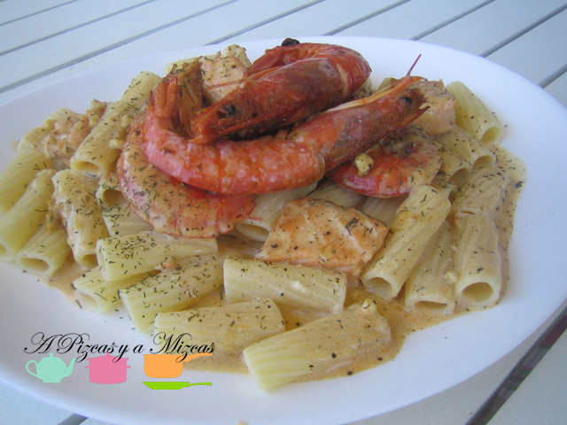

La pasta es una de nuestras debilidades. La cocinamos de muchísimas formas y estamos seguros de que la clave es una buena salsa, junto con los mejores ingredientes. Hoy planteamos una receta de rigatoni con salmón y gambas. Los [rigatoni](http://es.wikipedia.org/wiki/Rigatoni "Rigatoni") son como los macarrones, pero de un tamaño algo mayor y con estrías. Es una pasta que al dente queda riquísima, resistente y con gran capacidad de absorción de los sabores. Acompañada de un rico salmón en salsa de nata y eneldo, el resultado es inmejorable y muy completo.

## Ingredientes de los rigatoni con salmón y gambas (dos raciones)

- 160 gramos de rigatoni (si no los encontráis, podéis reemplazarlos por macarrones convencionales)
- Un lomo de salmón de buen tamaño
- Ocho gambones
- Un diente de ajo
- Una cebolla tierna
- 200 ml de nata líquida
- Eneldo picado
- Pimienta
- Sal
- Aceite de oliva virgen extra

No os asustéis de la cantidad de gambones, con menos sale igual de rico. Nosotros los teníamos que gastar sí o sí y no se nos encontró mejor manera. Si utilizáis menos gambones, por ejemplo, cuatro, podéis utilizar también gambas peladas congeladas.

Para nuestra receta de rigatoni con salmón es conveniente algo de preparación. Primero hay que limpiar bien los gambones y recortarles las barbas con unas tijeras. Así nos evitaremos encontrarlas luego sueltos en la salsa, que es muy molesto. Dejamos reservados.

Picamos muy fina la cebolla y el ajo. Si queremos, podemos retirar el germen del ajo y reservamos también.

Tomamos a continuación el salmón, le retiramos la piel y las espinas, y lo cortamos en dados.

Ponemos a hervir la pasta en abudante agua con sal. Cuando rompa a hervir añadimos la pasta, que tendremos cociendo el tiempo que indique el elaborador para que quede al dente.

En una sartén amplía, añadimos unas cuatro cucharadas de aceite de oliva virgen extra. Cuando esté bien caliente, añadimos los gambones con algo de sal, dejando que liberen la mayor parte de jugos. Los retiramos de la sartén y los reservamos. Bajamos el fuego hasta una potencia suave y añadimos en el mismo aceite la cebolla y el ajo picado. Dejamos que se poche bien y añadimos entonces el salmón a dados, salpimentamos. Cuando veamos que el pescado está prácticamente hecho, regamos con la nata líquida, espolvoreamos el eneldo picado, probamos de sal y rectificamos. Dejamos cociendo a fuego lento durante unos 7 minutos.

Con todo esto, la pasta ya la tendremos cocida, la escurrimos bien. Servimos los rigatoni con salmón en platos amplios, regados con la salsa de salmón y con los gambones por encima. Espolvoreamos un poco de eneldo más por encima y... a comerlo calentito.

