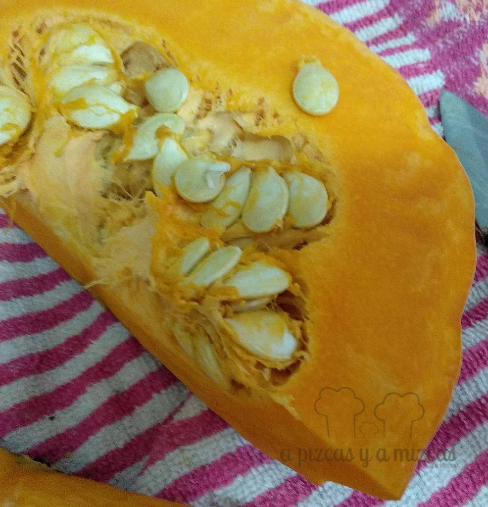
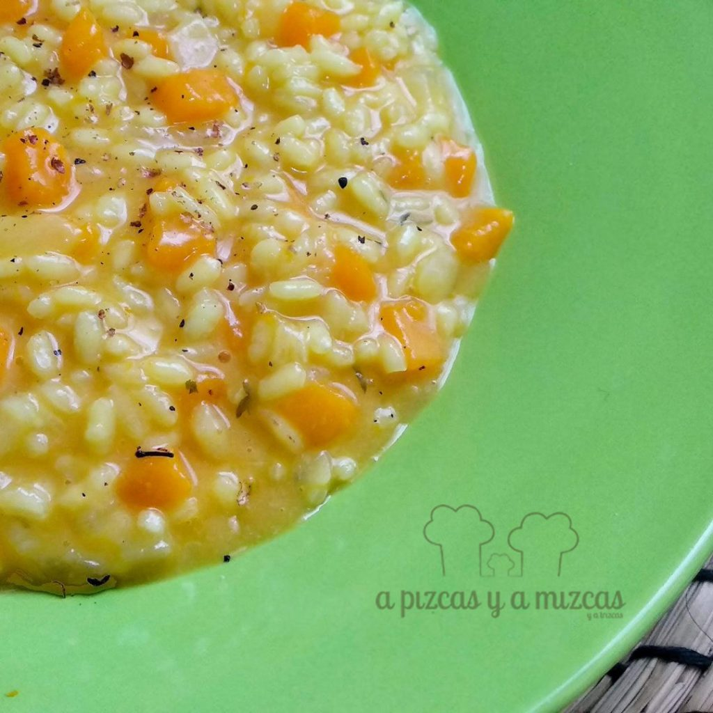

Con la llegada del otoño, viene también la temporada de uno de nuestros productos favoritos: la [calabaza](/?s=calabaza). El risotto de calabaza que hoy proponemos es solo una de las recetas que preparamos con este fruto y os aseguramos que en esta versión, utilizando vino rosado en su elaboración, el resultado es exquisito. No dudéis en preparar este [risotto](https://es.wikipedia.org/wiki/Risotto) de calabaza porque seguro que la incorporáis a vuestro recetario de otoño/invierno.

Lo más importante es contar con una calabaza de buena calidad, fresca y jugosa. Para eso, nada mejor que acudir a vuestra frutería/verdulería de confianza. Como en todos los risottos es necesario elaborar esta receta con mimo y atención, para conseguir el punto exacto del arroz.

## Ingredientes para el risotto de calabaza al vino rosado

- 300 gramos de arroz (lo idea es que sea de la variedad Arborio, pero empleamos en esta ocasión el arroz redondo tradicional)
- Queso parmigiano regiano (alrededor de 150 gramos) rallado
- Un vaso de vino rosado seco
- 200 gramos de calabaza cruda, pelada y troceada
- 1 litro de caldo de verduras
- 1 cebolla picada
- Una cucharada de mantequilla
- AOVE
- Sal
- Pimienta

Os recomendamos que mientras preparáis los ingredientes del risotto de calabaza y los vais troceando, vayáis calentando a fuego medio el caldo de verduras. Todos los ingredientes deben ir picados, la calabaza en dados de un cm aprox., la cebolla bien fina y el queso bien rallado.

Con el caldo caliente, pero sin que llegue a hervir, procedemos a elaborar el risotto de calabaza. En una cazuela antihaderente, fundimos una cucharada de mantequilla junto a otra de aceite de oliva virgen extra. Pochamos la cebolla, sal y pimienta, y a continuación, guisamos la calabaza a fuego medio, hasta que esté tierna pero al dente todavía.

Añadimos el arroz y lo rehogamos durante uno o dos minutos y añadimos el vino rosado al guiso y lo dejamos reducir durante otro par de minutos a fuego medio. Incorporamos dos cazos de caldo caliente y removemos. Habrá que remover constantemente para que el arroz vaya soltando almidón y trabando el risotto de calabaza. Vamos añadiendo caldo conforme se vaya consumiendo sin parar de remover. En total debéis calcular unos 20 minutos de cocción del arroz a este ritmo. Debe quedar cremoso pero no caldoso.

Rectificamos de sal y pimienta y antes de servir añadimos media cucharadita de mantequilla y la removemos bien. Espolvoreamos con un poco más de queso rallado nuestro risotto de calabaza y ya tenemos un plato de otoño de campeonato.
