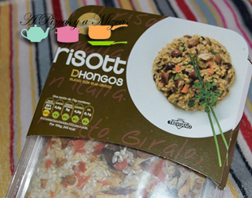
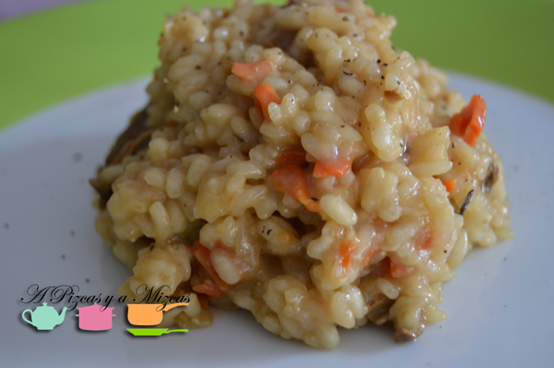

Hay días que no se cómo ni por qué... pero se me echa el tiempo encima y no me da tiempo preparar nada. Por eso nos gusta tener en nuestra despensa paquetitos de arroz deshidratado de [Trevijano](http://www.trevijano.com/index.php "Trevijano") que se preparan en un "pis pas" y el resultado es muy casero.

Nos gustan estos productos por:

\- Porque al contrario que los productos congelados no necesitan frío para su conservación

\- Los podemos guardar en la despensa y sus propiedades seguirán inalterables

\- Tiene un consumo preferente de larga duración (de hasta 18 meses)

\- Y no tienen ningún tipo de aditivo, con lo que es 100% natural

\- Son fáciles y rápidos de preparación, al mismo tiempo que permiten darles tu toque personal .

Existen cinco variedades distintas de risottos (de algas, mediterráneo, de albahaca y al curry). Hoy hemos escogido el de hongos pero están todos buenísimos

En el envase está muy bien explicado la forma de prepararlo, pero os lo contamos tal y como ellos lo explican

## Risotto de hongos (para dos o tres personas)

En una cacerola añadimos dos cucharadas de aceite de oliva virgen extra, sofreímos el arroz con la verduras y sazonamos al gusto. A continuación echamos un chorrito de vino blanco y removeremos hasta que se evapore. Después añadiremos poco a poco agua caliente (aproximadamente el doble de producto), removiendo constantemente durante aproximadamente 20 - 25 minutos.

En el envase nos indican que el arroz debe quedar meloso pero al dente. Retiraremos del fuego e incorporamos unos 25 gramos de mantequilla y dos cucharadas de queso parmesano.

Por último espolvoreamos con un poquito de perejil para presentarlo. Y tachaaaaán... ya tenemos nuestro risotto de hongos  listo para disfrutar. Rápido a la mesa que se enfría!

Y ahora que no se entera nadie... podeís decir que sois expertos en cocina italiana... y seguro que cuela... ja ja ja
