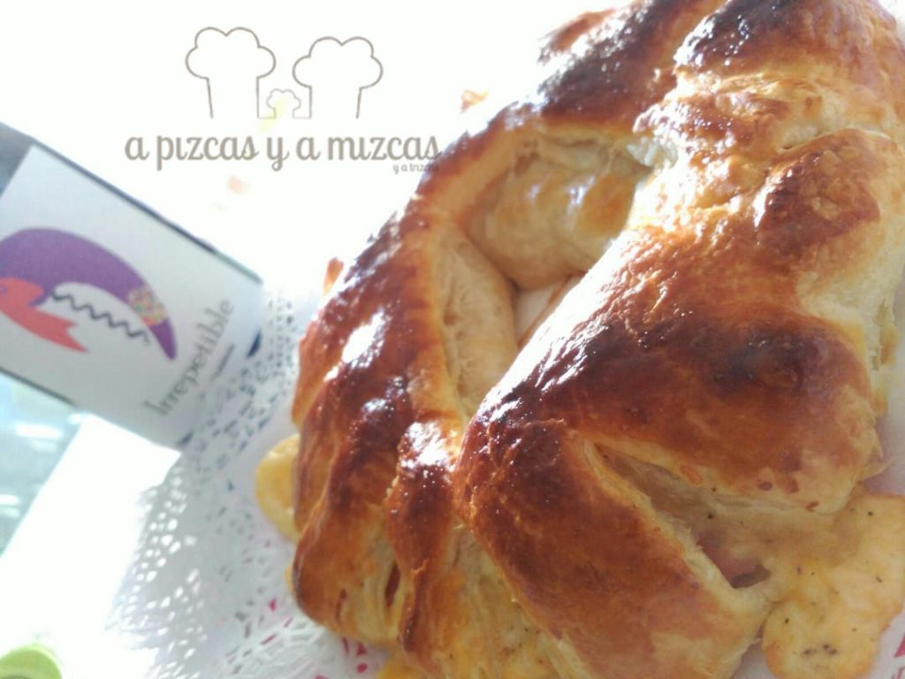
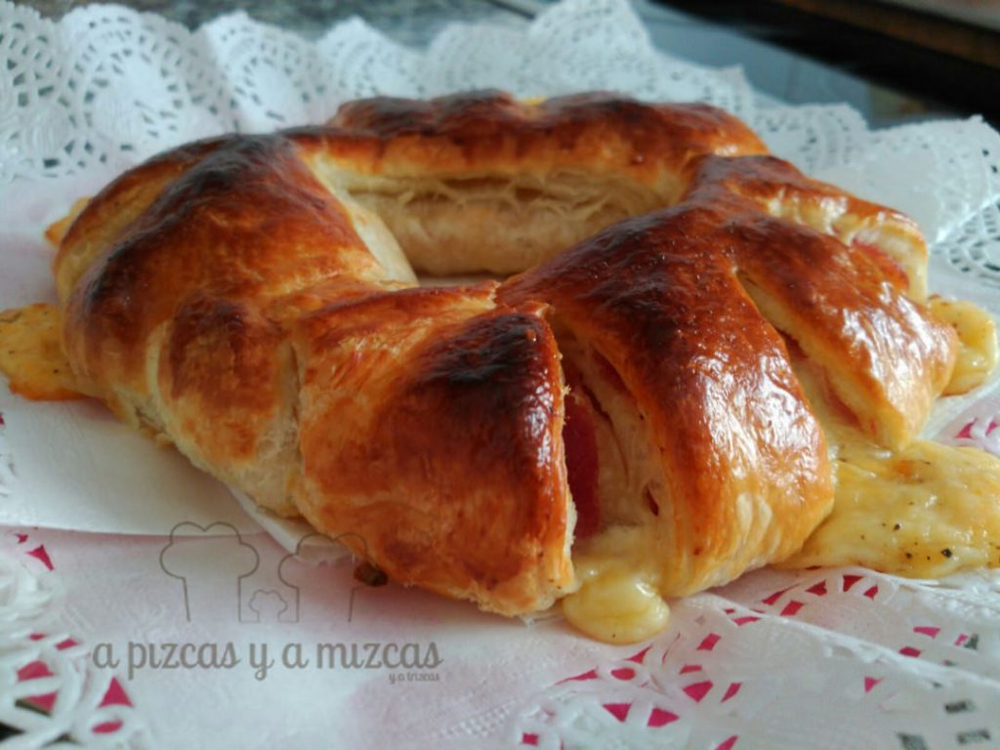

Con la vuelta a la rutina poco a poco volvemos a los fogones. Y con un poco de tiempo vamos haciendo alguna de las recetas que teníamos guardadas y con ganas de preparar y enseñaros. Hoy os traemos una rosca de jamón york y queso que se prepara en un periquete y que gusta a pequeños y mayores. Ideal para la merienda o para abrir boca... si no te quieres perder el paso a paso... quédate!

## Ingredientes para preparar la rosca de jamón york y queso

- lámina de hojaldre
- lonchas de jamón york
- lonchas de queso
- queso rayado
- pimienta
- huevo

Cómo otras recetas de A Pizcas y a Mizcas me va costar más escribir la receta que prepararla. Así que atentos... ji ji ji....

Extendemos la lámina de hojaldre sobre una hoja de papel sulfurizado en una bandeja apta para el horno. A continuación, colocamos las lonchas de jamón york dejando unos dos centímetros del borde para que luego podamos enrrollarlo sin problemas.

Lo mismo haremos con las lonchas de queso y por último agregaremos queso rayado. Por último añadiremos un poco de pimienta.

Ahora enrrollamos la masa con la ayuda del papel de horno. Cuando ya tenemos el rulo formado, juntamos los dos extremos del mismo formando una "o". Mojamos los extremos con un poquito de agua para sellarlo bien. Con la ayuda de un cuchillo haremos cortes transversales en la rosca sin llegar el centro. Después separaremos los trozos (sin que se rompan).

Pintamos la rosca con un huevo batido e introducimos en el horno previamente precalentado a 180º C. Dejaremos la rosca unos 25 minutos o hasta que veamos que está dorada.

